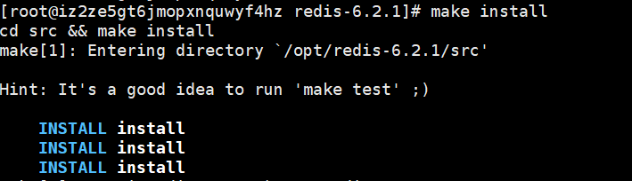
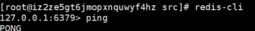

## 前言

​	记录本人的 Redis 学习过程，是大致的，以后如果有更深层次的理解再另外写新文章。

## Redis 介绍

​	Redis（Remote Dictionary Server )，即远程字典服务，是一个开源的使用ANSI C语言编写、支持网络、可基于内存亦可持久化的日志型、属于NoSQL中的Key-Value数据库。

​	NoSQL ≠ Not SQL ，而是 Not Only SQL！（NoStudy = Not Only Study）

​	Redis 有以下特点：

- 免费开源
- 体积小，性能强
- 支持事务，持久化
- 功能丰富

## Redis 安装

​	Redis 不推荐在 Windows 下使用，而且以后工作上的开发，也基本是在 Linux 上，所以在学习 Redis 中都在 Linux 中进行学习，也算是为以后做准备。

​	Redis 的安装，我一开始是使用 yum 进行安装的（比较方便），但是安装完版本太低，而且安装完东西有点乱，就卸载了，换了一种方法安装。

​	首先在官网上下载 Redis 最新版本，然后通过 Xftp 上传到服务器上。我是放在 `/opt` 这个文件夹下，然后进入所在文件夹，使用命令

```shell
tar zxvf redis-6.2.1.tar.gz
```

​	进入解压的文件夹，使用 yum 下载 C++

```shell
yum -y install gcc gcc-c++
```

​	在编译之前，先安装 tcl（否则编译会出现问题）

```
yum install tcl
```

​	进入 Redis 解压后的文件夹，使用指令进行编译

```shell
make
```

​	编译结束后可以使用 `make install` 检测一下，然后开启 redis 服务，使用 `ping` 测试一下是否开启





​	在 redis 文件夹下创建一个 etc 文件夹，用于保存 redis 配置文件。

```shell
mkdir etc
cp redis.conf etc
```

​	然后修改配置文件，使得 redis 可以在后台运行

```shell
# 使用这行命令，然后将文件中的 daemonize no 改为 yes
vim redis.conf

```

## 基础命令

​	切换数据库

```shell
# n 表示切换的数据库标号，默认有16个，从0开始
> select n
```

​	查看数据库已使用容量

```
> dbsize
```

​	查看所有的 key

```shell
> keys *
```

​	清空当前库

```shell
> flushdb
```

​	清空全部

```
> flushall
```

​	查询是否存在对应的key

```shell
> EXISTS key
```

​	移出对应的key（从n号数据库）

```shell
> MOVE key n
```

​	设置过期时间（单位秒）

```shell
> EXPIRE key time
```

​	查看剩余存活时间（单位秒） 

```shell
# -2 表示过期， -1 表示一直存在
> TTL key
```

​	存放和获取键值对

```shell
> set key value
> get key
```

​	查询 key 的类型

```
> type key
```

​	往某个键值对的值追加值

```shell
> appen key "追加值"
```

​	值加一减一操作

```shell
> incr key
> decr key
```

​	值加 n 减 n 操作

```shell
> incrby key n
> decrbt key n
```

​	截取值的某一部分

```shell
# st 起始位置 ed 结束位置
# 可以使用负数，表示倒数第几个
> getrange key st ed
```

​	替换某一部分

```shell
# 替换的值，不是插入，是一一替换
> setrange key st values

# 例子
127.0.0.1:6379> set me jeislu
OK
127.0.0.1:6379> setrange me 2 yeyu
(integer) 6
127.0.0.1:6379> get me
"jeyeyu"
```

​	存储的时候带上存活时间

```shell
> setex key time value
```

​	如果不存在对应的key才存储

```shell
> setnx key value
```

​	批量设置或者获取值

```shell
> mset key1 value1 key2 value2 ...
> mget key1 key2 ...
```

​	批量设置配合上面两个一起使用，在末尾带上 ex 或者 nx（原子性操作，如果一个失败则全部失败）

```shell
> msetnx key1 value1 key2 value2
```

​	先获取再设置（返回旧值并用新值覆盖旧值）

```shell
> getset key value
```

​	指令太多了，一个一个记也麻烦，如果想知道某个指令的内容，可以直接去官网查询，后面的记一下注意点

​	<a href="http://www.redis.cn/commands.html">传送门</a>

### 五大类型的注意点

1 List 是栈，push 操作是往头部加（配合栈，挺好理解的）