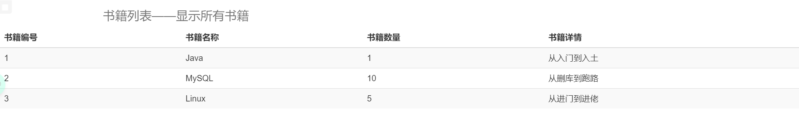
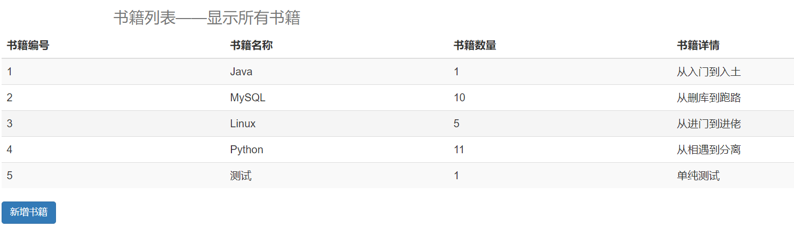

## 前言

​	学习完 Spring + SpringMVC + Mybatis 三个架构，弄个基本项目来把这三个东西整合在一起。

## 准备工作

### 导入依赖

​	需要导入 Mybatis、Spring、SpringMVC 以及 数据库等包，具体如下

```xml
<?xml version="1.0" encoding="UTF-8"?>
<project xmlns="http://maven.apache.org/POM/4.0.0"
         xmlns:xsi="http://www.w3.org/2001/XMLSchema-instance"
         xsi:schemaLocation="http://maven.apache.org/POM/4.0.0 http://maven.apache.org/xsd/maven-4.0.0.xsd">
    <modelVersion>4.0.0</modelVersion>

    <groupId>org.example</groupId>
    <artifactId>SSM</artifactId>
    <version>1.0-SNAPSHOT</version>

    <!-- 依赖 -->
    <dependencies>
        <!-- Junit -->
        <dependency>
            <groupId>junit</groupId>
            <artifactId>junit</artifactId>
            <version>4.12</version>
        </dependency>

        <!-- 数据库驱动 -->
        <dependency>
            <groupId>mysql</groupId>
            <artifactId>mysql-connector-java</artifactId>
            <version>5.1.46</version>
        </dependency>

        <!-- 数据库连接池 -->
        <dependency>
            <groupId>com.mchange</groupId>
            <artifactId>c3p0</artifactId>
            <version>0.9.5.2</version>
        </dependency>

        <!-- Servlet JSP -->
        <dependency>
            <groupId>javax.servlet</groupId>
            <artifactId>servlet-api</artifactId>
            <version>2.5</version>
        </dependency>
        <dependency>
            <groupId>javax.servlet.jsp</groupId>
            <artifactId>jsp-api</artifactId>
            <version>2.2</version>
        </dependency>
        <dependency>
            <groupId>javax.servlet</groupId>
            <artifactId>jstl</artifactId>
            <version>1.2</version>
        </dependency>

        <!-- Mybatis -->
        <dependency>
            <groupId>org.mybatis</groupId>
            <artifactId>mybatis</artifactId>
            <version>3.5.2</version>
        </dependency>
        <!-- MyBatis 和 Spring 的整合包 -->
        <dependency>
            <groupId>org.mybatis</groupId>
            <artifactId>mybatis-spring</artifactId>
            <version>2.0.5</version>
        </dependency>

        <!-- Spring -->
        <dependency>
            <groupId>org.springframework</groupId>
            <artifactId>spring-webmvc</artifactId>
            <version>5.2.12.RELEASE</version>
        </dependency>
        <dependency>
            <groupId>org.springframework</groupId>
            <artifactId>spring-jdbc</artifactId>
            <version>5.2.12.RELEASE</version>
        </dependency>
        
        <!-- Lombok -->
        <dependency>
            <groupId>org.projectlombok</groupId>
            <artifactId>lombok</artifactId>
            <version>1.18.12</version>
        </dependency>
    </dependencies>

</project>
```

​	在配置一个东西，Maven 的资源过滤，防止 Maven 不导出一些资源文件

```xml
<!-- 在bulid中的resources中添加一个新的resouce，如果没有父标签就创建 -->
<build>
    <resources>
        <resource>
            <!-- 需要开启资源文件的目录 -->
            <directory>src/main/resources</directory>
            <!-- 匹配规则 -->
            <includes>
                <!-- 单一匹配规则 -->
                <!-- ** 表示任意目录 -->
                <!-- *.xml 表示任意以xml结尾的文件 -->
                <include>**/*.xml</include>
                <include>**/*.properties</include>
            </includes>
            <filtering>true</filtering>
        </resource>
        <resource>
            <directory>src/main/java</directory>
            <includes>
                <include>**/*.xml</include>
                <include>**/*.properties</include>
            </includes>
            <filtering>true</filtering>
        </resource>
    </resources>
</build>
```

### 创建数据库	

​	导入完依赖以后，创建一个数据用，用于等等做测试，数据库的创建 SQL 如下

```mysql
# 创建表
CREATE TABLE books(
	bookID INT NOT NULL AUTO_INCREMENT COMMENT "书id",
	bookName VARCHAR(20) NOT NULL COMMENT "书名",
	bookNum INT NOT NULL COMMENT "数量",
	detail VARCHAR(200) NOT NULL COMMENT "描述",
	KEY bookID (bookID)
)ENGINE=INNODB DEFAULT CHARSET = utf8;

# 插入数据
INSERT INTO books(bookID,bookName,bookNum,detail) values(1,'Java',1,'从入门到入土'),(2,'MySQL',10,'从删库到跑路'),(3,'Linux',5,'从进门到进佬');
```

​	创建对应的目录结构

​	到这里，准备工作就已经差不多了，接下来分别配置 SSM 的东西

​	**先在资源目录下创建一个总的配置文件，用来整合其他的配置文件**

## MyBatis 配置

​	编写 MyBatis 配置文件，本来需要配置数据库，但是整合以后，这个过程交给 Spring 注入完成。

​	在配置文件中配置类别名。

​	根据创建的数据库编写 POJO 对象

```java
package com.jeislu.pojo;

import lombok.AllArgsConstructor;
import lombok.Data;
import lombok.NoArgsConstructor;

@Data
@AllArgsConstructor
@NoArgsConstructor
public class Book {
    private int bookID;
    private String bookName;
    private int bookNum;
    private String detail;
}
```

​	然后根据需求编写 DAO 接口和对应的配置文件

```java
package com.jeislu.dao;

import com.jeislu.pojo.Book;
import org.apache.ibatis.annotations.Mapper;
import org.apache.ibatis.annotations.Param;
import org.apache.ibatis.annotations.Select;

import java.util.List;
import java.util.Map;

public interface BookMapper {

    // 查询一本书
    Book queryBook(@Param("bookID") int bookId);

    // 查询所有书
    List<Book> queryAllBook();

    // 更新一本书
    int updateBook(Map book);

    // 删除一本书
    int deleteBook(@Param("bookID") int bookId);

    // 增加一本书
    int addBook(Map book);

}
```

```xml
<?xml version="1.0" encoding="UTF-8" ?>
<!DOCTYPE mapper
        PUBLIC "-//mybatis.org//DTD Config 3.0//EN"
        "http://mybatis.org/dtd/mybatis-3-mapper.dtd">
<mapper namespace="com.jeislu.dao.BookMapper">

    <select id="queryBook" resultType="Book">
        select * from ssm.books where id = #{bookID};
    </select>

    <select id="queryAllBook" resultType="Book">
        select * from ssm.books;
    </select>

    <update id="updateBook" parameterType="Book">
        update ssm.books
        SET bookName = #{bookName}, bookNum = #{bookNum},detail = ${detail}
        where bookId = #{bookId};
    </update>

    <delete id="deleteBook" parameterType="_int">
        delete from ssm.books where bookID = #{bookID};
    </delete>

    <insert id="addBook" parameterType="Book">
        insert into ssm.books (bookName,bookNum,detail) values (#{bookName},#{bookNum},#{detail});
    </insert>

</mapper>
```

​	编写业务层接口

```java
package com.jeislu.service;

import com.jeislu.pojo.Book;
import org.apache.ibatis.annotations.Param;

import java.util.List;
import java.util.Map;

public interface BookService {
    // 查询一本书
    Book queryBook(int bookId);

    // 查询所有书
    List<Book> queryAllBook();

    // 更新一本书
    int updateBook(Map book);

    // 删除一本书
    int deleteBook(int bookId);

    // 增加一本书
    int addBook(Map book);
}
```

​	业务层接口实现类

```java
package com.jeislu.service;

import com.jeislu.dao.BookMapper;
import com.jeislu.pojo.Book;

import java.util.List;
import java.util.Map;

public class BookServiceImpl implements BookService{
    // Book 层调 DAO 层
    private BookMapper bookMapper;

    public Book queryBook(int bookId) {
        return bookMapper.queryBook(bookId);
    }

    public List<Book> queryAllBook() {
        return bookMapper.queryAllBook();
    }

    public int updateBook(Map book) {
        return bookMapper.updateBook(book);
    }

    public int deleteBook(int bookId) {
        return bookMapper.deleteBook(bookId);
    }

    public int addBook(Map book) {
        return bookMapper.addBook(book);
    }
}
```

## Spring 配置

​	由于我们将 Mybatis 配置数据库的工作交给了 Spring 实现，所以先创建一个配置文件 spring-dao-config.xml ，用于配置 DAO 层的功能。

​	首先，创建一个数据库配置文件 database.properties ，用于存储数据库的配置

```properties
jdbc.driver = com.mysql.jdbc.Driver
jdbc.url = jdbc:mysql://localhost:3306/ssm?useSSL=false&useUnicode=true&characterEncoding=utf8
jdbc.username = root
jdbc.password = root
```

​	然后在 spring-dao-config.xml 中导入该配置文件

```xml
<!-- 关联数据库配置文件 -->
    <context:property-placeholder location="classpath:database.properties"/>
```

​	接着配置连接池（这里使用了 c3p0）：

```xml
<!-- 连接池 -->
<bean id="dataSource" class="com.mchange.v2.c3p0.ComboPooledDataSource">
    <property name="driverClass" value="${jdbc.driver}"/>
    <property name="jdbcUrl" value="${jdbc.url}"/>
    <property name="user" value="${jdbc.username}"/>
    <property name="password" value="${jdbc.password}"/>
</bean>
```

​	接着配置 SqlSessionFactory ，需要传入一个数据库配置（连接池也行）

```xml
<!-- 配置 SqlSessionFactory -->
<bean id="sqlSessionFactory" class="org.mybatis.spring.SqlSessionFactoryBean">
    <!-- 绑定数据库 -->
    <property name="dataSource" ref="dataSource"/>
    <!-- 綁定 Mybatis 配置文件 -->
    <property name="configLocation" value="classpath:mybatis-config.xml"/>
</bean>
```

​	我们之前整合 Spring 和 MyBatis 的时候，是使用创建一个实现类先手动实现 Mapper，以后不需要了，在配置文件中开启自动配置即可，Spring 帮我们完成

```xml
<!-- 配置 Mapper 实现类自动完成 -->
<bean class="org.mybatis.spring.mapper.MapperScannerConfigurer">
    <!-- 注入 SqlSessionFactory -->
    <property name="sqlSessionFactoryBeanName" value="sqlSessionFactory"/>
    <!-- 设置要自动实现的包 -->
    <property name="basePackage" value="com.jeislu.dao"/>
</bean>
```

​	配置事务（未具体实现功能）

```xml
<!-- 创建事务管理器 -->
<bean id="transactionManager" class="org.springframework.jdbc.datasource.DataSourceTransactionManager">
    <!-- 注入数据源 -->
    <property name="dataSource" ref="dataSource"/>
</bean>
```

​	再创建一个配置文件 spring-service-config.xml 用于配置 Service 层的东西。

​	Service 层目前只需要开启扫描注册的功能即可（未使用 @Service 所以未生效），以及注册一个 bean。

```xml
<?xml version="1.0" encoding="UTF-8"?>
<beans xmlns="http://www.springframework.org/schema/beans"
       xmlns:xsi="http://www.w3.org/2001/XMLSchema-instance"
       xmlns:context="http://www.springframework.org/schema/context"
       xsi:schemaLocation="http://www.springframework.org/schema/beans http://www.springframework.org/schema/beans/spring-beans.xsd http://www.springframework.org/schema/context https://www.springframework.org/schema/context/spring-context.xsd">

    <!-- 扫描 Service 下面的类 -->
    <context:component-scan base-package="com.jeislu.service"/>

    <!-- 注册 bean -->
    <bean id="BookServiceImpl" class="com.jeislu.service.BookServiceImpl">
        <property name="bookMapper" ref="bookMapper"/>
    </bean>
    
</beans>
```

## SpringMVC 配置

​	从下面到这里，还没有将项目设置为 Web 项目，先设置成为 web 项目，然后在 web.xml 中配置 SpringMVC 的核心——DispatchServlet 。

```xml
<!-- 配置DispatchServlet -->
<servlet>
    <servlet-name>DispatchServlet</servlet-name>
    <servlet-class>org.springframework.web.servlet.DispatcherServlet</servlet-class>
    <!-- SpringMVC 配置文件 -->
    <init-param>
        <param-name>contextConfigLocation</param-name>
        <!-- 这行代码是有问题的，这里先标注一下，后面说 -->
        <param-value>classpath:spring-mvc-config.xml</param-value>
    </init-param>
    <!-- 启动等级 -->
    <load-on-startup>1</load-on-startup>
</servlet>
<servlet-mapping>
    <servlet-name>DispatchServlet</servlet-name>
    <url-pattern>/</url-pattern>
</servlet-mapping>
```

​	配置过滤器，防止乱码

```xml
<!-- 过滤器，防止乱码 -->
<filter>
    <filter-name>encodingFilter</filter-name>
    <filter-class>org.springframework.web.filter.CharacterEncodingFilter</filter-class>
    <init-param>
        <param-name>encoding</param-name>
        <param-value>utf-8</param-value>
    </init-param>
</filter>
<filter-mapping>
    <filter-name>encodingFilter</filter-name>
    <url-pattern>/*</url-pattern>
</filter-mapping>
```

​	配置 Session 存活时间

```xml
<!-- 配置 Session 存活时间 -->
<session-config>
    <!-- 单位分钟 -->
    <session-timeout>15</session-timeout>
</session-config>
```

​	然后设置 SpringMVC 的配置文件 spring-mvc-config.xml。

​	首先，配置注解驱动，静态资源过滤，包扫描

```xml
<!-- 注解驱动 -->
<mvc:annotation-driven/>
<!-- 静态资源过滤 -->
<mvc:default-servlet-handler/>
<!-- 包扫描 -->
<context:component-scan base-package="com.jeislu.controller"/>
```

​	配置视图解析器

```xml
<!-- 视图解析器 -->
<bean id="viewResolver" class="org.springframework.web.servlet.view.InternalResourceViewResolver">
    <property name="prefix" value="/WEB-INF/jsp/"/>
    <property name="suffix" value=".jsp"/>
</bean>
```

## 添加业务

​	上面已经把三个框架整合完毕，接下来添加具体业务。

​	但是先说说上面的两个错误，第一个错误在 web.xml 这里面 DispatchServlet 配置的文件是 SpringMVC 的文件，里面没有其他 Spring 配置文件的 bean，所以修改为总的配置文件 applicationContext.xml 。

​	第二个问题就是 web 工程不将依赖一起导出，会直接 404 ，在项目结构里面的 Artifacts 里面新建 lib ，并添加依赖。

​	好了解决完这两个问题，就可以正式的写业务了。

​	先创建一个 Controller ，负责查询书籍并返回数据

```java
@Controller
@RequestMapping("/book")
public class BookController {
    // Controller 层调 Service 层
    // 自动装配
    @Autowired
    @Qualifier("BookServiceImpl")
    private BookService bookService;

    @GetMapping("/query")
    public String queryAllBook(Model model){
        model.addAttribute("books",bookService.queryAllBook());
        return "allBook";
    }
}
```

​	然后编写首页，使其跳转到 BookController 执行查询书籍并返回数据

```jsp
<%--
  Created by IntelliJ IDEA.
  User: Jeislu
  Date: 2021/3/13
  Time: 10:44
  To change this template use File | Settings | File Templates.
--%>
<%@ page contentType="text/html;charset=UTF-8" language="java" %>
<html>
  <head>
    <title>首页</title>
    <link href="https://cdn.staticfile.org/twitter-bootstrap/3.3.7/css/bootstrap.min.css" rel="stylesheet">
    <style>
      a{
        text-decoration: none;
        color: black;
        font-size: 20px;
      }

      div{
        width: 180px;
        height: 38px;
        margin: 100px auto;
        text-align: center;
        line-height: 38px;
      }
    </style>
  </head>
  <body>
    <div>
      <a class="btn btn-primary" href="${pageContext.request.contextPath}/book/query">所有书籍</a>
    </div>
  </body>
</html>

```

​	然后在 WEB-INF/ jsp 下新建一个 allBook.jsp （和 Controller 返回的视图名对应），编写展示数据页面（前端不太熟，这个完全是抄的）

```jsp
<%@ taglib prefix="c" uri="http://java.sun.com/jsp/jstl/core" %>
<%--
  Created by IntelliJ IDEA.
  User: Jeislu
  Date: 2021/3/13
  Time: 11:31
  To change this template use File | Settings | File Templates.
--%>
<%@ page contentType="text/html;charset=UTF-8" language="java" %>
<html>
<head>
    <title>书籍展示</title>

    <link href="https://cdn.staticfile.org/twitter-bootstrap/3.3.7/css/bootstrap.min.css" rel="stylesheet">
</head>
<body>
    <div class="container">
        <div class="row clearfix">
            <div class="col-md-12 column">
                <h1>
                    <small>书籍列表——显示所有书籍</small>
                </h1>
            </div>
        </div>
    </div>

    <div class="row clearfix">
        <div class="col-md-12 column">
            <table class = "table table-hover table-striped">
                <thead>
                    <tr>
                        <th>书籍编号</th>
                        <th>书籍名称</th>
                        <th>书籍数量</th>
                        <th>书籍详情</th>
                    </tr>
                </thead>

                <tbody>
                    <c:forEach var="book" items = "${books}">
                        <tr>
                            <td>${book.bookID}</td>
                            <td>${book.bookName}</td>
                            <td>${book.bookNum}</td>
                            <td>${book.detail}</td>
                        </tr>
                    </c:forEach>
                </tbody>
            </table>
        </div>
    </div>
</body>
</html>
```

​	这样，一个查询业务就做好了，可以通过启动项目查看效果



​	再添加一个增加书籍业务

​	首先在显示所有书籍页面添加一个跳转链接，跳转到增加书籍的按钮，在 Controller 中编写对应方法

```jsp
<div class="row">
    <div class="col-md-4 column">
        <a class="btn btn-primary" href="${pageContext.request.contextPath}/book/add">新增书籍</a>
    </div>
</div>
```

```java
// 跳转到添加书籍页面
    @GetMapping("/add")
    public String goToAddPage(){
        return "addBook";
    }
```

​	然后编写添加书籍页面

```jsp
<%@ taglib prefix="c" uri="http://java.sun.com/jsp/jstl/core" %>
<%--
  Created by IntelliJ IDEA.
  User: Jeislu
  Date: 2021/3/13
  Time: 10:44
  To change this template use File | Settings | File Templates.
--%>
<%@ page contentType="text/html;charset=UTF-8" language="java" %>
<html>
<head>
    <title>增加书籍</title>
    <link href="https://cdn.staticfile.org/twitter-bootstrap/3.3.7/css/bootstrap.min.css" rel="stylesheet">
    <style>
        body{
            margin-left: 30px;
            margin-right: 30px;
        }
    </style>
</head>
<body>
    <div class="container">
        <div class="row clearfix">
            <div class="col-md-12 column">
                <h1>
                    <small>添加书籍</small>
                </h1>
            </div>
        </div>
    </div>
    <form action="${pageContext.request.contextPath}/book/addBook" method="post">
        <div class="form-group">
            <label>书籍名称</label>
            <input type="text" name="bookName" class="form-control" required>
        </div>
        <div class="form-group">
            <label>书籍数量</label>
            <input type="text" name="bookNum" class="form-control" required>
        </div>
        <div class="form-group">
            <label>书籍描述</label>
            <input type="text" name="detail" class="form-control" required>
        </div>
        <button type="submit" class="btn btn-default">提交</button>
    </form>
</body>
</html>
```

​	在 Controller 中添加一个方法，用于处理表单的提交

```java
// 增加业务
@PostMapping("/addBook")
public String addBook(Book data){
    bookService.addBook(data);
    // 重定向到查询，再一次更新页面
    return "redirect:/book/query";
}
```

​	然后就完成了！不过当你点击提交按钮的时候，就会出现 500 错误，这是因为 Mybatis 里面的有一些问题。

​	在设计新增和更新书籍的时候，我接受的参数是 Map，我以为他会根据表单里面 input 的 name 给我添加对应的键值对，可惜不行，如果不行的话，那肯定会出问题。

​	解决方法就是，将 Map 全部换成 Book，Spring 会根据 input 中的名称以及 Book 类的属性名注入值。

​	在替换掉 Map 以后，一切就正常了。



​	接下来增加查询和删除业务

​	先扩展原有的，来所有书籍页面添加修改和删除按键

```jsp
<%@ taglib prefix="c" uri="http://java.sun.com/jsp/jstl/core" %>
<%--
  Created by IntelliJ IDEA.
  User: Jeislu
  Date: 2021/3/13
  Time: 11:31
  To change this template use File | Settings | File Templates.
--%>
<%@ page contentType="text/html;charset=UTF-8" language="java" %>
<html>
<head>
    <title>书籍展示</title>
    <link href="https://cdn.staticfile.org/twitter-bootstrap/3.3.7/css/bootstrap.min.css" rel="stylesheet">
    <style>
        body{
            margin-left: 30px;
            margin-right: 30px;
        }
    </style>
</head>
<body>
    <div class="container">
        <div class="row clearfix">
            <div class="col-md-12 column">
                <h1>
                    <small>书籍列表——显示所有书籍</small>
                </h1>
            </div>
        </div>
    </div>

    <div class="row clearfix">
        <div class="col-md-12 column">
            <table class = "table table-hover table-striped">
                <thead>
                    <tr>
                        <th>书籍编号</th>
                        <th>书籍名称</th>
                        <th>书籍数量</th>
                        <th>书籍详情</th>
                        <th>操作</th>
                    </tr>
                </thead>

                <tbody>
                    <c:forEach var="book" items = "${books}">
                        <tr>
                            <td>${book.bookID}</td>
                            <td>${book.bookName}</td>
                            <td>${book.bookNum}</td>
                            <td>${book.detail}</td>
                            <td>
                                <a href="${pageContext.request.contextPath}/book/update?id=${book.bookID}">修改</a>&nbsp;|&nbsp;
                                <a href="${pageContext.request.contextPath}/book/deleteBook?id=${book.bookID}">删除</a>
                            </td>
                        </tr>
                    </c:forEach>
                </tbody>
            </table>
        </div>
    </div>

    <div class="row">
        <div class="col-md-4 column">
            <a class="btn btn-primary" href="${pageContext.request.contextPath}/book/add">新增书籍</a>
        </div>
    </div>
</body>
</html>

```

​	然后新建一个修改页面

```jsp
<%@ taglib prefix="c" uri="http://java.sun.com/jsp/jstl/core" %>
<%--
  Created by IntelliJ IDEA.
  User: Jeislu
  Date: 2021/3/13
  Time: 10:44
  To change this template use File | Settings | File Templates.
--%>
<%@ page contentType="text/html;charset=UTF-8" language="java" %>
<html>
<head>
    <title>增加书籍</title>
    <link href="https://cdn.staticfile.org/twitter-bootstrap/3.3.7/css/bootstrap.min.css" rel="stylesheet">
    <style>
        body{
            margin-left: 30px;
            margin-right: 30px;
        }
    </style>
</head>
<body>
    <div class="container">
        <div class="row clearfix">
            <div class="col-md-12 column">
                <h1>
                    <small>修改书籍</small>
                </h1>
            </div>
        </div>
    </div>
    <form action="${pageContext.request.contextPath}/book/updateBook" method="post">
        <!-- 添加隐藏域，不然拿不到 bookID -->
        <input type="hidden" name="bookID" value="${UpdateBook.bookID}">
        <div class="form-group">
            <label>书籍名称</label>
            <input type="text" name="bookName" class="form-control" value="${UpdateBook.bookName}" required>
        </div>
        <div class="form-group">
            <label>书籍数量</label>
            <input type="text" name="bookNum" class="form-control" value="${UpdateBook.bookNum}" required>
        </div>
        <div class="form-group">
            <label>书籍描述</label>
            <input type="text" name="detail" class="form-control" value="${UpdateBook.detail}" required>
        </div>
        <button type="submit" class="btn btn-default">提交</button>
    </form>
</body>
</html>
```

​	注意添加隐藏域，不然取不到 bookID 无法更新。

​	在 BookController 中添加两个方法，分别是跳转到更新书籍页面和更新操作

```java
// 跳转到修改页面
@GetMapping("/update")
public String goToUpdate(int id,Model model){
    System.out.println(id);
    Book book = bookService.queryBook(id);
    model.addAttribute("UpdateBook",book);
    return "updateBook";
}

// 更新书籍
@PostMapping("/updateBook")
public String updateBook(Book book){
    bookService.updateBook(book);
    return "redirect:/book/query";
}
```

​	这样就好了，接下来是删除方法，首页已经修改过了，直接在 BookController 下面添加一个删除方法即可

```java
// 删除书籍
    @GetMapping("/deleteBook")
    public String deleteBook(int id){
        bookService.deleteBook(id);
        return "redirect:/book/query";
    }
```

​	增删改查功能全部完成。

​	新增一个根据书名查询功能，由于是横向扩展功能，写的东西有点多。

​	首先修改 BookMapper，新增一个方法，然后编写该方法的 SQL 语句，然后修改 Service 层和 Service 实现类，同样新增该方法。编写首页，新增搜索栏和搜索按钮，使用 Controller 完成查询操作并返回数据给展示页面。

​	由于改动的地方有点多，一点一点贴代码也不太好，最后把项目所有的文件代码贴上来。

## 项目所有文件

​	pom.xml

```xml
<?xml version="1.0" encoding="UTF-8"?>
<project xmlns="http://maven.apache.org/POM/4.0.0"
         xmlns:xsi="http://www.w3.org/2001/XMLSchema-instance"
         xsi:schemaLocation="http://maven.apache.org/POM/4.0.0 http://maven.apache.org/xsd/maven-4.0.0.xsd">
    <modelVersion>4.0.0</modelVersion>

    <groupId>org.example</groupId>
    <artifactId>SSM</artifactId>
    <version>1.0-SNAPSHOT</version>

    <!-- 依赖 -->
    <dependencies>
        <!-- Junit -->
        <dependency>
            <groupId>junit</groupId>
            <artifactId>junit</artifactId>
            <version>4.12</version>
        </dependency>

        <!-- 数据库驱动 -->
        <dependency>
            <groupId>mysql</groupId>
            <artifactId>mysql-connector-java</artifactId>
            <version>5.1.46</version>
        </dependency>

        <!-- 数据库连接池 -->
        <dependency>
            <groupId>com.mchange</groupId>
            <artifactId>c3p0</artifactId>
            <version>0.9.5.2</version>
        </dependency>

        <!-- Servlet JSP -->
        <dependency>
            <groupId>javax.servlet</groupId>
            <artifactId>servlet-api</artifactId>
            <version>2.5</version>
        </dependency>
        <dependency>
            <groupId>javax.servlet.jsp</groupId>
            <artifactId>jsp-api</artifactId>
            <version>2.2</version>
        </dependency>
        <dependency>
            <groupId>javax.servlet</groupId>
            <artifactId>jstl</artifactId>
            <version>1.2</version>
        </dependency>

        <!-- Mybatis -->
        <dependency>
            <groupId>org.mybatis</groupId>
            <artifactId>mybatis</artifactId>
            <version>3.5.2</version>
        </dependency>
        <!-- MyBatis 和 Spring 的整合包 -->
        <dependency>
            <groupId>org.mybatis</groupId>
            <artifactId>mybatis-spring</artifactId>
            <version>2.0.5</version>
        </dependency>

        <!-- Spring -->
        <dependency>
            <groupId>org.springframework</groupId>
            <artifactId>spring-webmvc</artifactId>
            <version>5.2.12.RELEASE</version>
        </dependency>
        <dependency>
            <groupId>org.springframework</groupId>
            <artifactId>spring-jdbc</artifactId>
            <version>5.2.12.RELEASE</version>
        </dependency>

        <!-- Lombok -->
        <dependency>
            <groupId>org.projectlombok</groupId>
            <artifactId>lombok</artifactId>
            <version>1.18.12</version>
        </dependency>


    </dependencies>

    <!-- 在bulid中的resources中添加一个新的resouce，如果没有父标签就创建 -->
    <build>
        <resources>
            <resource>
                <!-- 需要开启资源文件的目录 -->
                <directory>src/main/resources</directory>
                <!-- 匹配规则 -->
                <includes>
                    <!-- 单一匹配规则 -->
                    <!-- ** 表示任意目录 -->
                    <!-- *.xml 表示任意以xml结尾的文件 -->
                    <include>**/*.xml</include>
                    <include>**/*.properties</include>
                </includes>
                <filtering>true</filtering>
            </resource>
            <resource>
                <directory>src/main/java</directory>
                <includes>
                    <include>**/*.xml</include>
                    <include>**/*.properties</include>
                </includes>
                <filtering>true</filtering>
            </resource>
        </resources>
    </build>
</project>
```

​	web.xml

```xml
<?xml version="1.0" encoding="UTF-8"?>
<web-app xmlns="http://xmlns.jcp.org/xml/ns/javaee"
         xmlns:xsi="http://www.w3.org/2001/XMLSchema-instance"
         xsi:schemaLocation="http://xmlns.jcp.org/xml/ns/javaee http://xmlns.jcp.org/xml/ns/javaee/web-app_4_0.xsd"
         version="4.0">
    <!-- 配置DispatchServlet -->
    <servlet>
        <servlet-name>DispatchServlet</servlet-name>
        <servlet-class>org.springframework.web.servlet.DispatcherServlet</servlet-class>
        <!-- SpringMVC 配置文件 -->
        <init-param>
            <param-name>contextConfigLocation</param-name>
            <param-value>classpath:applicationContext.xml</param-value>
        </init-param>
        <!-- 启动等级 -->
        <load-on-startup>1</load-on-startup>
    </servlet>
    <servlet-mapping>
        <servlet-name>DispatchServlet</servlet-name>
        <url-pattern>/</url-pattern>
    </servlet-mapping>

    <!-- 过滤器，防止乱码 -->
    <filter>
        <filter-name>encodingFilter</filter-name>
        <filter-class>org.springframework.web.filter.CharacterEncodingFilter</filter-class>
        <init-param>
            <param-name>encoding</param-name>
            <param-value>utf-8</param-value>
        </init-param>
    </filter>
    <filter-mapping>
        <filter-name>encodingFilter</filter-name>
        <url-pattern>/*</url-pattern>
    </filter-mapping>

    <!-- 配置 Session 存活时间 -->
    <session-config>
        <!-- 单位分钟 -->
        <session-timeout>15</session-timeout>
    </session-config>
</web-app>
```

​	addBook.jsp

```jsp
<%@ taglib prefix="c" uri="http://java.sun.com/jsp/jstl/core" %>
<%--
  Created by IntelliJ IDEA.
  User: Jeislu
  Date: 2021/3/13
  Time: 10:44
  To change this template use File | Settings | File Templates.
--%>
<%@ page contentType="text/html;charset=UTF-8" language="java" %>
<html>
<head>
    <title>增加书籍</title>
    <link href="https://cdn.staticfile.org/twitter-bootstrap/3.3.7/css/bootstrap.min.css" rel="stylesheet">
    <style>
        body{
            margin-left: 30px;
            margin-right: 30px;
        }
    </style>
</head>
<body>
    <div class="container">
        <div class="row clearfix">
            <div class="col-md-12 column">
                <h1>
                    <small>添加书籍</small>
                </h1>
            </div>
        </div>
    </div>
    <form action="${pageContext.request.contextPath}/book/addBook" method="post">
        <div class="form-group">
            <label>书籍名称</label>
            <input type="text" name="bookName" class="form-control" required>
        </div>
        <div class="form-group">
            <label>书籍数量</label>
            <input type="text" name="bookNum" class="form-control" required>
        </div>
        <div class="form-group">
            <label>书籍描述</label>
            <input type="text" name="detail" class="form-control" required>
        </div>
        <button type="submit" class="btn btn-default">提交</button>
    </form>
</body>
</html>
```

​	allBook.jsp

```jsp
<%@ taglib prefix="c" uri="http://java.sun.com/jsp/jstl/core" %>
<%--
  Created by IntelliJ IDEA.
  User: Jeislu
  Date: 2021/3/13
  Time: 11:31
  To change this template use File | Settings | File Templates.
--%>
<%@ page contentType="text/html;charset=UTF-8" language="java" %>
<html>
<head>
    <title>书籍展示</title>
    <link href="https://cdn.staticfile.org/twitter-bootstrap/3.3.7/css/bootstrap.min.css" rel="stylesheet">
    <style>
        body{
            margin-left: 30px;
            margin-right: 30px;
        }
    </style>
</head>
<body>
    <div class="container" >
        <div class="row clearfix">
            <div class="col-md-12 column" style="display: flex;justify-content: center">
                <h1>
                    <small>书籍列表——显示所有书籍</small>
                </h1>
            </div>
        </div>
    </div>
    <!-- 查询功能 -->
    <div class="col-md-12 column" style="display: flex;justify-content: center">
        <form action="${pageContext.request.contextPath}/book/queryByName" method="get" style="display: flex">
            <input type="text" name="bookName" class="form-control" placeholder="请输入要查询的书籍名称">
            &nbsp;&nbsp;
            <input type="submit" value="查询" class="btn btn-default"/>
        </form>
    </div>

    <div class="row clearfix">
        <div class="col-md-12 column">
            <table class = "table table-hover table-striped">
                <thead>
                    <tr>
                        <th>书籍编号</th>
                        <th>书籍名称</th>
                        <th>书籍数量</th>
                        <th>书籍详情</th>
                        <th>操作</th>
                    </tr>
                </thead>

                <tbody>
                    <c:forEach var="book" items = "${books}">
                        <tr>
                            <td>${book.bookID}</td>
                            <td>${book.bookName}</td>
                            <td>${book.bookNum}</td>
                            <td>${book.detail}</td>
                            <td>
                                <a href="${pageContext.request.contextPath}/book/update?id=${book.bookID}">修改</a>&nbsp;|&nbsp;
                                <a href="${pageContext.request.contextPath}/book/deleteBook?id=${book.bookID}">删除</a>
                            </td>
                        </tr>
                    </c:forEach>
                </tbody>
            </table>
        </div>
    </div>

    <div class="row">
        <div class="col-md-4 column">
            <a class="btn btn-primary" href="${pageContext.request.contextPath}/book/add">新增书籍</a>
        </div>
    </div>
</body>
</html>

```

​	updateBook.jsp

```jsp
<%@ taglib prefix="c" uri="http://java.sun.com/jsp/jstl/core" %>
<%--
  Created by IntelliJ IDEA.
  User: Jeislu
  Date: 2021/3/13
  Time: 10:44
  To change this template use File | Settings | File Templates.
--%>
<%@ page contentType="text/html;charset=UTF-8" language="java" %>
<html>
<head>
    <title>增加书籍</title>
    <link href="https://cdn.staticfile.org/twitter-bootstrap/3.3.7/css/bootstrap.min.css" rel="stylesheet">
    <style>
        body{
            margin-left: 30px;
            margin-right: 30px;
        }
    </style>
</head>
<body>
    <div class="container">
        <div class="row clearfix">
            <div class="col-md-12 column">
                <h1>
                    <small>修改书籍</small>
                </h1>
            </div>
        </div>
    </div>
    <form action="${pageContext.request.contextPath}/book/updateBook" method="post">
        <input type="hidden" name="bookID" value="${UpdateBook.bookID}">
        <div class="form-group">
            <label>书籍名称</label>
            <input type="text" name="bookName" class="form-control" value="${UpdateBook.bookName}" required>
        </div>
        <div class="form-group">
            <label>书籍数量</label>
            <input type="text" name="bookNum" class="form-control" value="${UpdateBook.bookNum}" required>
        </div>
        <div class="form-group">
            <label>书籍描述</label>
            <input type="text" name="detail" class="form-control" value="${UpdateBook.detail}" required>
        </div>
        <button type="submit" class="btn btn-default">提交</button>
    </form>
</body>
</html>
```

​	BookController.java

```java
package com.jeislu.controller;

import com.jeislu.pojo.Book;
import com.jeislu.service.BookService;
import org.springframework.beans.factory.annotation.Autowired;
import org.springframework.beans.factory.annotation.Qualifier;
import org.springframework.stereotype.Controller;
import org.springframework.ui.Model;
import org.springframework.web.bind.annotation.GetMapping;
import org.springframework.web.bind.annotation.PostMapping;
import org.springframework.web.bind.annotation.RequestMapping;

import java.util.HashMap;
import java.util.List;
import java.util.Map;

@Controller
@RequestMapping("/book")
public class BookController {
    // Controller 层调 Service 层
    @Autowired
    @Qualifier("BookServiceImpl")
    private BookService bookService;

    // 查询业务
    @GetMapping("/query")
    public String queryAllBook(Model model){
        model.addAttribute("books",bookService.queryAllBook());
        return "allBook";
    }

    // 跳转到添加书籍页面
    @GetMapping("/add")
    public String goToAddPage(){
        return "addBook";
    }

    // 增加业务
    @PostMapping("/addBook")
    public String addBook(Book data){
        bookService.addBook(data);
        return "redirect:/book/query";
    }

    // 跳转到修改页面
    @GetMapping("/update")
    public String goToUpdate(int id,Model model){
        System.out.println(id);
        Book book = bookService.queryBook(id);
        model.addAttribute("UpdateBook",book);
        return "updateBook";
    }

    // 更新书籍
    @PostMapping("/updateBook")
    public String updateBook(Book book){
        bookService.updateBook(book);
        return "redirect:/book/query";
    }

    // 删除书籍
    @GetMapping("/deleteBook")
    public String deleteBook(int id){
        bookService.deleteBook(id);
        return "redirect:/book/query";
    }

    // 通过名字查询
    @GetMapping("/queryByName")
    public String queryByName(String bookName,Model model){
        List<Book> books = bookService.queryByName(bookName);
        model.addAttribute("books",books);
        return "allBook";

    }
}
```

​	BookMapper.java

```java
package com.jeislu.dao;

import com.jeislu.pojo.Book;
import org.apache.ibatis.annotations.Param;

import java.util.List;

public interface BookMapper {

    // 查询一本书
    Book queryBook(@Param("bookID") int bookId);

    // 查询所有书
    List<Book> queryAllBook();

    // 更新一本书
    int updateBook(Book book);

    // 删除一本书
    int deleteBook(@Param("bookID") int bookId);

    // 增加一本书
    int addBook(Book book);

    // 根据书名查询
    List<Book> queryByName(@Param("bookName")String bookName);

}
```

​	BookMapper.xml

```xml
<?xml version="1.0" encoding="UTF-8" ?>
<!DOCTYPE mapper
        PUBLIC "-//mybatis.org//DTD Config 3.0//EN"
        "http://mybatis.org/dtd/mybatis-3-mapper.dtd">
<mapper namespace="com.jeislu.dao.BookMapper">

    <select id="queryBook" resultType="Book">
        select * from ssm.books where bookID = #{bookID};
    </select>

    <select id="queryAllBook" resultType="Book">
        select * from ssm.books;
    </select>

    <update id="updateBook" parameterType="Book">
        update ssm.books
        SET bookName = #{bookName}, bookNum = #{bookNum}, detail = #{detail}
        where bookID = #{bookID};
    </update>

    <delete id="deleteBook" parameterType="_int">
        delete from ssm.books where bookID = #{bookID};
    </delete>

    <insert id="addBook" parameterType="Book">
        insert into ssm.books (bookName,bookNum,detail) values (#{bookName},#{bookNum},#{detail});
    </insert>

    <select id="queryByName" resultType="Book">
        select * from ssm.books where bookName = #{bookName};
    </select>


</mapper>
```

​	book.java

```java
package com.jeislu.pojo;

import lombok.AllArgsConstructor;
import lombok.Data;
import lombok.NoArgsConstructor;

@Data
@AllArgsConstructor
@NoArgsConstructor
public class Book {
    private int bookID;
    private String bookName;
    private int bookNum;
    private String detail;
}
```

​	BookService.java

```java
package com.jeislu.service;

import com.jeislu.pojo.Book;
import org.apache.ibatis.annotations.Param;

import java.util.List;
import java.util.Map;

public interface BookService {
    // 查询一本书
    Book queryBook(int bookId);

    // 查询所有书
    List<Book> queryAllBook();

    // 更新一本书
    int updateBook(Book book);

    // 删除一本书
    int deleteBook(int bookId);

    // 增加一本书
    int addBook(Book book);

    // 通过名字查询
    List<Book> queryByName(String bookName);
}

```

​	BookServiceImpl.java

```java
package com.jeislu.service;

import com.jeislu.dao.BookMapper;
import com.jeislu.pojo.Book;
import lombok.AllArgsConstructor;
import lombok.Data;
import lombok.NoArgsConstructor;

import java.util.List;
import java.util.Map;

@Data
@AllArgsConstructor
@NoArgsConstructor
public class BookServiceImpl implements BookService{
    // Book 层调 DAO 层
    private BookMapper bookMapper;

    public Book queryBook(int bookId) {
        return bookMapper.queryBook(bookId);
    }

    public List<Book> queryAllBook() {
        return bookMapper.queryAllBook();
    }

    public int updateBook(Book book) {
        return bookMapper.updateBook(book);
    }

    public int deleteBook(int bookId) {
        return bookMapper.deleteBook(bookId);
    }

    public int addBook(Book book) {
        return bookMapper.addBook(book);
    }

    public List<Book> queryByName(String bookName) {
        return bookMapper.queryByName(bookName);
    }
}
```

## 问题	

### 1. 404

​	报错如下，经典问题，没有在 Artifacts 里面添加 lib 依赖。

```
[2021-03-13 11:43:27,023] Artifact SSM:war exploded: Artifact is being deployed, please wait...
13-Mar-2021 11:43:27.164 警告 [RMI TCP Connection(3)-127.0.0.1] org.apache.tomcat.util.descriptor.web.WebXml.setVersion 未知版本字符串 [4.0]。将使用默认版本。
13-Mar-2021 11:43:27.258 严重 [RMI TCP Connection(3)-127.0.0.1] org.apache.catalina.core.StandardContext.startInternal 一个或多个筛选器启动失败。完整的详细信息将在相应的容器日志文件中找到
13-Mar-2021 11:43:27.259 严重 [RMI TCP Connection(3)-127.0.0.1] org.apache.catalina.core.StandardContext.startInternal 由于之前的错误，Context[]启动失败
[2021-03-13 11:43:27,269] Artifact SSM:war exploded: Error during artifact deployment. See server log for details.
13-Mar-2021 11:43:36.601 信息 [localhost-startStop-1] org.apache.catalina.startup.HostConfig.deployDirectory 把web 应用程序部署到目录 [D:\Program\Tomcat\webapps\manager]
13-Mar-2021 11:43:36.647 信息 [localhost-startStop-1] org.apache.catalina.startup.HostConfig.deployDirectory Web应用程序目录[D:\Program\Tomcat\webapps\manager]的部署已在[46]毫秒内完成
```

### 2. 500

​	点击跳转的时候，发现报500

```
org.springframework.beans.factory.UnsatisfiedDependencyException: Error creating bean with name 'bookController': Unsatisfied dependency expressed through field 'bookService'; nested exception is org.springframework.beans.factory.NoSuchBeanDefinitionException: No qualifying bean of type 'com.jeislu.service.BookService' available: expected at least 1 bean which qualifies as autowire candidate. Dependency annotations: {@org.springframework.beans.factory.annotation.Autowired(required=true), @org.springframework.beans.factory.annotation.Qualifier(value=BookServiceImpl)}
	org.springframework.beans.factory.annotation.AutowiredAnnotationBeanPostProcessor$AutowiredFieldElement.inject(AutowiredAnnotationBeanPostProcessor.java:643)
	org.springframework.beans.factory.annotation.InjectionMetadata.inject(InjectionMetadata.java:119)
	org.springframework.beans.factory.annotation.AutowiredAnnotationBeanPostProcessor.postProcessProperties(AutowiredAnnotationBeanPostProcessor.java:399)
	org.springframework.beans.factory.support.AbstractAutowireCapableBeanFactory.populateBean(AbstractAutowireCapableBeanFactory.java:1420)
	org.springframework.beans.factory.support.AbstractAutowireCapableBeanFactory.doCreateBean(AbstractAutowireCapableBeanFactory.java:593)
	org.springframework.beans.factory.support.AbstractAutowireCapableBeanFactory.createBean(AbstractAutowireCapableBeanFactory.java:516)
	org.springframework.beans.factory.support.AbstractBeanFactory.lambda$doGetBean$0(AbstractBeanFactory.java:324)
```

​	因为我们在配置 DispatchServlet 的时候，配置是这样子的

```xml
<!-- 配置DispatchServlet -->
<servlet>
    <servlet-name>DispatchServlet</servlet-name>
    <servlet-class>org.springframework.web.servlet.DispatcherServlet</servlet-class>
    <!-- SpringMVC 配置文件 -->
    <init-param>
        <param-name>contextConfigLocation</param-name>
        <param-value>classpath:applicationContext.xml</param-value>
    </init-param>
    <!-- 启动等级 -->
    <load-on-startup>1</load-on-startup>
</servlet>
```

​	`<param-value>classpath:spring-mvc-config.xml</param-value>`，SpringMVC 里面当然没有 Service 层的 bean 啊

​	修改此配置为

```xml
<param-value>classpath:applicationContext.xml</param-value>
```


