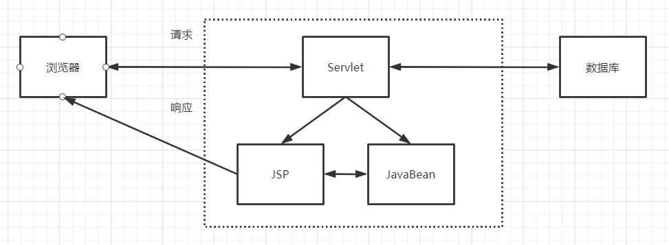

## 前言

​	记录我学习 SpringMVC 中的知识点，问题，流程等，不能一定保证正确。

## SpringMVC介绍

​	SpringMVC 就是使用 Spring 实现的 MVC（废话），哪什么是 MVC 呢？

### MVC 架构

​	JavaWeb的经历了Model1、Model1二代、Model2三个时期。

​	Model1是JavaWeb早期的模型，服务器端只有JSP页面，所有的操作都在JSP页面中，连访问数据库的API也在JSP页面中完成。也就是说，所有的东西都耦合在一起。


​	Model1第二代有所改进，把业务逻辑的内容放到了JavaBean中，而JSP页面负责显示以及请求调度的工作。虽然第二代比第一代好了些，但还让JSP做了过多的工作，JSP中把视图工作和请求调度（控制器）的工作耦合在一起了。


​	Model1的优点是架构简单，比较适合小型项目开发，而缺点是所有的东西都耦合在一起，对后期的维护和扩展极为不利。

​	Model2设计模式，把一个Web软件项目分成三层，包括视图层、控制层、模型层。这样的分层思想，不仅提高的代码的重用率、项目的扩展性，而且大大降低了项目的维护成本。此外，Model2设计模式的这种分层思想，在逻辑上相当的清晰，易被人们接受，而且便于开发人员的分工合作，因此，大大提升了开发效率。

Model2中的三层结构：

​    视图层：包括JSP、HTML、CSS、JavaScript、图片等；

​    控制层：由Servlet构成；

​    模型层：由JavaBean构成(包括DAO等)。



那 SpringMVC 的结构是什么样子的呢？

MVC，即 Model 模型、View 视图，及 Controller 控制器。

- View：视图，为用户提供使用界面，与用户直接进行交互。
- Model：模型，承载数据，并对用户提交请求进行计算的模块。其分为两类：
   一类称为数据承载 Bean：实体类，专门用户承载业务数据的，如 Student、User 等
   一类称为业务处理 Bean：指 Service 或 Dao 对象，专门用于处理用户提交请求的。
- Controller：控制器，用于将用户请求转发给相应的 Model 进行处理，并根据 Model 的计算结果向用户提供相应响应。

MVC 架构程序的工作流程：
 （1）用户通过 View 页面向服务端提出请求，可以是表单请求、超链接请求、AJAX 请求等
 （2）服务端 Controller 控制器接收到请求后对请求进行解析，找到相应的 Model 对用户请求进行处理
 （3）Model 处理后，将处理结果再交给 Controller
 （4）Controller 在接到处理结果后，根据处理结果找到要作为向客户端发回的响应 View 页面。页面经渲染（数据填充）后，再发送给客户端。

SpringMVC具体流程：


## SpringMVC 配置相关

​	保存一下 SpringMVC 所需要的依赖，刚学，容易忘

```xml
<dependencies>
    <!-- SrpingMVC 支持主要依赖 -->
    <dependency>
        <groupId>org.springframework</groupId>
        <artifactId>spring-webmvc</artifactId>
        <version>5.2.12.RELEASE</version>
    </dependency>
	
    <!-- 测试功能用 -->
    <dependency>
        <groupId>junit</groupId>
        <artifactId>junit</artifactId>
        <version>4.12</version>
    </dependency>

    <!-- Servlet 三件套 -->
    <dependency>
        <groupId>javax.servlet</groupId>
        <artifactId>servlet-api</artifactId>
        <version>2.5</version>
    </dependency>
    <dependency>
        <groupId>javax.servlet.jsp</groupId>
        <artifactId>jsp-api</artifactId>
        <version>2.2</version>
    </dependency>
    <dependency>
        <groupId>javax.servlet</groupId>
        <artifactId>jstl</artifactId>
        <version>1.2</version>
    </dependency>
</dependencies>
```

​	SpringMVC 配置文件

```xml
<?xml version="1.0" encoding="UTF-8"?>
<beans xmlns="http://www.springframework.org/schema/beans"
       xmlns:xsi="http://www.w3.org/2001/XMLSchema-instance"
       xsi:schemaLocation="http://www.springframework.org/schema/beans
       http://www.springframework.org/schema/beans/spring-beans.xsd">

    <!-- 处理器映射器 -->
    <bean class="org.springframework.web.servlet.handler.BeanNameUrlHandlerMapping"/>
    <!-- 处理器适配器 -->
    <bean class="org.springframework.web.servlet.mvc.SimpleControllerHandlerAdapter"/>
    <!-- 视图解析器 -->
    <bean class="org.springframework.web.servlet.view.InternalResourceViewResolver" id = "ViewResolver">
        <!-- 前缀配置 -->
        <property name="prefix" value="/WEB-INF/jsp/"/>
        <!-- 后缀配置 -->
        <property name="suffix" value=".jsp"/>
    </bean>

    <!-- 将对应的控制器注册 -->
    <bean id="/Hello" class="com.jeislu.controller.Hello"/>
</beans>
```

## SpringMVC 使用简单流程

之前习惯把这个流程新建一个文件来记录，以后放一起了，不然翻来翻起也麻烦。

第一步先新建一个 Maven 项目，接着把项目设置为 web 项目（我这里是个子项目，所以位置不太一样），接着把上面的依赖导入


第二步，配置 `web/WEB-INF/web.xml`，SpringMVC 默认自带了一个 Servlet ，名字叫做 DispatcherServlet ，Spring web 就是以它为核心的，暂时先配置它就可以了，配置和 Servlet 基本一致，具体看配置文件

```xml
<?xml version="1.0" encoding="UTF-8"?>
<web-app xmlns="http://xmlns.jcp.org/xml/ns/javaee"
         xmlns:xsi="http://www.w3.org/2001/XMLSchema-instance"
         xsi:schemaLocation="http://xmlns.jcp.org/xml/ns/javaee http://xmlns.jcp.org/xml/ns/javaee/web-app_4_0.xsd"
         version="4.0">
    <servlet>
        <servlet-name>springmvc</servlet-name>
        <servlet-class>org.springframework.web.servlet.DispatcherServlet</servlet-class>
        <!-- 关联一个 Spring 配置文件 -->
        <init-param>
            <param-name>contextConfigLocation</param-name>
            <param-value>classpath:springmvc-servlet.xml</param-value>
        </init-param>
        <!-- 启动级别 -->
        <load-on-startup>1</load-on-startup>
    </servlet>
    
    <servlet-mapping>
        <servlet-name>springmvc</servlet-name>
        <!-- /  适配所有请求，但是不适配jsp
             /* 适配所有文件，并且包括jsp    -->
        <url-pattern>/</url-pattern>
    </servlet-mapping>
</web-app>
```

第三步，在 `src/main/resources` 目录下新建一个 Spring 配置文件，也就是上面 Servlet 关联的位置。

​	这个配置文件需要配置三个东西，分别是处理器映射器，处理器适配器以及视图解析器。还需要注册对应的控制器。

```xml
<?xml version="1.0" encoding="UTF-8"?>
<beans xmlns="http://www.springframework.org/schema/beans"
       xmlns:xsi="http://www.w3.org/2001/XMLSchema-instance"
       xsi:schemaLocation="http://www.springframework.org/schema/beans
       http://www.springframework.org/schema/beans/spring-beans.xsd">

    <!-- 处理器映射器 -->
    <bean class="org.springframework.web.servlet.handler.BeanNameUrlHandlerMapping"/>
    <!-- 处理器适配器 -->
    <bean class="org.springframework.web.servlet.mvc.SimpleControllerHandlerAdapter"/>
    <!-- 视图解析器 -->
    <bean class="org.springframework.web.servlet.view.InternalResourceViewResolver" id = "ViewResolver">
        <property name="prefix" value="/WEB-INF/jsp/"/>
        <property name="suffix" value=".jsp"/>
    </bean>

    <!-- 将对应的控制器注册 -->
    <bean id="/Hello" class="com.jeislu.controller.Hello"/>
</beans>
```

第四步，到这一步配置方面的就基本完成了，可以写一个 Controller 和一个页面测试一下了，新建一个 Controller 和 JSP 页面

​	HelloController（**记得在 Spring 配置文件中注册**），HelloController 需要继承一个 Controller 来表明自身是一个控制器，继承完需要重写一个方法，作为执行方法，做完操作之后需要返回一个 ModelAndView 对象，这个对象用来存储数据以及需要转发的下一个视图。

```java
package com.jeislu.controller;

import org.springframework.web.servlet.ModelAndView;
import org.springframework.web.servlet.mvc.Controller;

import javax.servlet.http.HttpServletRequest;
import javax.servlet.http.HttpServletResponse;

public class HelloController implements Controller {
    public ModelAndView handleRequest(HttpServletRequest request, HttpServletResponse response) throws Exception {
        ModelAndView mav = new ModelAndView();

        // 往 Model 中添加数据，使用键值对的形式存储
        mav.addObject("msg","Hello SpringMVC");
        // 添加视图名称
        mav.setViewName("Hello");
        return mav;
    }
}
```

 	JSP 页面（我保存在 `web/WEB-INF/jsp/Hello.jsp`）：

```jsp
<%--
  Created by IntelliJ IDEA.
  User: Jeislu
  Date: 2021/3/11
  Time: 20:22
  To change this template use File | Settings | File Templates.
--%>
<%@ page contentType="text/html;charset=UTF-8" language="java" %>
<html>
<head>
    <title>Title</title>
</head>
<body>
    <!-- 取出从 HelloController 中存储的数据-->
    ${msg}
</body>
</html>

```

解释流程：

​	因为我们在 Spring 中配置 Controller 的响应路径是 `/Hello` ，当我们开启服务后，从浏览器中输入 `localhost:8080/Hello` 的时候，会先被 DispatcherServlet 这个前端控制器拦住，然后和映射器和适配器联合工作，发现是转发给 HelloController 的。

​	然后就调用 HelloControll 的 handleRequest 来响应，该方法返回了一个 ModelAndView ，里面存储了一个 Map（msg ：Hello SpringMVC） 以及一个视图名称（Hello）。

​	返回这个的这个 ModelAndView 会被视图解析器处理，里面存储的视图名字会加上在视图解析器中配置的前缀以及后缀（Hello -> /WEB-INF/jsp/Hello.jsp)，然后通过处理器的路径去寻找对应的 jsp 页面，再返回给浏览器。

​	整个流程配合上面 SringMVC 具体流程那张图来理解。

但是这样配置下来，还是很麻烦，所以 SpringMVC 引入了注解配置来简化开发。

## SpringMVC 的注解开发

​	不使用注解开发一整个流程还是太麻烦了，接下来介绍如何使用注解进行开发。

​	首先需要在 Spring 中加个配置，使得 Spring 回去扫描该路径下是否存在 @Controller，@Service，@Repository，@Component，会将这四个注解的类注册成对应的 bean

```xml
<context:component-scan base-package="com.jeislu.controller"/>
```

​	然后配置，防止 SpringMVC 处理静态资源，比如 .css .js .mp4 格式的资源

```xml
<!-- 跳过静态资源 -->
<mvc:default-servlet-handler/>
```

​	然后再配置一个驱动，注解驱动，使得访问路径和方法可以通过注释配置

```xml
<mvc:annotation-driven />
```

​	接下来介绍一下，Controller 的改造。

​	首先，不需要再继承 Controller 类然后重写方法了，可以通过在类上标识一个 @Controller 来声明，然后通过返回值来返回视图名，可以在方法参数里面添加 Model 对象来传递数据，也可以出入 req，resp 这两个对象。然后使用 @RequestMapping 来标识映射的路径。

```java
@Controller
public class Hello{

    @RequestMapping("/hello")
    public String hello(Model model){
        // 往 Model 中添加数据，使用键值对的形式存储
        model.addAttribute("msg","Hello SpringMVC");
        // 添加视图名称

        return "Hello";
    }
}
```

​	@Controller 类下面的所有方法返回的字符串都会被视图解析器拦截解析，如果指向返回普通的字符串，可以在方法上面加上一个 @ResponseBody，这样就不会被视图解析器拦截解析了。也可以使用 @RestController 这样，该类下面所有的方法都不会被视图解析器拦截解析。

​	@RequestMapping 有一些变体形式，例如 @GetMapping 表示只接受 Get 请求，@PostMapping 表示只接受 Post请求。这些标签也可以用在类上面，表示父级目录。

​	使用注解开发不仅可以减少配置，而且你可以在一个类里面配置很多个 Controller，只要映射到不同的路径即可，如果使用继承的方法，就得用很多个类在分别实现。

​	这里再介绍一个注解 @RequestParam() 可以给变量取个别名，我们可以通过在方法的参数列表里面加入和前端数据相同名字的变量来获取前端的数据，但是如果和前端不一致怎么办？可以通过这个 @RequestParam() 来起别名（和 Mybatis 里面的 @Param 一样），也可以间接表示，这个变量用于接收前端的数据。

## SpringMVC 的一些其他操作

### 视图

​	我们一般通过 Controller 返回的视图名称是通过转发的，这是默认方法，我们也可以声明为重定向

```java
return "redirect:www.baidu.com";
```

## SpringMVC 的坑

### 1. 404

404 出现的情况太多了，这里说几个容易出现的：

​	如果检查什么都没有错，但是访问页面出现 404，那可能是输出文件中缺少了依赖。

​	检查项目的 Artifacts 中是否存在 lib 目录（存放依赖）


​	我这个是处理过的，所以存在，如果存在的话，看看是不是缺包了，添加进去。如果没有，就新建一个 lib 目录，然后点击上面的 + 号，往 lib 里面添加依赖


如果主页都打不开，直接 404，那可能是在配置 DispatcherServlet 的时候，映射目录写成了 /*，改成 / 就好了。i

### 2. 乱码

​	输入不乱码，后面拿到乱码，配置过滤器解决

```xml
<filter>
    <filter-name>encodingFilter</filter-name>
    <filter-class>org.springframework.web.filter.CharacterEncodingFilter</filter-class>
    <init-param>
        <param-name>encoding</param-name>
        <param-value>utf-8</param-value>
    </init-param>
</filter>
<filter-mapping>
    <filter-name>encodingFilter</filter-name>
    <url-pattern>/*</url-pattern>
</filter-mapping>
```

