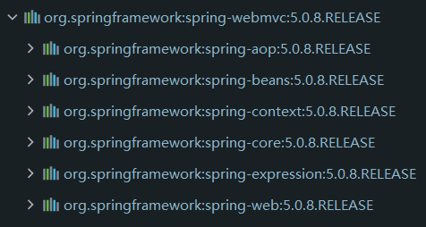

## 前言

​	介绍在一个工程中使用 Spring 进行开发的大致流程。

## 1 准备工作

​	创建一个 Maven 工程，导入相应的 jar 包。

​	需要代入的 jar 包有一下几个

### 1.1 spring-webmvc（必须）

​	会导入Spring MVC 框架相关的所有类，如下图所示



​	导入代码 ( 比较高版本 ) ：

```xml
<dependency>
    <groupId>org.springframework</groupId>
    <artifactId>spring-webmvc</artifactId>
    <version>5.0.8.RELEASE</version>
</dependency>
```

### 1.2 junit（**可选**）

​	提供测试功能

​	导入代码

```xml
<dependency>
    <groupId>junit</groupId>
    <artifactId>junit</artifactId>
    <version>4.12</version>
    <!--作用范围仅在测试时候使用-->
    <scope>test</scope>
</dependency>
```

### 1.3 Lombok（可选）

​	提供更加方便快捷的代码编写

​	导入代码

```xml
<dependency>
    <groupId>org.projectlombok</groupId>
    <artifactId>lombok</artifactId>
    <version>1.18.12</version>
</dependency>
```

### 1.4 spring-jdbc (可选)

​	提供对 JDBC 相关功能的支持，虽是可选，其实应该是必须，如果用到和数据库相关

## 2 编写 POJO 类

​	编写实体类，这里创建一个学生类，具体信息见代码

```java
package com.jeislu.pojo;

import lombok.AllArgsConstructor;
import lombok.Data;
import lombok.NoArgsConstructor;

@AllArgsConstructor
@NoArgsConstructor
@Data
public class Student {
    private String name;
    private int age;
    private String sex;

    public void study(){
        System.out.println(age + "岁的" + name + "正在学习");
    }
}
```

## 3 编写 Spring 配置文件

> 这一步可以使用其他的来代替，例如使用 Java 进行配置，不过这里不讨论

​	将项目内的 POJO 类 配置到文件中

```xml
<?xml version="1.0" encoding="UTF-8"?>
<beans xmlns="http://www.springframework.org/schema/beans"
       xmlns:xsi="http://www.w3.org/2001/XMLSchema-instance"
       xsi:schemaLocation="http://www.springframework.org/schema/beans
       http://www.springframework.org/schema/beans/spring-beans.xsd">
    
    <bean id="student" class="com.jeislu.pojo.Student">
        <property name="age" value="10"/>
        <property name="name" value="老王"/>
        <property name="sex" value="女"/>
    </bean>

</beans>
```

## 4. 编写测试类进行测试

​	这一步就没什么好说的，就是测试自己上面是否有哪里出问题了。

​	我的测试代码如下

```java
public class StudentTest {
    @Test
    public void studentTest(){
        // 获得 Spring 的上下文对象
        ApplicationContext context = new ClassPathXmlApplicationContext("beans.xml");
        // 通过配置文件中配置的POJO类的ID，取出对应的对象
        Student student = context.getBean("student", Student.class);
        student.study();
    }
}
```

​	程序运行结果有几行红字，一开始吓到我了，结果发现是提示信息

```
二月 26, 2021 3:06:21 下午 org.springframework.context.support.AbstractApplicationContext prepareRefresh
信息: Refreshing org.springframework.context.support.ClassPathXmlApplicationContext@5c0369c4: startup date [Fri Feb 26 15:06:21 CST 2021]; root of context hierarchy
二月 26, 2021 3:06:21 下午 org.springframework.beans.factory.xml.XmlBeanDefinitionReader loadBeanDefinitions
信息: Loading XML bean definitions from class path resource [beans.xml]
10岁的老王正在学习
```

## 总结

​	流程其实挺简单的，就是该导的包导进去，然后将所有的 POJO 类交给 Spring管理，需要的时候去 Spring 里面取就可以了

