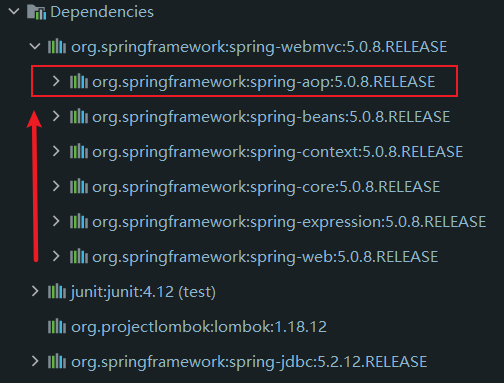
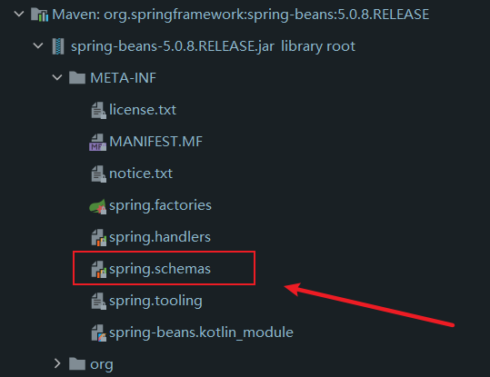

## 前言

​	Spring 的学习总记录。

​	文章中可能会出现错误的内容，在一边写一边实践的时候，有些东西和我想的不太一样，因此我不能肯定前面的一定是对的，不过大体上是对的应该没问题。

## 1 Spring

​	Spring框架是针对 **bean 的生命周期**进行管理的轻量级容器，是一个轻量级的**控制反转（IOC）**和 **面向切面编程（AOP）**的框架。

## 2 控制反转（IOC）

​	控制反转，其实主要理解什么被反转就可以了。

​	正常的设计中，各个对象之间相互协调，相互合作来实现业务逻辑，如下图所示


​	而在IOC中，引入了一个容器，各对象之间不再直接关联，而是通过容器来协调，如下图所示


​	引入 IOC 容器之前，如果 A 想使用 B，需要自己去创建一个 B，这时候 A 来直接控制 B 的创建。

​	而引入 IOC 容器以后，如果 A 想使用 B，去和 IOC 容器拿就可以了，这时候控制权反转了，B 的创建被 IOC 容器控制，由 IOC 容器创建 B 然后注入到 A 需要用到 B 的地方。

​	控制反转主要的功能就是，减少程序间的耦合度，它来控制对象的创建，然后在将控制的对象注入到所需的地方。也就是由 Spring 来创建、管理、装配对象。

## 3 依赖注入（DI）

​	依赖注入是实现控制反转的一种主要方式。

​	在 Spring 中，依赖注入有三种实现方式，分别是 构造器注入、Set注入、扩展方式注入。

### 3.1 构造器注入

​	所谓构造器注入，就是通过类的有参构造方法来将值注入到属性中，也就是这种方法必须要求对应类有对应的有参构造方法。

​	这里有几种配置的方式，第一种是通过下标来配置，假如我们的类如下

```java
public class Student {
    private String name;
    private int age;
    private String sex;

    public Student(String name,int age){
        this.name = name;
        this.age = age;
    }

    public void study(){
        System.out.println(age + "岁的" + name + "正在学习");
    }
}
```

​	则在 Spring 中的配置如下：

```xml
<bean id="student" class="com.jeislu.pojo.Student">
    <constructor-arg index="0" value="老钱"/>
    <constructor-arg index="1" value="20"/>
</bean>
```

​	这里面的下标就是形参的位置，很好理解吧。

​	那如果是有两个有参构造方法，都是两个参数，那么怎么办呢？例如下面这种情况

```java
public class Student {
    private String name;
    private int age;
    private String sex;

    public Student(int age,String sex){
        this.age = age;
        this.sex = sex;
    }

    public Student(String name,int age){
        this.name = name;
        this.age = age;
    }

    public void study(){
        System.out.println(age + "岁的" + name + "正在学习");
    }
}
```

​	这种情况，虽然都是两个参数，但是由于 age 是 int 的，所以会智能的选择第二个。

```
Student(name=老钱, age=20, sex=null)
```

​	那假如是下面这种情况呢

```java
public class Student {
    private String name;
    private int age;
    private String sex;
    private String love;

    public Student(String name,String sex){
        this.name = name;
        this.sex = sex;
    }

    public Student(String name,int age){
        this.age = age;
        this.name = name;
    }

    public void study(){
        System.out.println(age + "岁的" + name + "正在学习");
    }
}
```

​	这种情况，由于两个都适配，则Spring会默认选择第一个

```
Student(name=老钱, age=0, sex=20)
```

​	如果有这种情况，那么还是选择使用其他方式注入吧

​	第二种则是通过变量名注入，我们使用变量名来解决上面那个问题吧

​	配置如下

```xml
<bean id="student" class="com.jeislu.pojo.Student">
    <constructor-arg name="age" value="18"/>
    <constructor-arg name="name" value="务实"/>
</bean>
```

​	需要说的是，这里的 name 对应的是构造方法里面的形参变量名，必须一致，否则会报错。

​	配置完的运行结果为

```
Student(name=务实, age=18, sex=null)
```

​	第三种方法，则是通过类型注入，配置如下

```xml
<bean id="student" class="com.jeislu.pojo.Student">
    <!--type记得写全-->
    <constructor-arg type="java.lang.String" value="老王"/>
    <constructor-arg type="java.lang.String" value="男"/>
</bean>
```

​	注意，这里面是两个 String ，先配置的会注入到第一个参数里面。

​	这就是构造器注入的几种方式，一般来说，最常使用的是通过形参名注入，这种可以比较好的防范很多问题，依据具体情况使用即可。

### 3.2 Set注入

​	Set注入就是通过 Set 方法将值注入，其实和构造器区别不大，就是通过的方法不一样而已。还是使用上面那个类，由于我使用了 Lombok 所以没有看到我的 set 方法，这里发一遍不使用 Lombok。

```java
@NoArgsConstructor
public class Student {
    private String name;
    private int age;
    private String sex;

    public Student(String name,String sex){
        this.name = name;
        this.sex = sex;
    }

    public Student(String name,int age){
        this.age = age;
        this.name = name;
    }

    @Override
    public String toString() {
        return "Student{" +
                "name='" + name + '\'' +
                ", age=" + age +
                ", sex='" + sex + '\'' +
                '}';
    }

    public String getName() {
        return name;
    }

    public void setName(String name) {
        this.name = name;
    }

    public int getAge() {
        return age;
    }

    public void setAge(int age) {
        this.age = age;
    }

    public String getSex() {
        return sex;
    }

    public void setSex(String sex) {
        this.sex = sex;
    }
}
```

​	配置文件如下：

```xml
<bean id="student" class="com.jeislu.pojo.Student">
    <property name="age" value="19"/>
</bean>
```

​	输出：

```
Student{name='null', age=19, sex='null'}
```

​	不过有两个个注意点。

​	第一，在不使用构造器注入的时候，必须有无参构造器，因为 Spring 在创建 bean 的时候，默认就是调用类的无参构造方法（我上面看起来好像没有无参构造，其实上面那个@NoArgsConstructor帮我创建了一个无参了），否则会报错，错误如下：

> org.springframework.beans.factory.BeanCreationException: Error creating bean with name 'student' defined in class path resource [beans.xml]: Instantiation of bean failed; nested exception is org.springframework.beans.BeanInstantiationException: Failed to instantiate [com.jeislu.pojo.Student]: No default constructor found; nested exception is java.lang.NoSuchMethodException: com.jeislu.pojo.Student.< init >()

​	第二，set 方法名别乱改，一般我们的习惯是将属性名字大写然后在前面加个get，也就是 getAge()，如果你硬要改，会报错，错误如下(省略一些错误)：

> org.springframework.beans.factory.BeanCreationException: Error creating bean with name 'student' defined in class path resource [beans.xml]: Error setting property values; nested exception is org.springframework.beans.NotWritablePropertyException: Invalid property 'age' of bean class [com.jeislu.pojo.Student]: Bean property 'age' is not writable or has an invalid setter method. Did you mean 'aage', or 'name'?

### 3.3 扩展方式注入

​	 扩展方式其实也是上面那两种，只不过用了更加简洁的语法而已，这里介绍一下 p 命名空间（property）注入 和 c 命名空间（constructor-args）注入

​	注意，无论是使用哪个，都需要编辑配置 XML 来提供支持

​	如果使用 p 命名空间，那么需要加入这一行在 XML 中 `xmlns:p="http://www.springframework.org/schema/p"`，如果是使用 c 命名空间，那么需要加入`xmlns:p="http://www.springframework.org/schema/c"`，下面给出加入 p 命名空间 以及 c 命名空间的配置文件

```xml
<?xml version="1.0" encoding="UTF-8"?>
<beans xmlns="http://www.springframework.org/schema/beans"
       xmlns:xsi="http://www.w3.org/2001/XMLSchema-instance"
       xmlns:p="http://www.springframework.org/schema/p"
       xmlns:c="http://www.springframework.org/schema/c"
       xsi:schemaLocation="http://www.springframework.org/schema/beans
       http://www.springframework.org/schema/beans/spring-beans.xsd">
</beans>
```

​	p 命名空间的使用很简单，其实就是把`< property name="age" value="19"/ >`这个配置缩减罢了，原配置如下：

```xml
<bean id="student" class="com.jeislu.pojo.Student">
    <property name="age" value="19"/>
</bean>
```

​	使用 p 命名空间的配置如下：

```xml
<bean id="student" class="com.jeislu.pojo.Student" p:age="19"/>
```

​	c 命名空间同理，不过是用来替代构造器注入的，原配置如下

```xml
<bean id="student" class="com.jeislu.pojo.Student">
    <constructor-arg name="age" value="19"/>
    <constructor-arg name="name" value="老王"/>
</bean>
```

​	使用 c 命名空间的配置如下：

```xml
<bean id="student" class="com.jeislu.pojo.Student" c:age="19" c:name="老王"/>
```

​	不过 c 命名空间的东西稍微多了一个下标注入，就是原版本的缩减代码版本，理解就行

### 3.4 复杂注入

​	那问题来了，如果对象的属性是一个类、一个数组、一个集合或者一个 Map呢，那要怎么注入呢？

​	其实也不麻烦，一个一个说。

​	类的话，先给这个类创建一个Bean，然后将这个 Bean 注入到对应属性即可，相关类如下

```java
package com.jeislu.pojo;

import lombok.AllArgsConstructor;
import lombok.Data;
import lombok.NoArgsConstructor;
import lombok.ToString;

@NoArgsConstructor
@AllArgsConstructor
@Data
@ToString
public class Student {
    private String name;
    private int age;
    private String sex;
    private Book loveBook;
}
```

```java
package com.jeislu.pojo;

import lombok.AllArgsConstructor;
import lombok.Data;
import lombok.NoArgsConstructor;

@AllArgsConstructor
@NoArgsConstructor
@Data
public class Book {
    private String bookName;
}
```

​	上面两个类使用 Lombok，以后将不贴上 Lombok 注释和导入包信息	

​	相应的配置如下：

```xml
<bean id="student" class="com.jeislu.pojo.Student">
    <constructor-arg name="age" value="19"/>
    <constructor-arg name="name" value="老王"/>
    <constructor-arg name="sex" value="男"/>
    <!--将bean注入-->
    <constructor-arg name="loveBook" ref="wangLoveBook"/>
</bean>

<!-- 给对应类创建一个bean-->
<bean id="wangLoveBook" class="com.jeislu.pojo.Book">
    <property name="bookName" value="活着"/>
</bean>
```

​	如果注入的是数组的话，则改变一下注入写法即可，基础类型或者映射类型可以直接写在 constructor-arg 标签中，如果是复杂类型的话，则需要写在标签里面（有点绕，看代码）

​	POJO类：

```java
public class Student {
    private String name;
    private int age;
    private String sex;
    private String[] loveBook;
}
```

​	注入配置

```xml
<bean id="student" class="com.jeislu.pojo.Student">
    <constructor-arg name="age" value="19"/>
    <constructor-arg name="name" value="老王"/>
    <constructor-arg name="sex" value="男"/>
    <constructor-arg name="loveBook">
        <array>
            <value>活着</value>
            <value>许三观卖血记</value>
        </array>
    </constructor-arg>
</bean>
```

​	在 constructor-arg 里面加上一个 array 标签，然后使用 value 标签写上需要的注入的值即可

​	集合（List，set）类似，将上面书的类型从数组修改成集合，两者的配置分别如下

```xml
<bean id="student" class="com.jeislu.pojo.Student">
    <constructor-arg name="age" value="19"/>
    <constructor-arg name="name" value="老王"/>
    <constructor-arg name="sex" value="男"/>
    <constructor-arg name="loveBook">
        <list>
            <value>活着</value>
            <value>许三观卖血记</value>
        </list>
    </constructor-arg>
</bean>
```

```xml
    <bean id="student" class="com.jeislu.pojo.Student">
        <constructor-arg name="age" value="19"/>
        <constructor-arg name="name" value="老王"/>
        <constructor-arg name="sex" value="男"/>
        <constructor-arg name="loveBook">
            <set>
                <value>活着</value>
                <value>许三观卖血记</value>
            </set>
        </constructor-arg>
    </bean>
```

​	是的，就是将 array 标签换成 list 或者 set 即可，因为这两者就是特殊的数组

​	如果注入的是 Map 则稍微麻烦一点，如果需要注入的类如下所示

```java
public class Student {
    private String name;
    private int age;
    private String sex;
    private Map<String,String> love;
}
```

​	则注入配置如下：

```xml
<bean id="student" class="com.jeislu.pojo.Student">
    <constructor-arg name="age" value="19"/>
    <constructor-arg name="name" value="老王"/>
    <constructor-arg name="sex" value="男"/>
    <constructor-arg name="love">
        <map>
            <entry key="书籍" value="活着"/>
            <entry key="水果" value="芒果"/>
            <entry key="动漫" value="齐木楠雄"/>
        </map>
    </constructor-arg>
</bean>
```

​	还有一个 properties ，properties 的配置和 Map 和相似，但是有不一样的地方，配置如下所示

```xml
<bean id="student" class="com.jeislu.pojo.Student">
    <constructor-arg name="age" value="19"/>
    <constructor-arg name="name" value="老王"/>
    <constructor-arg name="sex" value="男"/>
    <constructor-arg name="love">
        <props>
            <prop key="书籍">活着</prop>
            <prop key="水果">芒果</prop>
            <prop key="动漫">齐木楠雄</prop>
        </props>
    </constructor-arg>
</bean>
```

​	Map 的键值对是在写标签中的，而 properties 是被标签包裹的，这是一个注意点

​	还有一个比较特殊的，null，用于赋空值，继续用上面那个例子，配置如下

```xml
<bean id="student" class="com.jeislu.pojo.Student">
    <constructor-arg name="age" value="19"/>
    <constructor-arg name="name" value="老王"/>
    <constructor-arg name="sex" value="男"/>
    <constructor-arg name="love">
        <null/>
    </constructor-arg>
</bean>
```

## 4 bean的作用域

​	在创建 bean 的时候，可以使用 scope 来设置 bean 的作用域，一共能设置五个值，不过有三个值只能在 web 开发中使用

​	第一个值是 singleton，单例，也是默认值，配置这个属性，从 Spring 容器中取出来的同一个 bean 都是同一个对象

​	第二个值是 prototype，原型，配置这个属性，每一次从 Spring 容器中取出来的同一个 bean 都是不同的，当你取出来的时候，都是一个新的 bean 。

​	后面三个分别是 session、application、websocket ，这三个分别是 bean 在 web 开发中的作用域。

## 5 自动装配

​	自动装配是让 Spring 在上下文中自动帮 bean 注入属性（非基本类型）。

### 5.1 在 xml 中显性配置

 	在配置 bean 的时候，给 bean 配置一个 autowire 属性，autowire 有几种类型，下面一一介绍

​	首先是 `autowire = "byName"`这种方法，顾名思义，就是通过名字来匹配，当配置这个属性的时候，Spring 将在上下文中寻找 id 和类 set 方法后面名字一样的 bean，并将其自动装配。听起来有点绕，看代码很容易理解。

​	假如我们有如下三个三个类

```java
public class Student {
    private People lovePeople;
    private Book loveBook;

    public void setLovePeople(People lovePeople) {
        this.lovePeople = lovePeople;
    }

    public void setLoveBook(Book loveBook) {
        this.loveBook = loveBook;
    }
}
```

```java
public class People {
    private String name;
}
```

```java
public class Book {
    private String bookName;
}
```

​	在 Spring 的配置文件中如下配置：

```xml
<bean id="student" class="com.jeislu.pojo.Student" autowire="byName"/>

<bean id="lovePeople" class="com.jeislu.pojo.People" c:name="小红"/>
<bean id="loveBook" class="com.jeislu.pojo.Book" c:bookName="活着"/>
```

​	那么 Spring 将会自动配置 student 的 两个属性 lovePeople 和 loveBook，会去寻找 id 和 Student 类中的 Set 方法后面名字一样的bean，也就是`setLovePeople`和`setLoveBook` 后面的名字，也就是 lovePeople 和 loveBook。这时候发现有两个 id 是一致的 bean 就将其配置过去。

​	这里有一些问题，`setLovePeople`后面的名字不应该是 LovePeople 吗？首字母怎么小写了，这就是约定了，在 Spring 中有很多遵从规范的规定。

​	在 Java 编程中有很多约定俗成的习惯，驼峰原则就是其中之一，首单词首字母小写，接下去的单词首字母大写，例如 love people（塑料英语，见谅），整合成一个变量名就是 lovePeople。Get 和 Set 方法也是如此，所以原本小写的 l 在方法中就变成大写的 L，Spring 在寻找的时候，会自动将其转变回来，也就是变成 lovePeople。

​	这时候可能会有人会问，那要是 id 是大写怎么办，也就是如下配置

```xml
<bean id="student" class="com.jeislu.pojo.Student" autowire="byName"/>

<bean id="LovePeople" class="com.jeislu.pojo.People" c:name="小红"/>
<bean id="LoveBook" class="com.jeislu.pojo.Book" c:bookName="活着"/>
```

​	答案是，自动配置失败

```pro
Student(LovePeople=null, LoveBook=null)
```

​	其实在依赖注入里面也有这个约定的体现，这是一个注意点，编程要规范！

​	接下来是`autowire = "byType"`这种配置，这样配置的话，Spring 会在上下文中寻找 bean 类型和类属性一致的 bean 装配。Spring 配置如下：

```xml
<bean id="student" class="com.jeislu.pojo.Student" autowire="byType"/>

<bean id="11111" class="com.jeislu.pojo.People" c:name="小红"/>
<bean id="22222" class="com.jeislu.pojo.Book" c:bookName="活着"/>
```

​	这时候 id 是什么就不关键了，只要类型一致就可以。不过这种问题也很明显，如果有两个类型的 bean 怎么办？例如下面这种情况

```xml
<bean id="student" class="com.jeislu.pojo.Student" autowire="byType"/>

<bean id="11111" class="com.jeislu.pojo.People" c:name="小红"/>
<bean id="11112" class="com.jeislu.pojo.People" c:name="小蓝"/>
<bean id="22222" class="com.jeislu.pojo.Book" c:bookName="活着"/>
```

​	会直接报错！

> org.springframework.beans.factory.UnsatisfiedDependencyException: Error creating bean with name 'student' defined in class path resource [beans.xml]: Unsatisfied dependency expressed through bean property 'lovePeople'; nested exception is org.springframework.beans.factory.NoUniqueBeanDefinitionException: No qualifying bean of type 'com.jeislu.pojo.People' available: expected single matching bean but found 2: 11111,11112

​	所以使用的时候需要注意一下。

### 5.2 使用注解进行配置

​	可以直接在类的属性上添加注解来实现自动装配，不过使用注解进行自动装配需要进行一些配置，需要在配置文件头添加一个约束以及使用一个标签开启全局自动装配，添加完约束的配置文件如下：

```xml
<?xml version="1.0" encoding="UTF-8"?>
<beans xmlns="http://www.springframework.org/schema/beans"
       xmlns:xsi="http://www.w3.org/2001/XMLSchema-instance"
       xmlns:context="http://www.springframework.org/schema/context"
       xsi:schemaLocation="http://www.springframework.org/schema/beans
       http://www.springframework.org/schema/beans/spring-beans.xsd
       http://www.springframework.org/schema/context
       http://www.springframework.org/schema/context/spring-context.xsd">

    <!--开启注解支持-->
    <context:annotation-config/>
</beans>
```

​	其中 beans 标签中 context 三行就是新添加的，`<context:annotation-config/>`也是新添加的。

​	在配置结束后，我们就可以使用注解进行自动装配了，在类中使用注解完成自动装配的代码如下：

```java
public class Student {
    // 在属性上加上 Autowire 注解实现自动装配
    @Autowired
    private People lovePeople;
    @Autowired
    private Book loveBook;

    public void setLovePeople(People lovePeople) {
        this.lovePeople = lovePeople;
    }

    public void setLoveBook(Book loveBook) {
        this.loveBook = loveBook;
    }
}
```

​	注解默认是 byName 方式来实现自动装配，但是如果找不到 id 和变量名一致的，也会 byType 进行查找，需要注意的是，注解的自动装配，不依赖 Set 方法，哪怕没有 Set 方法也可以实现自动装配。

​	和 @Autowire 注解一起的使用的还有另一个 @Qualifier(value = " ")，这个可以直接指定装配和 value 值一样 id 的 bean，就不用要求 bean 的 id 和变量名一致了。

```java
public class Student {
    // 在属性上加上 Autowire 注解实现自动装配
    @Autowired
    @Qualifier(value = "11")
    private People lovePeople;
    @Autowired
    private Book loveBook;

    public void setLovePeople(People lovePeople) {
        this.lovePeople = lovePeople;
    }

    public void setLoveBook(Book loveBook) {
        this.loveBook = loveBook;
    }
}
```

```xml
<bean id="student" class="com.jeislu.pojo.Student"/>

<bean id="11" class="com.jeislu.pojo.People" c:name="小红"/>
<bean id="lovePeople" class="com.jeislu.pojo.People" c:name="小红"/>
<bean id="loveBook" class="com.jeislu.pojo.Book" c:bookName="活着"/>
```

​	运行结果

```
Student(lovePeople=People(name=小红), loveBook=Book(bookName=活着))
```

​	上面这两个注解是 Spring 的，还有一个 Java自带的 @Resource，也可以实现和 @Autowire 一样的功能，而且他自带了 @Qualifier 的功能，和 @Qualifier 一样，在后面给 name 传一个值即可。

```java
public class Student {
    @Resource(name = "11")
    private People lovePeople;
    @Resource
    private Book loveBook;

    public void setLovePeople(People lovePeople) {
        this.lovePeople = lovePeople;
    }

    public void setLoveBook(Book loveBook) {
        this.loveBook = loveBook;
    }
}
```

​	运行结果和上面一样！

​	@Autowire 和 @Resource 都是优先使用 byName 的，其次才是 byType。

## 6 使用注解进行开发

​	使用注解进行开发是 Spring 较为重要的一个内容，注解可以减少代码量，更加快捷方便的进行开发

​	需要注意的是，使用注解进行开发需要导入依赖包并且开启注解支持（在上面已经有使用过），不过我们在准备工作导入的 spring-webmvc 包里面已经包含了，所需的包如下图：



​	有了依赖包以后，需要在配置文件中设置，配置如下

```xml
<?xml version="1.0" encoding="UTF-8"?>
<beans xmlns="http://www.springframework.org/schema/beans"
       xmlns:xsi="http://www.w3.org/2001/XMLSchema-instance"
       xmlns:context="http://www.springframework.org/schema/context"
       xsi:schemaLocation="http://www.springframework.org/schema/beans
       http://www.springframework.org/schema/beans/spring-beans.xsd
       http://www.springframework.org/schema/context
       http://www.springframework.org/schema/context/spring-context.xsd">
    
    <!--开启注解支持-->
    <context:annotation-config/>

</beans>
```

​	下面来一一介绍常用的注解。

​	第一个是 @Component ，功能是将类注册成一个 bean，等价于在配置文件中使用 bean 标签进行注册，示例：

```java
@Component
public class Student {
    private String name = "张三";
}
```

​	不在配置文件中配置，也可以从容器中拿出该类的 bean。还有三个注解是相同功能的，不过用在不同的层次，分别是 @Repository 用于 dao 层，@Service 用于 service 层，@Controller 用于 controller 层，都是将某个类注册到 Spring 中，装配 Bean。

​	注意，使用 @Component 这一类的注解之前，需要先在配置中开启 Component 扫描

```xml
<?xml version="1.0" encoding="UTF-8"?>
<beans xmlns="http://www.springframework.org/schema/beans"
       xmlns:xsi="http://www.w3.org/2001/XMLSchema-instance"
       xmlns:context="http://www.springframework.org/schema/context"
       xsi:schemaLocation="http://www.springframework.org/schema/beans
       http://www.springframework.org/schema/beans/spring-beans.xsd
       http://www.springframework.org/schema/context
       http://www.springframework.org/schema/context/spring-context.xsd">

    <!-- 开启 bean 扫描，会将对应包下面带类似 @Component 注解的类都注册为 bean -->
    <context:component-scan base-package="com.jeislu.pojo"/>
    <!--开启注解支持-->
    <context:annotation-config/>

</beans>
```

​	第二个是 @Value，用于给属性注入值，用于替代配置 bean 标签里面的 < constructor-arg > 以及 < property >来给属性注入值，示例如下

```java
@Component
public class Student {
    @Value("李四")
    private String name;
}
```

​	这就将李四赋值给了 name，而且注释的话，不依赖 Set 方法和构造方法。

​	第三个是 @Scope，用于指定 bean 的作用域，用法都一样，看例子就可以了

```java
@Component
@Scope(value = "prototype")
public class Student {
    @Value("李四")
    private String name;
}
```

​	这里指定为原型模式。

## 7 使用 Java 进行配置开发

​	使用 Java 进行 bean 的配置，这样的话，就不需要额外创建一个 XML 配置文件了。

​	使用 Java 类进行配置开发的话，需要搭配使用上面的注解才可以。

​	首先，创建一个 Java 类，然后使用 @Configuration 将其注册为一个配置类，然后我们就可以在这个配置类里面配置了。

```java
@Configuration
public class MyConfig {
}
```

​	其次，将每一个需要配置的 bean 使用 Get  方法返回，然后在该方法上注上 @Bean，这里的 @Bean 就类似于 < bean > ，其中方法名是 id ，返回值是 class。

```java
@Configuration
public class MyConfig {

    @Bean
    public Student getStudent(){
        return new Student();
    }
}
```

```java
public class Student {
    private String name;
}
```

​	接着，不再使用 XML 创建 Spring 容器（上下文对象），而是通过该配置类来创建，在获取 bean 的时候，注册对应 bean 的方法名就是 “ id ”

```java
@Test
public void studentTest(){
    // 获得 Spring 的上下文对象
    ApplicationContext context = new AnnotationConfigApplicationContext(MyConfig.class);
    // 通过配置类中配置方法的方法名，拿出对应的对象
    Student student = context.getBean("getStudent", Student.class);
    System.out.println(student);
}
```

​	如果不想一个一个 bean 的配置，例如像配置文件中，使用 @Component 和 < context:component-scan > 的组合，自动配置 bean，Java 配置类也可以实现。

​	类上的不变，还是加上 @Component 注解，然后在 Java 配置类上，使用 @ComponentScan 注解，给注解的 basePackages 传入需要扫描的地址即可

```java
@Configuration
@ComponentScan(basePackages = "com.jeislu.pojo")
public class MyConfig {

}
```

​	使用这种方法，那么对应 bean 的 id 就是类名，记得驼峰原则，首字母小写！

```java
@Test
public void studentTest(){
    ApplicationContext context = new AnnotationConfigApplicationContext(MyConfig.class);
    Student student = context.getBean("student", Student.class);
    System.out.println(student);
}
```

​	运行结果

```
Student(name=赵奇)
```

​	如果有多个 Java 配置文件，和 XML 配置类似，使用一个 @Import 注释，将对应配置类的 class 传进去即可

```java
@Import(MyConfig2.class)
```


## Spring注意事项以及问题

### .1 Spring 的大致流程


### .2 配置文件头的 https 的问题

​	在使用注解开发的时候，程序的运行效率大大降低，每一次运行都要好久，我一开始以为是注解开发的效率较低，而且程序时不时还运行出问题，报错如下：

> org.xml.sax.SAXParseException; lineNumber: 11; columnNumber: 61; schema_reference.4: 无法读取方案文档 'https://www.springframework.org/schema/context/spring-context.xsd', 原因为 1) 无法找到文档; 2) 无法读取文档; 3) 文档的根元素不是 <xsd:schema>。

​	而且这不是一定发生的，有时候就运行成功，有时候就运行报错，明明是基本相同的代码。然后我就去找原因了，一番查阅下来，发现是配置文件出了问题，在配置注解功能的时候，http 被我配置成了 https，也就是下面这种情况:

```xml
<!-- 问题配置 -->
<beans xmlns="http://www.springframework.org/schema/beans"
       xmlns:xsi="http://www.w3.org/2001/XMLSchema-instance"
       xmlns:context="http://www.springframework.org/schema/context"
       xsi:schemaLocation="http://www.springframework.org/schema/beans
       http://www.springframework.org/schema/beans/spring-beans.xsd
       http://www.springframework.org/schema/context
       https://www.springframework.org/schema/context/spring-context.xsd">
    
<!-- 正确配置 -->
<beans xmlns="http://www.springframework.org/schema/beans"
       xmlns:xsi="http://www.w3.org/2001/XMLSchema-instance"
       xmlns:context="http://www.springframework.org/schema/context"
       xsi:schemaLocation="http://www.springframework.org/schema/beans
       http://www.springframework.org/schema/beans/spring-beans.xsd
       http://www.springframework.org/schema/context
       http://www.springframework.org/schema/context/spring-context.xsd">
```

​	在 org.springframework:spring-context:5.0.8.RELEASE 这个包的 META-INF/spring.schemas 中有相关的设置



​	在对比我的内容和他以后，我发现我多了一个 s ，就是因为这个 s ，所以出现了上面那些问题，把 s 删掉，不会报错，运行速度也正常了。

### .3 如何合并多个配置文件

​	很简单，在配置文件中使用 < import > 标签即可将其他配置文件整合进来