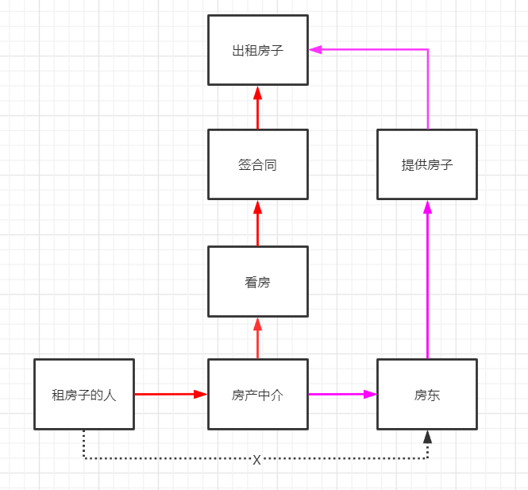
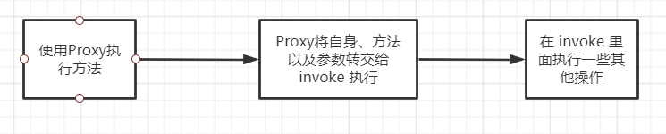

## 前言

​	代理模式是设计模式中的一种，在学习 Spring 的时候，进一步了解了这个模式，所以记录一下

<!-- more -->

## 简介

​	代理模式，言简意赅的说，就是保持原有东西不变的情况下，“ 委托 ” 其他人来做一些事，举个简单的例子

​	一般来说，房东有房子，住房的人需要租房子，那么房东把房子租给租房的人就可以了。

​	但是，房东很懒，他只想提供房子，不想和住房的人打交道，很麻烦，这时候他就把他的房子都交给中介去打理，中介再把钱给他就行了。

​	这时候房东就只负责提供房子，看房子，签合同的工作就交给了中介去完成，这就是一种代理模式。



​	使用代理模式的优点就是，在不改变原有代码的情况下，增加了功能，而且起到了隔离作用。

​	代理模式有很多实现方式，根据**代理创建的时期**来区分的话，有两种，分别是**静态代理**和**动态代理**。

## 静态代理

​	所谓静态代理，就是在运行之前，代理类就已经存在。

### 静态代理的流程

​	以上面的例子为模板，

​	首先创建一个接口

```java
public interface FangDong {
    void rentHouse();
}
```

​	接着，创建一个接口实现类

```java
public class FangDongImpl implements FangDong{
    public void rentHouse() {
        System.out.println("出租房子！");
    }
}
```

​	接着创建一个代理

```java
public class FangDongDaiLi  implements FangDong{

    private FangDong fd;

    public FangDongDaiLi(FangDong fd){
        this.fd = fd;
    }

    public void rentHouse() {
        System.out.println("参观房子");
        System.out.println("签署合同");
        fd.rentHouse();
    }
}
```

​	以后租房子的人直接和代理打交道即可，看测试类

```java
public class FangDongtest {
    public static void main(String[] args) {
        FangDong wang = new FangDongImpl();
        FangDongDaiLi zhang = new FangDongDaiLi(wang);

        zhang.rentHouse();
    }
}
```

​	输出结果

```java
参观房子
签署合同
出租房子！
```

### 静态代理的缺点

​	静态代理的缺点也很明显，要为每一个被代理的对象创建一个代理类，这样子引起了代码量增加，而且很多时候代理类的功能都是类似的（这个后面说），也就是存在很多重复代码。因此，引入了动态代理。

## 动态代理

​	动态代理是利用 Java  的反射机制来实现的，在程序运行的时候，动态的进行代理。

​	动态代理有很多种实现方式，这里使用的是基于接口的JDK动态代理（我目前也只会这一种）

### 动态代理的流程

​	动态代理主要就是代理类的不同，让我们用动态代理的方法重新编写一下代理类。

​	在编写动态代理类之前，需要先知道两个东西，分别是`Proxy` 和 `InvocationHandler`。

​	Proxy 常用其静态方法 `newProxyInstance()`来生成一个代理对象，方法的原型如下

```java
public static Object newProxyInstance(ClassLoader loader, Class<?>[] interfaces, InvocationHandler h)
```

​	第一个是类加载器，可以通过 `this.getClass().getClassLoader()`来获得。

​	第二个是被代理对象实现的接口，可以通过`代理类.getClass().getInterfaces()`来获取

​	第三个是实现了 InvocationHandler 接口的对象，一般是 this。

​	InvocationHandler 则主要是 invoke 方法，用于代理对象调用方法的时候，将其转发给 invoke 执行。

​	好了，我们来编写一个动态代理类

```java
import java.lang.reflect.InvocationHandler;
import java.lang.reflect.Method;
import java.lang.reflect.Proxy;

public class FangDongHandle implements InvocationHandler {

    // 被代理的接口（后续会改进）
    FangDong fd;

    public FangDongHandle(FangDong fd){
        this.fd = fd;
    }

    // 得到代理类
    public Object getProxy(){
        return Proxy.newProxyInstance(this.getClass().getClassLoader(),fd.getClass().getInterfaces(),this);
    }


    public Object invoke(Object proxy, Method method, Object[] args) throws Throwable {

        System.out.println("参观房子");
        System.out.println("签署合同");
        Object result = method.invoke(fd, args);
        return result;

    }
}
```

​	然后我们尝试在测试类中使用

```java
public class FangDongtest {
    public static void main(String[] args) {
        FangDongImpl wang = new FangDongImpl();
        // 将 wang 设置为代理对象
        FangDongHandle fangDongHandle = new FangDongHandle(wang);
        // 获取代理对象
        FangDong proxy = (FangDong) fangDongHandle.getProxy();
        proxy.rentHouse();
    }
}
```

​	执行结果

```
参观房子
签署合同
出租房子！
```

### 梳理一下动态代理

​	我们来梳理一下在执行动态代理的时候，究竟是怎么样的流程，也就如何获得通过代理对象来执行方法。

​	在构建代理对象 Proxy 的时候，会传入三个值，类加载器，代理类实现的接口以及一个实现了 InvocationHandler 的类，其中第三个较为关键，也就是使用代理类执行方法的时候，会将方法转发给这个实现了 InvocationHandler 的 invoke（）方法进行执行。

​	这个 invoke 方法的三个参数是 `Object proxy`, `Method method`, `Object[] args`，代理对象，执行的方法，执行方法的参数。只需要通过 `method.invoke()`来执行原方法，在这之前或者之后我们可以添加一个其他的操作。



### 动态代理的进一步改进

​	不需要规定是什么样的接口，因为动态代理可以在运行的时候确定，所以完全可以将其改进为一个工具类

```java
public class FangDongHandle implements InvocationHandler {

    // 被代理的接口（后续会改进）
    Object target;

    public FangDongHandle(Object target){
        this.target = target;
    }

    // 得到代理类
    public Object getProxy(){
        return Proxy.newProxyInstance(this.getClass().getClassLoader(),target.getClass().getInterfaces(),this);
    }


    public Object invoke(Object proxy, Method method, Object[] args) throws Throwable {

        // 执行方法前的操作
        Object result = method.invoke(target, args);
        // 执行方法后的操作

        return result;

    }
}
```

​	根据情况修改 invoke 即可

## 代理模式究竟在做什么（个人）

​	可以看出代理模式做的应该是一些针对大群体的共同增强操作。

​	我个人觉得，代理模式应该是来做打印日志这一类的功能，实在是想不到还能干吗了，单独为某类方法执行某种增强？没有在实际项目中接触到，还是不怎么能理解。