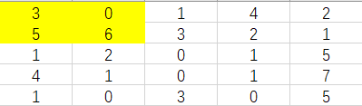
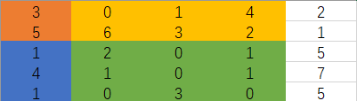

## 前言

​	之前每日一题的markdown文件不知道哪去了，只能重新开始写，以后记得备份文件！

​	记录本人力扣每日一题的思路，如果日期后面有补字，则代表当天忘了做，后面补上的

<!-- more -->

​	本来想弄个目录的，但是 Typora 自动生成目录又会带上题目、思路和代码这样的小题目，而且单一个日期好像也没什么用，想了想还是算了，毕竟如果要自己手动维护一个目录很麻烦，而且如果真的想针对性的找什么内容，使用`Ctrl + f`就可以直接搜索了。

2021/1/29

​	感觉最近重心又偏了，坚持做题是为了保持一个状态，最近在做题上花费的时间有点多，而且补题也是，我是为了保持状态而去做题，而不是必须完成每日一题。时间要放在更迫切的地方上面。

2021/2/1

​	最近重心放在其他事情上面，在做题上花费的心思会变少

2021/3/2

​	突然觉得新做的题应该放在前面才对，以后就放前面了

2021/3/14

​	我觉得我题做少了，格局小了。。。

## 2021/3/27

### 题目

61. [旋转链表](https://leetcode-cn.com/problems/rotate-list/)

难度中等474收藏分享切换为英文接收动态反馈

给你一个链表的头节点 `head` ，旋转链表，将链表每个节点向右移动 `k` 个位置。

**示例 1：**


```
输入：head = [1,2,3,4,5], k = 2
输出：[4,5,1,2,3]
```

**示例 2：**


```
输入：head = [0,1,2], k = 4
输出：[2,0,1]
```

 

**提示：**

- 链表中节点的数目在范围 `[0, 500]` 内
- `-100 <= Node.val <= 100`
- `0 <= k <= 2 * 109`

### 思路

​	需要注意一下，这里 k 的取值是可能大于链表长度的，如果不大于的话，可以少去一步计算长度，大于的话，需要先把链表长度计算出来，然后将 k 的大小缩减到长度之内。

​	以实例1为例子，链表长度为5，k 为 2，以为着倒数第 k 个节点，也就是第二个节点会变成头结点，那么我们遍历到这个节点的前一个 pre 即可，然后将 pre 的 next 指向 null，然后将原来的尾结点指向头指针，这里的尾节点可以在找到 pre 的时候继续往后走找到，也可以在一开始计算长度的时候保存。

### 代码

```java
public ListNode rotateRight(ListNode head, int k) {
    // 如果长度为0或者不需要移动直接返回
    if(head == null || k == 0 ){
        return head;
    }

    int len = 1;
    ListNode endNode = new ListNode();
    // 计算出长度,并且保存尾部
    while(endNode.next != null){
        endNode = endNode.next;
        len++;
    }

    // 将 k 的值控制在长度以内
    k %= len;
    // 剪枝，计算完还是长度的整数倍意味着没变
    if(k == 0){
        return head;
    }
    // 计算要改变的节点
    k = len - k;
    ListNode change = head;
    while(--k > 0){
        change = change.next;
    }

    // 改变节点变成尾部
    ListNode ans = change.next;
    change.next = null;
    endNode.next = head;

    return ans;
}
```

## 2021/3/26

### 题目

[83. 删除排序链表中的重复元素](https://leetcode-cn.com/problems/remove-duplicates-from-sorted-list/)

难度简单543收藏分享切换为英文接收动态反馈

存在一个按升序排列的链表，给你这个链表的头节点 `head` ，请你删除所有重复的元素，使每个元素 **只出现一次** 。

返回同样按升序排列的结果链表。

 

**示例 1：**


```
输入：head = [1,1,2]
输出：[1,2]
```

**示例 2：**


```
输入：head = [1,1,2,3,3]
输出：[1,2,3]
```

 

**提示：**

- 链表中节点数目在范围 `[0, 300]` 内
- `-100 <= Node.val <= 100`
- 题目数据保证链表已经按升序排列

### 思路

​	这道题比起昨天的就比较简单了，可以站在当前节点看下一个节点，如果相同则跳过该节点，直到不同或者没有下一个节点，则走向下一个。

### 代码

```java
public ListNode deleteDuplicates(ListNode head) {
    // 无节点
    if(head == null){
        return head;
    }

    // 保存头结点
    ListNode ans = head;

    while(head.next != null){
        if(head.next.val == head.val){
            // 删除下一个节点
            head.next = head.next.next;
        }else{
            head = head.next;
        }
    }

    return ans;
}
```

## 2021/3/25

### 题目

[82. 删除排序链表中的重复元素 II](https://leetcode-cn.com/problems/remove-duplicates-from-sorted-list-ii/)

难度中等543收藏分享切换为英文接收动态反馈

存在一个按升序排列的链表，给你这个链表的头节点 `head` ，请你删除链表中所有存在数字重复情况的节点，只保留原始链表中 **没有重复出现** 的数字。

返回同样按升序排列的结果链表。

 

**示例 1：**


```
输入：head = [1,2,3,3,4,4,5]
输出：[1,2,5]
```

**示例 2：**


```
输入：head = [1,1,1,2,3]
输出：[2,3]
```

 

**提示：**

- 链表中节点数目在范围 `[0, 300]` 内
- `-100 <= Node.val <= 100`
- 题目数据保证链表已经按升序排列

### 思路

​	如果链表为空就直接返回，否则先给 head 再创建一个前结点 pre。

​	需要保证 head 以及 head.next 都不为空

- head 走一步，通过 pre 判断 pre.next 和 head 的值是否相等
  - 如果相等，head 一直往后走，直到值不等或者自身为空
    - 然后 pre 指向此时的 head，等于跳过了所有重复的
  - 如果不等，pre = pre.next

### 代码

```java
public ListNode deleteDuplicates(ListNode head) {
    if(head == null){
        return head;
    }
    // 当前节点的下一个节点
    ListNode pre = new ListNode();
    ListNode ans = pre;
    pre.next = head;

    while(head != null && head.next != null){
        head = head.next;
        // 出现相同，开始删除
        if(pre.next.val == head.val){
            while(head != null && pre.next.val == head.val){
                head = head.next;
            }
            // 直接跳过这些相同的
            pre.next = head;
        }else{
            pre = pre.next;
        }
    }

    return ans.next;
}
```


## 2021/3/24

### 题目

[456. 132模式](https://leetcode-cn.com/problems/132-pattern/)

难度中等302收藏分享切换为英文接收动态反馈

给定一个整数序列：a1, a2, ..., an，一个132模式的子序列 a**i**, a**j**, a**k** 被定义为：当 **i** < **j** < **k** 时，a**i** < a**k** < a**j**。设计一个算法，当给定有 n 个数字的序列时，验证这个序列中是否含有132模式的子序列。

**注意：**n 的值小于15000。

**示例1:**

```
输入: [1, 2, 3, 4]

输出: False

解释: 序列中不存在132模式的子序列。
```

**示例 2:**

```
输入: [3, 1, 4, 2]

输出: True

解释: 序列中有 1 个132模式的子序列： [1, 4, 2].
```

**示例 3:**

```
输入: [-1, 3, 2, 0]

输出: True

解释: 序列中有 3 个132模式的的子序列: [-1, 3, 2], [-1, 3, 0] 和 [-1, 2, 0].
```

### 思路

​	固定1，遍历3，找出2（1 2 3 是指大小关系）。

​	从头遍历到尾，以 3 为遍历点，1 可以通过保存左边最小的值求出，2 的话可以通过将右侧所有值保存在 TreeMap 里面，然后根据当前的 1 来求出最符合的 2，也就是 Map 里面比 1 大的最小数，接着判断 2 和 3 的大小关系，如果 3 大于 2，则返回 true。

​	上面这种解法运行完发现效率不是那么好，也是，因为涉及频繁的 Map 更新。然后就在别人的提交里面又找了一份时间消耗比较良好的。思路如下：

- 存储每个位置的最小值，例如 a[ i ]表示 0 - i 里面的最小值。
- 维护一个栈，用于保存可能的 2 
- 然后从尾想前遍历
  - 如果当前数比前面的最小值大，则将栈里面比最小值要小的数弹出栈，直到栈空或者栈顶元素大于最小值，然后比较栈顶元素和当前数的大小，满足条件返回 True，否则将当前值压入栈

​	说起来好像有点玄乎，其实看代码还好理解。

### 代码

​	解法1：

```java
class Solution {
    public boolean find132pattern(int[] nums) {
        int n = nums.length;
        if (n < 3) {
            return false;
        }

        // 左侧最小值
        int leftMin = nums[0];
        // 右侧所有元素
        TreeMap<Integer, Integer> rightAll = new TreeMap<Integer, Integer>();

        // 将右侧所有元素存入 Map
        for (int k = 2; k < n; ++k) {
            rightAll.put(nums[k], rightAll.getOrDefault(nums[k], 0) + 1);
        }

        for (int j = 1; j < n - 1; ++j) {
            if (leftMin < nums[j]) {
                // 找出比 左侧最小值 大的最小数
                Integer next = rightAll.ceilingKey(leftMin + 1);
                // 如果这个值小于当前值，则表示满足条件
                if (next != null && next < nums[j]) {
                    return true;
                }
            }
            // 更新左侧最小值
            leftMin = Math.min(leftMin, nums[j]);
            // 更新右侧所有值，将下一个位置的值弹出来，也就是 - 1，因为数量可能不止一个
            rightAll.put(nums[j + 1], rightAll.get(nums[j + 1]) - 1);
            // 如果数量已经归零，则删除这个 key
            if (rightAll.get(nums[j + 1]) == 0) {
                rightAll.remove(nums[j + 1]);
            }
        }

        return false;
    }
}
```

解法2：

```java
class Solution {
    public boolean find132pattern(int[] nums) {
        // 保存最小值
        int[] preMin = new int[nums.length];
        preMin[0] = nums[0];
        // 计算每个位置的最小值
        for (int i = 1; i < nums.length; ++i) {
            preMin[i] = Math.min(nums[i], preMin[i - 1]);
        }
        
        // 栈，用于保存 2 的数据
        int[] stack = new int[nums.length];
        int stackIndex = 0;
        // 从尾到头遍历
        for (int i = nums.length - 1; i > 0; --i) {
            // 当前值大于最小值
            if (nums[i] > preMin[i]) {
                // 弹出栈中所有小于等于最小值的数，因为最小值随着推进只可能递增，栈中的数只要比最小值小，则代表不可能使用到
                while (stackIndex > 0 && stack[stackIndex - 1] <= preMin[i]) {
                    --stackIndex;
                }
                // 如果弹完栈中还有元素，则判断该元素和当前元素的大小关系
                if (stackIndex > 0 && stack[stackIndex - 1] < nums[i]) {
                    return true;
                }
                // 将当前元素压入栈
                stack[stackIndex++] = nums[i];
            }
        }
        return false;
    }
}
```


## 2021/3/23

### 题目

[341. 扁平化嵌套列表迭代器](https://leetcode-cn.com/problems/flatten-nested-list-iterator/)

难度中等215收藏分享切换为英文接收动态反馈

给你一个嵌套的整型列表。请你设计一个迭代器，使其能够遍历这个整型列表中的所有整数。

列表中的每一项或者为一个整数，或者是另一个列表。其中列表的元素也可能是整数或是其他列表。

 

**示例 1:**

```
输入: [[1,1],2,[1,1]]
输出: [1,1,2,1,1]
解释: 通过重复调用 next 直到 hasNext 返回 false，next 返回的元素的顺序应该是: [1,1,2,1,1]。
```

**示例 2:**

```
输入: [1,[4,[6]]]
输出: [1,4,6]
解释: 通过重复调用 next 直到 hasNext 返回 false，next 返回的元素的顺序应该是: [1,4,6]。
```

### 思路

​	使用栈进行存储迭代器。

- 如果迭代器指向的下一个为整数，则创建一个 list ，将它存储回去，接着再把迭代器存入主数据里面
- 如果指向的是一个集合，则存回这个集合的迭代器

​	但是这种方法其实效率比较低，因为你遇到数字还需要创建一个迭代器只指向这个数字，这种行为效率很低。

​	有一个效率比较高的方法，就是使用深搜。深搜步骤如下：

- 使用一个集合存储所有数据
- 遍历当前迭代器
  - 如果指向的是数字，则存入集合
  - 如果是集合，则再调用自己
- 直到遍历完，这样就把里面所有的数据拿出来了

​	这种方法虽然效率高，但是不符合迭代器的思想，迭代器不应该自己去处理数据，它应该只是一个游标一样的东西。

​	深搜也不难，这里就不写了。

### 代码

```java
import java.util.ArrayList;
import java.util.Iterator;
import java.util.List;
import java.util.Stack;

public class LC341 implements Iterator<Integer> {
    /*
        用栈来保存数据，如果下一个数据是集合，就获得它的迭代器，然后存入
                     如果下一个是数字，则直接返回
     */

    // 保存遍历器
    Stack<Iterator<NestedInteger>> data;


    public LC341(List<NestedInteger> nestedList) {
        data = new Stack<>();
        data.add(nestedList.iterator());
    }

    @Override
    public Integer next() {
        // 调用 next 之前会先调用 hasNext，所以直接返回栈顶的值
        return data.peek().next().getInteger();
    }

    @Override
    public boolean hasNext() {
        while(!data.isEmpty()){
            Iterator<NestedInteger> now = data.peek();
            // 该遍历器到尾了，弹出
            if(!now.hasNext()){
                data.pop();
                continue;
            }
            // 取出当前的值
            NestedInteger nest = now.next();
            // 如果是数字
            if(nest.isInteger()){
                // 创建一个List，然后将其 Iterator存入
                List<NestedInteger> temp = new ArrayList<>();
                temp.add(nest);
                // 栈中压入它的迭代器
                data.push(temp.iterator());
                return true;
            }
            // 是集合
            data.push(nest.getList().iterator());
        }
        return false;
    }
}

interface NestedInteger {
    // @return true if this NestedInteger holds a single integer, rather than a nested list.
    public boolean isInteger();

    // @return the single integer that this NestedInteger holds, if it holds a single integer
    // Return null if this NestedInteger holds a nested list
    public Integer getInteger();

    // @return the nested list that this NestedInteger holds, if it holds a nested list
    // Return null if this NestedInteger holds a single integer
    public List<NestedInteger> getList();
}
```


## 2021/3/22

### 题目

​	[191. 位1的个数](https://leetcode-cn.com/problems/number-of-1-bits/)

难度简单275收藏分享切换为英文接收动态反馈

编写一个函数，输入是一个无符号整数（以二进制串的形式），返回其二进制表达式中数字位数为 '1' 的个数（也被称为[汉明重量](https://baike.baidu.com/item/汉明重量)）。

 

**提示：**

- 请注意，在某些语言（如 Java）中，没有无符号整数类型。在这种情况下，输入和输出都将被指定为有符号整数类型，并且不应影响您的实现，因为无论整数是有符号的还是无符号的，其内部的二进制表示形式都是相同的。
- 在 Java 中，编译器使用[二进制补码](https://baike.baidu.com/item/二进制补码/5295284)记法来表示有符号整数。因此，在上面的 **示例 3** 中，输入表示有符号整数 `-3`。

 

**示例 1：**

```
输入：00000000000000000000000000001011
输出：3
解释：输入的二进制串 00000000000000000000000000001011 中，共有三位为 '1'。
```

**示例 2：**

```
输入：00000000000000000000000010000000
输出：1
解释：输入的二进制串 00000000000000000000000010000000 中，共有一位为 '1'。
```

**示例 3：**

```
输入：11111111111111111111111111111101
输出：31
解释：输入的二进制串 11111111111111111111111111111101 中，共有 31 位为 '1'。
```

**提示：**

- 输入必须是长度为 `32` 的 **二进制串** 。 

**进阶**：

- 如果多次调用这个函数，你将如何优化你的算法？

### 思路

​	使用位操作， n &= (n-1) 每一次会消去最后面的1，计算这个等式使用的次数即可判断出有多少个 1 。

​	当然，使用位操作也行，判断 n 的最后一位数，然后将 n 向右位移。

### 代码

```java
public int hammingWeight(int n) {
    int count = 0;
    while(n != 0){
        n &= (n-1);
        count++;
    }

    return count;
}
```

## 2021/3/21

### 题目

[73. 矩阵置零](https://leetcode-cn.com/problems/set-matrix-zeroes/)

难度中等413收藏分享切换为英文接收动态反馈

给定一个 `*m* x *n*` 的矩阵，如果一个元素为 **0** ，则将其所在行和列的所有元素都设为 **0** 。请使用 **[原地](http://baike.baidu.com/item/原地算法)** 算法**。**

**进阶：**

- 一个直观的解决方案是使用  `O(*m**n*)` 的额外空间，但这并不是一个好的解决方案。
- 一个简单的改进方案是使用 `O(*m* + *n*)` 的额外空间，但这仍然不是最好的解决方案。
- 你能想出一个仅使用常量空间的解决方案吗？

**示例 1：**


```
输入：matrix = [[1,1,1],[1,0,1],[1,1,1]]
输出：[[1,0,1],[0,0,0],[1,0,1]]
```

**示例 2：**


```
输入：matrix = [[0,1,2,0],[3,4,5,2],[1,3,1,5]]
输出：[[0,0,0,0],[0,4,5,0],[0,3,1,0]]
```

**提示：**

- `m == matrix.length`
- `n == matrix[0].length`
- `1 <= m, n <= 200`
- `-231 <= matrix[i][j] <= 231 - 1`

### 思路

​	如果不要求空间复杂度为 O(n+m) ，那么还是挺简单的，找两个标识数组分别来保存行和列的情况，遍历完以后，根据两个标识数组来将某行某列归零。

​	空间复杂度为常数的话，则需要使用数组自身来记录也就是使用第一行第一列来充当上面的两个标识数组，不过需要额外使用两个变量来保存第一行和第一列的情况，然后遍历下面的。

### 代码

```java
class Solution {
    public void setZeroes(int[][] matrix) {
        int m = matrix.length, n = matrix[0].length;
        boolean flagCol0 = false, flagRow0 = false;
        for (int i = 0; i < m; i++) {
            if (matrix[i][0] == 0) {
                flagCol0 = true;
            }
        }
        for (int j = 0; j < n; j++) {
            if (matrix[0][j] == 0) {
                flagRow0 = true;
            }
        }
        for (int i = 1; i < m; i++) {
            for (int j = 1; j < n; j++) {
                if (matrix[i][j] == 0) {
                    matrix[i][0] = matrix[0][j] = 0;
                }
            }
        }
        for (int i = 1; i < m; i++) {
            for (int j = 1; j < n; j++) {
                if (matrix[i][0] == 0 || matrix[0][j] == 0) {
                    matrix[i][j] = 0;
                }
            }
        }
        if (flagCol0) {
            for (int i = 0; i < m; i++) {
                matrix[i][0] = 0;
            }
        }
        if (flagRow0) {
            for (int j = 0; j < n; j++) {
                matrix[0][j] = 0;
            }
        }
    }
}
```

### 题目

[300. 最长递增子序列](https://leetcode-cn.com/problems/longest-increasing-subsequence/)

难度中等1455收藏分享切换为英文接收动态反馈

给你一个整数数组 `nums` ，找到其中最长严格递增子序列的长度。

子序列是由数组派生而来的序列，删除（或不删除）数组中的元素而不改变其余元素的顺序。例如，`[3,6,2,7]` 是数组 `[0,3,1,6,2,2,7]` 的子序列。

**示例 1：**

```
输入：nums = [10,9,2,5,3,7,101,18]
输出：4
解释：最长递增子序列是 [2,3,7,101]，因此长度为 4 。
```

**示例 2：**

```
输入：nums = [0,1,0,3,2,3]
输出：4
```

**示例 3：**

```
输入：nums = [7,7,7,7,7,7,7]
输出：1
```

 

**提示：**

- `1 <= nums.length <= 2500`
- `-104 <= nums[i] <= 104`

 

**进阶：**

- 你可以设计时间复杂度为 `O(n2)` 的解决方案吗？
- 你能将算法的时间复杂度降低到 `O(n log(n))` 吗?

### 思路

​	使用 DP 解法，`dp[i]`表示以 `num[i]` 结尾的上升子序列的长度。然后遍历每一个数，找到它前面能合并的最长子序列。

### 代码

```java
public int lengthOfLIS(int[] nums) {
    int len = nums.length;
    int[] dp = new int[len];
    Arrays.fill(dp,1);

    for(int i = 1; i < len; i++){
        for(int j = i - 1; j >= 0; j--){
            if(nums[i] > nums[j]){
                dp[i] = Math.max(dp[i],dp[j]+1);
            }
        }
    }

    return Arrays.stream(dp).max().getAsInt();
}
```

### 其他

​	今天第二道题是被别人问，不过他的题比较复杂，需要求出响应的子序列，然后长度相同还要找出字符集最小的。没在力扣找到相同的题，只找到了这道，不过根据上面的解法，他那道也是可以解的，就是复杂了一点，思路如下：

​	首先，再加一个数组来保存每个位置上一个字符的下标（保存的时候，保存字符集最小的），根据上面求出的最长子序列大小，找出所有该长度的，然后求出对应的子序列，计算大小，保存最小的。说起来简单，实际写起来应该还是有点小麻烦。

## 2021/3/20

### 题目

[150. 逆波兰表达式求值](https://leetcode-cn.com/problems/evaluate-reverse-polish-notation/)

难度中等289收藏分享切换为英文接收动态反馈

根据[ 逆波兰表示法](https://baike.baidu.com/item/逆波兰式/128437)，求表达式的值。

有效的算符包括 `+`、`-`、`*`、`/` 。每个运算对象可以是整数，也可以是另一个逆波兰表达式。

 

**说明：**

- 整数除法只保留整数部分。
- 给定逆波兰表达式总是有效的。换句话说，表达式总会得出有效数值且不存在除数为 0 的情况。

 

**示例 1：**

```
输入：tokens = ["2","1","+","3","*"]
输出：9
解释：该算式转化为常见的中缀算术表达式为：((2 + 1) * 3) = 9
```

**示例 2：**

```
输入：tokens = ["4","13","5","/","+"]
输出：6
解释：该算式转化为常见的中缀算术表达式为：(4 + (13 / 5)) = 6
```

**示例 3：**

```
输入：tokens = ["10","6","9","3","+","-11","*","/","*","17","+","5","+"]
输出：22
解释：
该算式转化为常见的中缀算术表达式为：
  ((10 * (6 / ((9 + 3) * -11))) + 17) + 5
= ((10 * (6 / (12 * -11))) + 17) + 5
= ((10 * (6 / -132)) + 17) + 5
= ((10 * 0) + 17) + 5
= (0 + 17) + 5
= 17 + 5
= 22
```

 

**提示：**

- `1 <= tokens.length <= 104`
- `tokens[i]` 要么是一个算符（`"+"`、`"-"`、`"*"` 或 `"/"`），要么是一个在范围 `[-200, 200]` 内的整数

 

**逆波兰表达式：**

逆波兰表达式是一种后缀表达式，所谓后缀就是指算符写在后面。

- 平常使用的算式则是一种中缀表达式，如 `( 1 + 2 ) * ( 3 + 4 )` 。
- 该算式的逆波兰表达式写法为 `( ( 1 2 + ) ( 3 4 + ) * )` 。

逆波兰表达式主要有以下两个优点：

- 去掉括号后表达式无歧义，上式即便写成 `1 2 + 3 4 + * `也可以依据次序计算出正确结果。
- 适合用栈操作运算：遇到数字则入栈；遇到算符则取出栈顶两个数字进行计算，并将结果压入栈中。

### 思路

​	逆波兰式也就是后缀表达式，正常的话，应该是让你前缀转后缀再计算那还好说，单纯的后缀计算挺简单的。

​	遇到数字压入栈，遇到符号弹出两个来运算，需要注意的是 - 和 / 的，先弹出来的是在后面的。

​	还有就是，这里面的数字是可以带符号的，也就是不能单纯通过第一个字符来判断，顺便判断一下长度

### 代码

```java
public int evalRPN(String[] tokens) {
    Stack<Integer> data = new Stack<>();

    for(String s : tokens){
        // 判断是不是数字
        if(s.length() > 1 || s.charAt(0) >= '0' && s.charAt(0) <= '9'){
            data.add(Integer.valueOf(s));
        }else{
            char temp = s.charAt(0);
            if(temp == '+'){
                data.add(data.pop() + data.pop());
            }else if(temp == '-'){
                data.add( - data.pop() + data.pop());
            }else if(temp == '*'){
                data.add(data.pop() * data.pop());
            }else{
                int num1 = data.pop();
                data.add(data.pop() / num1);
            }
        }
    }

    return data.peek();
}
```


## 2021/3/19

### 题目

[1603. 设计停车系统](https://leetcode-cn.com/problems/design-parking-system/)

请你给一个停车场设计一个停车系统。停车场总共有三种不同大小的车位：大，中和小，每种尺寸分别有固定数目的车位。

请你实现 `ParkingSystem` 类：

- `ParkingSystem(int big, int medium, int small)` 初始化 `ParkingSystem` 类，三个参数分别对应每种停车位的数目。
- `bool addCar(int carType)` 检查是否有 `carType` 对应的停车位。 `carType` 有三种类型：大，中，小，分别用数字 `1`， `2` 和 `3` 表示。**一辆车只能停在** `carType` 对应尺寸的停车位中。如果没有空车位，请返回 `false` ，否则将该车停入车位并返回 `true` 。

 

**示例 1：**

```
输入：
["ParkingSystem", "addCar", "addCar", "addCar", "addCar"]
[[1, 1, 0], [1], [2], [3], [1]]
输出：
[null, true, true, false, false]

解释：
ParkingSystem parkingSystem = new ParkingSystem(1, 1, 0);
parkingSystem.addCar(1); // 返回 true ，因为有 1 个空的大车位
parkingSystem.addCar(2); // 返回 true ，因为有 1 个空的中车位
parkingSystem.addCar(3); // 返回 false ，因为没有空的小车位
parkingSystem.addCar(1); // 返回 false ，因为没有空的大车位，唯一一个大车位已经被占据了
```

 

**提示：**

- `0 <= big, medium, small <= 1000`
- `carType` 取值为 `1`， `2` 或 `3`
- 最多会调用 `addCar` 函数 `1000` 次

### 思路

​	这还有什么好说的，就一个点，不存在位置的增加（车只负责进，不负责走），不要 if 判断，每一次都递减判断

### 代码

```java
public class LC1603 {
    int[] data = new int[3];

    public LC1603(int big, int medium, int small) {
        data[0] = big;
        data[1] = medium;
        data[2] = small;
    }

    public boolean addCar(int carType) {
        // 判断减完大不大于0即可，程序内部 - 1操作比判断语句快多了
        return data[carType-1]-- > 0;
    }
}
```


## 2021/3/18

### 题目

[92. 反转链表 II](https://leetcode-cn.com/problems/reverse-linked-list-ii/)

难度中等723收藏分享切换为英文接收动态反馈

反转从位置 *m* 到 *n* 的链表。请使用一趟扫描完成反转。

**说明:**
1 ≤ *m* ≤ *n* ≤ 链表长度。

**示例:**

```
输入: 1->2->3->4->5->NULL, m = 2, n = 4
输出: 1->4->3->2->5->NULL
```

### 思路

​	首先创建一个虚拟头指针，因为可能反转整个链表。

​	保存 m 节点的前一个节点 pre ，保存当前链表的下一个节点 next ，保存头指针 ans，保存 m 节点 mNode。然后遍历需要反转的区间，对每一个节点 node 做以下操作

- 保存当前节点 node 的下一个节点 next
- 当前节点的 node 下一个节点指向 pre  下一个节点
- pre 的下一个节点指向当前节点 node 

​	上面的操作每一次都将节点插到 pre 后面，但是第一个会出现自循环的时候（自己的下一个节点指向自己）。

​	但是我们上面保存了 m 节点（也就是循环的第一个节点），将循环空间后面链表接到 m 节点后面。

### 代码

```java
/**
 * Definition for singly-linked list.
 * public class ListNode {
 *     int val;
 *     ListNode next;
 *     ListNode() {}
 *     ListNode(int val) { this.val = val; }
 *     ListNode(int val, ListNode next) { this.val = val; this.next = next; }
 * }
 */
class Solution {
    public ListNode reverseBetween(ListNode head, int left, int right) {
        ListNode pre = new ListNode();
        int count = 0;
        // 新增一个头节点
        ListNode first = new ListNode();
        first.next = head;
        ListNode ans = first;
        // 保存下一个节点
        ListNode next;
        // 保存 m 节点
        ListNode mNode = new ListNode();
        // 找到要反转位置的前一个节点
        while(first != null){
            if(count == left - 1){
                pre = first;
                first = first.next;
                // 保存 m 节点
                mNode = first;
                count++;
                break;
            }
            first = first.next;
            count++;
        }
        // 将要反转的位置，一个一个插到 pre 后面
        while(first != null){
            if(count > right){
              break;
            }
            next = first.next;
            first.next = pre.next;
            pre.next = first;
            first = next;
            count++;
        }
        // 将 m 节点的后面接上 原链表
        mNode.next = first;

        return ans.next;
    }
}
```

## 2021/3/17

### 题目

[115. 不同的子序列](https://leetcode-cn.com/problems/distinct-subsequences/)

难度困难479收藏分享切换为英文接收动态反馈

给定一个字符串 `s` 和一个字符串 `t` ，计算在 `s` 的子序列中 `t` 出现的个数。

字符串的一个 **子序列** 是指，通过删除一些（也可以不删除）字符且不干扰剩余字符相对位置所组成的新字符串。（例如，`"ACE"` 是 `"ABCDE"` 的一个子序列，而 `"AEC"` 不是）

题目数据保证答案符合 32 位带符号整数范围。

 

**示例 1：**

```
输入：s = "rabbbit", t = "rabbit"
输出：3
解释：
如下图所示, 有 3 种可以从 s 中得到 "rabbit" 的方案。
(上箭头符号 ^ 表示选取的字母)
rabbbit
^^^^ ^^
rabbbit
^^ ^^^^
rabbbit
^^^ ^^^
```

**示例 2：**

```
输入：s = "babgbag", t = "bag"
输出：5
解释：
如下图所示, 有 5 种可以从 s 中得到 "bag" 的方案。 
(上箭头符号 ^ 表示选取的字母)
babgbag
^^ ^
babgbag
^^    ^
babgbag
^    ^^
babgbag
  ^  ^^
babgbag
    ^^^
```

 ### 思路

​	使用 DP 来递推出子串的重复次数，本人使用的是从后往前递归的方法。

​	`dp[i][j]`表明，字符串 S 从 i 到 末尾的子串 和 T 从 j 到末尾子串的重复次数，这里有一个注意点，这里的子串不等于 T！

​	当 i = S.length() 的时候，是空串，空串不包括任何子串（除了空串自身），这个时候，全部设置为0，当 j = T.length() 的时候，是空串，空串是任何字符串的子串，全部设置为1。

​	然后从后面的递推回来，如果当前 i ，j 指向的字符相同，那么这时候的字符串个数由两边合并得到，`dp[i+1][j+1]` + `dp[i+1][j]`，由上一次自己的个数，以及上一次上一个字符的个数的总和，有点难理解，dubug 看一遍过程比较好理解。

​	第二个则是，指向的字符不同，那么只能从上一次自己得到`dp[i+1][j]`

### 代码

```java
public int numDistinct(String s, String t) {
    int sLen = s.length();
    int tLen = t.length();

    int[][] dp = new int[sLen+1][tLen+1];
    // 初始化,dp数组默认是0，所以0就不用赋值了
    for(int i = 0; i <= sLen; i++){
        dp[i][tLen] = 1;
    }

    for(int i = sLen - 1; i >= 0; i--){
        for(int j = tLen - 1; j >= 0; j--){
            if(s.charAt(i) == t.charAt(j)){
                dp[i][j] = dp[i+1][j+1] + dp[i+1][j];
            }else{
                dp[i][j] = dp[i+1][j];
            }
        }
    }

    return dp[0][0];
}
```


**提示：**

- `0 <= s.length, t.length <= 1000`
- `s` 和 `t` 由英文字母组成

## 2021/3/16

### 题目

[59. 螺旋矩阵 II](https://leetcode-cn.com/problems/spiral-matrix-ii/)

给你一个正整数 `n` ，生成一个包含 `1` 到 `n2` 所有元素，且元素按顺时针顺序螺旋排列的 `n x n` 正方形矩阵 `matrix` 。

**示例 1：**


```
输入：n = 3
输出：[[1,2,3],[8,9,4],[7,6,5]]
```

**示例 2：**

```
输入：n = 1
输出：[[1]]
```

 

**提示：**

- `1 <= n <= 20`

### 思路

​	当使用变量维护四个边际之后，一切就变得简单多了。今天的题和昨天的基本一样，只不过从输出变成了构建。一样是绕圈，然后，使用一个变量自增即可。

### 代码

```java
public int[][] generateMatrix(int n) {
    int[][] ans = new int[n][n];
    // 使用一个变量来存储，避免每一次都要进行运算
    int count = n * n;
    // 目前的值
    int now = 1;
    // 四个边
    int left = 0;
    int right = n-1;
    int top = 0;
    int bottom = n-1;

    while(now <= count){
        // 填充上面一行
        for(int i = left; i <= right && now <= count; i++){
            ans[top][i] = now++;
        }
        top++;

        // 填充右边一行
        for(int i = top; i <= bottom && now <= count; i++){
            ans[i][right] = now++;
        }
        right--;

        // 填充下面一行
        for(int i = right; i >= left; i--){
            ans[bottom][i] = now++;
        }
        bottom--;
        // 填充左边
        for(int i = bottom; i >= top; i--){
            ans[i][left] = now++;
        }
        left++;
    }

    return ans;
}
```


## 2021/3/15

### 题目

[54. 螺旋矩阵](https://leetcode-cn.com/problems/spiral-matrix/)

给你一个 `m` 行 `n` 列的矩阵 `matrix` ，请按照 **顺时针螺旋顺序** ，返回矩阵中的所有元素。

**示例 1：**


```
输入：matrix = [[1,2,3],[4,5,6],[7,8,9]]
输出：[1,2,3,6,9,8,7,4,5]
```

**示例 2：**


```
输入：matrix = [[1,2,3,4],[5,6,7,8],[9,10,11,12]]
输出：[1,2,3,4,8,12,11,10,9,5,6,7]
```

 

**提示：**

- `m == matrix.length`
- `n == matrix[i].length`
- `1 <= m, n <= 10`
- `-100 <= matrix[i][j] <= 100`

### 思路

​	维护四个变量，分别代表上下左右，然后绕圈拿数即可

​	我以前都是靠自己脑子想，明明找个变量维护就好了，傻！

### 代码

```java
public List<Integer> spiralOrder(int[][] matrix) {
    List<Integer> ans = new LinkedList<>();
    int left = 0;
    int right = matrix[0].length-1;
    int top = 0;
    int bottom = matrix.length-1;
    // 总数
    int nums = (right+1) * (bottom+1);

    // 还没拿完
    while(nums > 0){
        // 拿上边的，记得加个判断，看看拿完了没
        for(int i = left; i <= right && nums > 0; i++){
            ans.add(matrix[top][i]);
            nums--;
        }
        top++;

        // 拿右边的
        for(int i = top; i <= bottom && nums > 0; i++){
            ans.add(matrix[i][right]);
            nums--;
        }
        right--;

        // 拿下边的
        for(int i = right; i >= left && nums > 0; i--){
            ans.add(matrix[bottom][i]);
            nums--;
        }
        bottom--;

        // 拿左边的
        for(int i = bottom; i >= top && nums > 0; i--){
            ans.add(matrix[i][left]);
            nums--;
        }
        left++;
    }

    return ans;
}
```


## 2021/3/14

### 题目

[706. 设计哈希映射](https://leetcode-cn.com/problems/design-hashmap/)

难度简单136收藏分享切换为英文接收动态反馈

不使用任何内建的哈希表库设计一个哈希映射（HashMap）。

实现 `MyHashMap` 类：

- `MyHashMap()` 用空映射初始化对象
- `void put(int key, int value)` 向 HashMap 插入一个键值对 `(key, value)` 。如果 `key` 已经存在于映射中，则更新其对应的值 `value` 。
- `int get(int key)` 返回特定的 `key` 所映射的 `value` ；如果映射中不包含 `key` 的映射，返回 `-1` 。
- `void remove(key)` 如果映射中存在 `key` 的映射，则移除 `key` 和它所对应的 `value` 。

 

**示例：**

```
输入：
["MyHashMap", "put", "put", "get", "get", "put", "get", "remove", "get"]
[[], [1, 1], [2, 2], [1], [3], [2, 1], [2], [2], [2]]
输出：
[null, null, null, 1, -1, null, 1, null, -1]

解释：
MyHashMap myHashMap = new MyHashMap();
myHashMap.put(1, 1); // myHashMap 现在为 [[1,1]]
myHashMap.put(2, 2); // myHashMap 现在为 [[1,1], [2,2]]
myHashMap.get(1);    // 返回 1 ，myHashMap 现在为 [[1,1], [2,2]]
myHashMap.get(3);    // 返回 -1（未找到），myHashMap 现在为 [[1,1], [2,2]]
myHashMap.put(2, 1); // myHashMap 现在为 [[1,1], [2,1]]（更新已有的值）
myHashMap.get(2);    // 返回 1 ，myHashMap 现在为 [[1,1], [2,1]]
myHashMap.remove(2); // 删除键为 2 的数据，myHashMap 现在为 [[1,1]]
myHashMap.get(2);    // 返回 -1（未找到），myHashMap 现在为 [[1,1]]
```

 

**提示：**

- `0 <= key, value <= 106`
- 最多调用 `104` 次 `put`、`get` 和 `remove` 方法

 

**进阶：**你能否不使用内置的 HashMap 库解决此问题？

### 思路

​	和昨天的差不多，加点东西而已

### 代码

```java
/*
    自己实现一个 HashMap，要求完成 put，get 以及 remove 三个基础功能
 */

import org.junit.Test;

public class LC706 {
    private final int LEN = 128;

    // 固定大小
    private final MyNode[] data = new MyNode[LEN];

    // Hash 算法
    private int getHash(int val){
        return (val ^ val >> 8) % LEN;
    }

    // 自定义节点
    class MyNode{
        // 自身的值，下一个节点以及上一个节点
        int key;
        int val;
        MyNode next;

        private MyNode(int key,int val){
            this.key = key;
            this.val = val;
        }
    }

    public LC706(){
        for(int i = 0; i < LEN; i++){
            // 题目限定值不会为负一，用-1作为起始节点
            data[i] = new MyNode(-1,-1);
        }
    }

    public void put(int key, int value) {
        MyNode node = data[getHash(key)];
        while(node.next != null){
            if(node.next.key == key){
                node.next.val = value;
                return;
            }
            node = node.next;
        }

        node.next = new MyNode(key,value);
    }

    public int get(int key) {
        MyNode now = data[getHash(key)];
        // 遍历查看是否存在该key
        while(now != null){
            if(now.key == key){
                return now.val;
            }
            now = now.next;
        }

        return -1;
    }

    public void remove(int key) {
        MyNode now = data[getHash(key)];
        while(now.next != null){
            if(now.next.key == key){
                now.next = now.next.next;
                return;
            }
            now = now.next;
        }
    }
}

```

## 2021/3/13

### 题目

[705. 设计哈希集合](https://leetcode-cn.com/problems/design-hashset/)

不使用任何内建的哈希表库设计一个哈希集合（HashSet）。

实现 `MyHashSet` 类：

- `void add(key)` 向哈希集合中插入值 `key` 。
- `bool contains(key)` 返回哈希集合中是否存在这个值 `key` 。
- `void remove(key)` 将给定值 `key` 从哈希集合中删除。如果哈希集合中没有这个值，什么也不做。

**示例：**

```
输入：
["MyHashSet", "add", "add", "contains", "contains", "add", "contains", "remove", "contains"]
[[], [1], [2], [1], [3], [2], [2], [2], [2]]
输出：
[null, null, null, true, false, null, true, null, false]

解释：
MyHashSet myHashSet = new MyHashSet();
myHashSet.add(1);      // set = [1]
myHashSet.add(2);      // set = [1, 2]
myHashSet.contains(1); // 返回 True
myHashSet.contains(3); // 返回 False ，（未找到）
myHashSet.add(2);      // set = [1, 2]
myHashSet.contains(2); // 返回 True
myHashSet.remove(2);   // set = [1]
myHashSet.contains(2); // 返回 False ，（已移除）
```

**提示：**

- `0 <= key <= 106`
- 最多调用 `104` 次 `add`、`remove` 和 `contains` 。

### 思路

​	由于只是简单实现，就数组加链表。

​	一开始写了一个，觉得贼复杂，特判很多，后面就给数组每一个链表设置一个头结点，然后代码就清楚多了。

​	这个实现就没什么好说的吧，挺基础的，具体看代码

### 代码

```java
class MyHashSet {
    // 数组大小,多次提交发现这个数字是这里面比较好的
    final int LEN = 888;

    // 固定大小
    private final MyNode[] data = new MyNode[LEN];

    // Hash 算法
    private int getHash(int val){
        return (val ^ val >> 8) % LEN;
    }

    // 自定义节点
    class MyNode{
        // 自身的值，下一个节点以及上一个节点
        int key;
        MyNode next;

        private MyNode(int key){
            this.key = key;
        }
    }

    public MyHashSet(){
        for(int i = 0; i < LEN; i++){
            // 题目限定值不会为负一，用-1作为起始节点
            data[i] = new MyNode(-1);
        }
    }

    public void add(int key) {
        MyNode node = data[getHash(key)];
        while(node.next != null){
            if(node.next.key == key){
                return;
            }
            node = node.next;
        }

        node.next = new MyNode(key);
    }

    public boolean contains(int key) {
        MyNode now = data[getHash(key)];
        // 遍历查看是否存在该key
        while(now != null){
            if(now.key == key){
                return true;
            }
            now = now.next;
        }

        return false;
    }

    public void remove(int key) {
        MyNode now = data[getHash(key)];
        while(now.next != null){
            if(now.next.key == key){
                now.next = now.next.next;
                return;
            }
            now = now.next;
        }
    }
}
```


## 2021/3/12

### 题目

[331. 验证二叉树的前序序列化](https://leetcode-cn.com/problems/verify-preorder-serialization-of-a-binary-tree/)

序列化二叉树的一种方法是使用前序遍历。当我们遇到一个非空节点时，我们可以记录下这个节点的值。如果它是一个空节点，我们可以使用一个标记值记录，例如 `#`。

```
     _9_
    /   \
   3     2
  / \   / \
 4   1  #  6
/ \ / \   / \
# # # #   # #
```

例如，上面的二叉树可以被序列化为字符串 `"9,3,4,#,#,1,#,#,2,#,6,#,#"`，其中 `#` 代表一个空节点。

给定一串以逗号分隔的序列，验证它是否是正确的二叉树的前序序列化。编写一个在不重构树的条件下的可行算法。

每个以逗号分隔的字符或为一个整数或为一个表示 `null` 指针的 `'#'` 。

你可以认为输入格式总是有效的，例如它永远不会包含两个连续的逗号，比如 `"1,,3"` 。

**示例 1:**

```
输入: "9,3,4,#,#,1,#,#,2,#,6,#,#"
输出: true
```

**示例 2:**

```
输入: "1,#"
输出: false
```

**示例 3:**

```
输入: "9,#,#,1"
输出: false
```

### 思路

​	由于本题使用的是前序遍历，所以可以使用占槽法，一个不为空的节点会消耗一个槽位，并带来两个新槽位，一个为空的槽位会消耗一个槽位。最后如果槽位刚好占满，则返回可以。

### 代码

```java
public boolean isValidSerialization(String preorder) {
    int nums = 1;
    int len = preorder.length();

    for(int i = 0; i < len; i++){
        char temp = preorder.charAt(i);
        if(temp == '#'){
            nums--;
            i++;
        }else{
            // 取出完整数字，最后会在 ，处停或者结尾
            while(temp >= '0' && temp <= '9'){
                if(++i >= len){
                    break;
                }
                temp = preorder.charAt(i);
            }
            nums++;
        }

        if(i != len && nums == 0){
            return false;
        }
    }

    return nums == 0;
}
```

### 题目

[面试题 17.10. 主要元素](https://leetcode-cn.com/problems/find-majority-element-lcci/)

数组中占比超过一半的元素称之为主要元素。给定一个**整数**数组，找到它的主要元素。若没有，返回-1。

**示例 1：**

```
输入：[1,2,5,9,5,9,5,5,5]
输出：5
```

 

**示例 2：**

```
输入：[3,2]
输出：-1
```

 

**示例 3：**

```
输入：[2,2,1,1,1,2,2]
输出：2
```

 

**说明：**
你有办法在时间复杂度为 O(N)，空间复杂度为 O(1) 内完成吗？

### 思路

​	这道题不是今天的每日一题，但是我觉得有必要加到这里面来说，因为这个解法太妙了（在笔试题里遇到）

​	我看到这题，第一反应是 Hash 存储，然后判断某个数字是否大于一半，但是还有更加简单的，就是摩尔投票算法。

​	思路很简单，如果这个数组存在一个数的数量大于数组的一般，那么将这个数和其他数一一抵消，那么最后剩下的一定是这个数。

​	具体实现，遍历数组，然后将不同的数字抵消，如果最后剩下一个数，那么再遍历一次数组，计算这个数字是否超过一半。再遍历一次的原因是，可能这个数没有大于一般，但是前面的数两两打架，抵消了，例如[1,2,3,4,5]，抵消到最后，只剩下一个5，但是5不大于一半。

### 代码

```java
public int majorityElement(int[] nums) {
    int count = 0;
    int major = 0;

    for(int i : nums){
        // 如果当前计数为0，则将当前的数字当做可能大于一般的数字
        if(count == 0){
            major = i;
            count++;
        // 两者不等就相互抵消
        }else if(major != i){
            count--;
        // 相等计数 + 1
        }else{
            count++;
        }
    }
	
    // 查看剩下的是否大于一半
    if(count > 0){
        count = 0;
        for(int i : nums){
            if(i == major){
                count++;
            }
        }

        if(count > nums.length/2){
            return major;
        }
    }

    return -1;
}
```


## 2021/3/11

### 题目

[227. 基本计算器 II](https://leetcode-cn.com/problems/basic-calculator-ii/)

难度中等342收藏分享切换为英文接收动态反馈

给你一个字符串表达式 `s` ，请你实现一个基本计算器来计算并返回它的值。

整数除法仅保留整数部分。

 

**示例 1：**

```
输入：s = "3+2*2"
输出：7
```

**示例 2：**

```
输入：s = " 3/2 "
输出：1
```

**示例 3：**

```
输入：s = " 3+5 / 2 "
输出：5
```

 

**提示：**

- `1 <= s.length <= 3 * 105`
- `s` 由整数和算符 `('+', '-', '*', '/')` 组成，中间由一些空格隔开
- `s` 表示一个 **有效表达式**
- 表达式中的所有整数都是非负整数，且在范围 `[0, 231 - 1]` 内
- 题目数据保证答案是一个 **32-bit 整数**

### 思路

​	一眼我就又想到了中缀转后缀，不过今天倒是没有坑，过了，我一开始还怕给我两个乘完会溢出的数，结果居然没有，不然就得改一下类型了。

​	看完题解，我真傻，没必要算这么多，又没有括号，不得不说，题解太妙了。题解代码我也会贴上来，加上一些注释

### 代码

​	个人贼长的代码（下一次遇到这种，先想想题解这种了）

```java
public int calculate(String s) {
    // 用于保存生成的后缀运算符
    StringBuilder afterData = new StringBuilder();
    Stack<Character> operator = new Stack<>();
    int len = s.length();

    // 中缀转后缀
    for(int i = 0; i < len; i++){
        char temp = s.charAt(i);
        // 是空格
        if(temp == ' '){
            continue;
        }
        // 数字情况，把所有数字都添加进去，用空格作为数字分隔
        if(temp >= '0' && temp <= '9'){
            while(temp >= '0' && temp <= '9'){
                afterData.append(temp);
                i++;
                if(i >= len){
                    break;
                }
                temp = s.charAt(i);
            }
            // 加空格
            afterData.append(" ");
            // i会自增一次，所以需要回退一步
            i--;
        }else{
            // 除了数字和空格，只剩下运算符
            if(operator.isEmpty()){
                operator.add(temp);
            }else{
                // 这两个运算符算最小的，如果他们要入栈，必须弹出栈内所有元素
                if(temp == '+' || temp == '-'){
                    while(!operator.isEmpty()){
                        afterData.append(operator.pop()).append(" ");
                    }
                    operator.push(temp);
                }else{
                    // 如果这两个要入栈，只要栈为空或者栈顶元素为 - +
                    while(!operator.isEmpty() && (operator.peek() != '+' && operator.peek() != '-')){
                        afterData.append(operator.pop()).append(" ");
                    }
                    operator.push(temp);
                }
            }
        }
    }

    // 运算符栈内还有元素
    while(!operator.isEmpty()){
        afterData.append(operator.pop()).append(" ");
    }

    // 用于存放数据
    Stack<Integer> data = new Stack<>();

    len = afterData.length();
    for(int i = 0; i < len; i++){
        char temp = afterData.charAt(i);
        if(temp <= '9' && temp >= '0'){
            int num = 0;
            // 数字以空格分隔
            while(temp != ' '){
                num *= 10;
                num += temp - '0';
                i++;
                if(i >= len){
                    break;
                }
                temp = afterData.charAt(i);
            }
            data.add(num);
        }else{
            // 每一次空格都会被跳过，所以一定是运算符
            int num1 = data.pop();
            int num2 = data.pop();
            if(temp == '*'){
                data.add(num1 * num2);
            }else if(temp == '/'){
                data.add(num2 / num1);
            }else if(temp == '+'){
                data.add(num1 + num2);
            }else{
                data.add(num2 - num1);
            }
            i++;
        }
    }

    return data.peek();
}
```

​	题解

```java
class Solution {
    public int calculate(String s) {
        // 存储运算结果
        Deque<Integer> stack = new LinkedList<Integer>();
        // 保存当前数字的符号
        char preSign = '+';
        int num = 0;
        int n = s.length();
        for (int i = 0; i < n; ++i) {
            // 如果是数字，则计算出整个数字的值
            // 这个计算也是妙，没有直接遍历求出，就一个数字一个数字算，直到运算符就截止（赋值为0）
            if (Character.isDigit(s.charAt(i))) {
                num = num * 10 + s.charAt(i) - '0';
            }
            // 不是数字，不为空格，或者是最后一个位置
            if (!Character.isDigit(s.charAt(i)) && s.charAt(i) != ' ' || i == n - 1) {
                // 根据上一个符号来计算
                switch (preSign) {
                    case '+':
                        stack.push(num);
                        break;
                    case '-':
                        stack.push(-num);
                        break;
                    // 乘除需要再拿一个数字出来
                    case '*':
                        stack.push(stack.pop() * num);
                        break;
                    default:
                        stack.push(stack.pop() / num);
                }
                // 更新上一个符号
                preSign = s.charAt(i);
                num = 0;
            }
        }
        int ans = 0;
        // 计算里面所有值就是答案了
        while (!stack.isEmpty()) {
            ans += stack.pop();
        }
        return ans;
    }
}
```


## 2021/3/10

### 题目

[224. 基本计算器](https://leetcode-cn.com/problems/basic-calculator/)

实现一个基本的计算器来计算一个简单的字符串表达式 `s` 的值。

**示例 1：**

```
输入：s = "1 + 1"
输出：2
```

**示例 2：**

```
输入：s = " 2-1 + 2 "
输出：3
```

**示例 3：**

```
输入：s = "(1+(4+5+2)-3)+(6+8)"
输出：23
```

 

**提示：**

- `1 <= s.length <= 3 * 105`
- `s` 由数字、`'+'`、`'-'`、`'('`、`')'`、和 `' '` 组成
- `s` 表示一个有效的表达式

### 思路

​	第一眼就想到中缀转后缀计算，然后一通狂写，发现一个问题，如果表达式是 “1--1”，这种，因为 - 号即可以是一元运算符，也可以是二元运算符，表达式的中缀转后缀结果是 "1-1-" 也就是 -1 - 1，答案是 - 2，但是正确答案是 2。硬要做也不是不行，就是在转后缀的时候，遇到两个符号相连，合并起来就可以了，但是那样我觉得太麻烦了。

​	看了题解，发现果然没有那么麻烦，题解的思路是：

​	由于只有 + - 两者符号，那么我确定当前的符号是正还是负就可以了，遇到括号的话，根据括号前的符号来改变括号内的运算符。例如，-(1+2)，那么这个时候这个 + 应该是 - ，使用一个栈来保存，因为括号结束的时候，要返回上一个状态

### 代码

```java
public int calculate(String s) {
    Deque<Integer> ops = new LinkedList<Integer>();
    ops.push(1);
    int sign = 1;

    int ret = 0;
    int n = s.length();
    int i = 0;
    while (i < n) {
        if (s.charAt(i) == ' ') {
            i++;
        } else if (s.charAt(i) == '+') {
            sign = ops.peek();
            i++;
        } else if (s.charAt(i) == '-') {
            sign = -ops.peek();
            i++;
        } else if (s.charAt(i) == '(') {
            ops.push(sign);
            i++;
        } else if (s.charAt(i) == ')') {
            ops.pop();
            i++;
        } else {
            long num = 0;
            while (i < n && Character.isDigit(s.charAt(i))) {
                num = num * 10 + s.charAt(i) - '0';
                i++;
            }
            ret += sign * num;
        }
    }
    return ret;
}
```

## 2021/3/9

### 题目

[1047. 删除字符串中的所有相邻重复项](https://leetcode-cn.com/problems/remove-all-adjacent-duplicates-in-string/)

难度简单208收藏分享切换为英文接收动态反馈

给出由小写字母组成的字符串 `S`，**重复项删除操作**会选择两个相邻且相同的字母，并删除它们。

在 S 上反复执行重复项删除操作，直到无法继续删除。

在完成所有重复项删除操作后返回最终的字符串。答案保证唯一。

 

**示例：**

```
输入："abbaca"
输出："ca"
解释：
例如，在 "abbaca" 中，我们可以删除 "bb" 由于两字母相邻且相同，这是此时唯一可以执行删除操作的重复项。之后我们得到字符串 "aaca"，其中又只有 "aa" 可以执行重复项删除操作，所以最后的字符串为 "ca"。
```

 

**提示：**

1. `1 <= S.length <= 20000`
2. `S` 仅由小写英文字母组成。

### 思路

​	使用栈一个一个存储字符，如果准备加入的字符和栈顶的字符一样，则弹出栈顶的并且不把新字符加入栈，重复这一过程即可。

​	不一定需要使用栈（我想到栈就用栈了），也可以使用 StringBuilder 这种可变字符串，思路一样的，append 之前查看字符串的尾部即可。

### 代码

```java
public String removeDuplicates(String S) {
    StringBuilder stack = new StringBuilder();
    // 保存字符串尾部下标
    int top = -1;
    for (int i = 0; i < S.length(); ++i) {
        char ch = S.charAt(i);
        if (top >= 0 && stack.charAt(top) == ch) {
            stack.deleteCharAt(top);
            --top;
        } else {
            stack.append(ch);
            ++top;
        }
    }
    return stack.toString();
}
```

## 2021/3/8

[132. 分割回文串 II](https://leetcode-cn.com/problems/palindrome-partitioning-ii/)

给你一个字符串 `s`，请你将 `s` 分割成一些子串，使每个子串都是回文。

返回符合要求的 **最少分割次数** 。

 

**示例 1：**

```
输入：s = "aab"
输出：1
解释：只需一次分割就可将 s 分割成 ["aa","b"] 这样两个回文子串。
```

**示例 2：**

```
输入：s = "a"
输出：0
```

**示例 3：**

```
输入：s = "ab"
输出：1
```

 

**提示：**

- `1 <= s.length <= 2000`
- `s` 仅由小写英文字母组成

### 思路

​	先预处理数据，得出每个子串是否是回文串，然后就可以直接递归求出 dp[0] [i]的值了

### 代码

```java
public int minCut(String s) {
    int len = s.length();
    if(len == 0){
        return 0;
    }

    int ans = Integer.MAX_VALUE;
    boolean[][] member = new boolean[len][len];
    int[] dp = new int[len];
    Arrays.fill(dp,Integer.MAX_VALUE);

    // 预处理，先求出子串是不是回文串
    for(int i = 0; i < len; i++){
        Arrays.fill(member[i],true);
    }
    for(int i = len - 2; i >= 0; i--){
        for(int j = i + 1; j < len; j++){
            member[i][j] = s.charAt(i) == s.charAt(j) && member[i+1][j-1];
        }
    }

    for(int i = 0; i < len; i++){
        // 如果自身就是一个回文，直接设置为0即可
        if(member[0][i]){
            dp[i] = 0;
        }else{
            // 否则进行分割，取分割里面最小的
            for(int j = 0; j < i; j++){
                // 前面必有可分的情况，而且分割次数最多为自身长度，后面由于是一次分割，所以得进行判断
                if(member[j+1][i]){
                    dp[i] = Math.min(dp[i],dp[j]+1);
                }
            }
        }
    }

    return dp[len-1];

}
```


## 2021/3/7

### 题目

[131. 分割回文串](https://leetcode-cn.com/problems/palindrome-partitioning/)

给你一个字符串 `s`，请你将 `s` 分割成一些子串，使每个子串都是 **回文串** 。返回 `s` 所有可能的分割方案。

**回文串** 是正着读和反着读都一样的字符串。

 

**示例 1：**

```
输入：s = "aab"
输出：[["a","a","b"],["aa","b"]]
```

**示例 2：**

```
输入：s = "a"
输出：[["a"]]
```

 

**提示：**

- `1 <= s.length <= 16`
- `s` 仅由小写英文字母组成

### 思路

​	两种思路，一种是使用 DP 先预处理所有的字符串，然后使用回溯切割，另外一种就是直接使用回溯切割，然后在判断回文字符串的时候用记忆化数组进行优化。

​	第二种需要注意下，这里的时候记忆化数组进行优化不单单只是保存答案，而是在求当前字符串是否是回文的时候，顺便判断一下子串。我一开始只是保存答案，发现没什么多大优化。

### 代码

​	下面两种代码都是题解代码

​	第一种

```java
class Solution {
    boolean[][] f;
    List<List<String>> ret = new ArrayList<List<String>>();
    List<String> ans = new ArrayList<String>();
    int n;

    public List<List<String>> partition(String s) {
        n = s.length();
        f = new boolean[n][n];
        for (int i = 0; i < n; ++i) {
            // 默认设置为回文，主要是解决单个字符自身属于回文
            Arrays.fill(f[i], true);
        }
		
        // 预处理数据
        for (int i = n - 1; i >= 0; --i) {
            for (int j = i + 1; j < n; ++j) {
                f[i][j] = (s.charAt(i) == s.charAt(j)) && f[i + 1][j - 1];
            }
        }

        dfs(s, 0);
        return ret;
    }

    public void dfs(String s, int i) {
        if (i == n) {
            ret.add(new ArrayList<String>(ans));
            return;
        }
        for (int j = i; j < n; ++j) {
            if (f[i][j]) {
                ans.add(s.substring(i, j + 1));
                dfs(s, j + 1);
                ans.remove(ans.size() - 1);
            }
        }
    }
}
```

​	第二种

```java
class Solution {
    // 预处理数组
    int[][] f;
    // 提升作用域
    List<List<String>> ret = new ArrayList<List<String>>();
    List<String> ans = new ArrayList<String>();
    int n;

    public List<List<String>> partition(String s) {
        n = s.length();
        f = new int[n][n];

        dfs(s, 0);
        return ret;
    }

    public void dfs(String s, int i) {
        // 遍历到末尾，将分隔方案加入答案
        if (i == n) {
            ret.add(new ArrayList<String>(ans));
            return;
        }
        for (int j = i; j < n; ++j) {
            // 1 代表该字符串是回文串
            if (isPalindrome(s, i, j) == 1) {
                ans.add(s.substring(i, j + 1));
                dfs(s, j + 1);
                ans.remove(ans.size() - 1);
            }
        }
    }

    // 记忆化搜索中，f[i][j] = 0 表示未搜索，1 表示是回文串，-1 表示不是回文串
    public int isPalindrome(String s, int i, int j) {
        if (f[i][j] != 0) {
            return f[i][j];
        }
        if (i >= j) {
            f[i][j] = 1;
        } else if (s.charAt(i) == s.charAt(j)) {
            // 不直接判断，继续处理子串
            f[i][j] = isPalindrome(s, i + 1, j - 1);
        } else {
            f[i][j] = -1;
        }
        return f[i][j];
    }
}

```

## 2021/3/6

### 题目

[503. 下一个更大元素 II](https://leetcode-cn.com/problems/next-greater-element-ii/)

给定一个循环数组（最后一个元素的下一个元素是数组的第一个元素），输出每个元素的下一个更大元素。数字 x 的下一个更大的元素是按数组遍历顺序，这个数字之后的第一个比它更大的数，这意味着你应该循环地搜索它的下一个更大的数。如果不存在，则输出 -1。

**示例 1:**

```
输入: [1,2,1]
输出: [2,-1,2]
解释: 第一个 1 的下一个更大的数是 2；
数字 2 找不到下一个更大的数； 
第二个 1 的下一个最大的数需要循环搜索，结果也是 2。
```

**注意:** 输入数组的长度不会超过 10000。

### 思路

​	使用单调栈来求出答案，单调栈，顾名思义就是栈里的元素都是单调递增或者递减的。解法如下：

- 两次遍历数组（由于是循环数组，所以需要两次），将当前数据 now 和栈顶数据 top 进行比较
  - 如果当前数据 now 小于等于栈顶数据 top 则将当前数据压入栈
  - 如果当前数据 now 大于栈顶数据 top 则将所有小于当前数据 now 的栈顶数据全部弹出，并将这些数据的答案设置为当前数据 now 

​	注意，此题栈内保存的是下标。

```java
public int[] nextGreaterElements(int[] nums) {
    int len = nums.length;
    if(len == 0){
        return new int[]{};
    }
    // 保存答案
    int[] ans = new int[len];
    Arrays.fill(ans,-1);
    Stack<Integer> s = new Stack<>();
    // 由于是循环数组，所以需要遍历两次
    for(int i = 0; i < 2 * len-1; i++){
        while (!s.isEmpty() && nums[s.peek()] < nums[i % len]) {
            ans[s.pop()] = nums[i % len];
        }
        s.add(i%len);
    }
    return ans;
}
```

## 2021/3/5

### 题目

[232. 用栈实现队列](https://leetcode-cn.com/problems/implement-queue-using-stacks/)

请你仅使用两个栈实现先入先出队列。队列应当支持一般队列的支持的所有操作（`push`、`pop`、`peek`、`empty`）：

实现 `MyQueue` 类：

- `void push(int x)` 将元素 x 推到队列的末尾
- `int pop()` 从队列的开头移除并返回元素
- `int peek()` 返回队列开头的元素
- `boolean empty()` 如果队列为空，返回 `true` ；否则，返回 `false`

 

**说明：**

- 你只能使用标准的栈操作 —— 也就是只有 `push to top`, `peek/pop from top`, `size`, 和 `is empty` 操作是合法的。
- 你所使用的语言也许不支持栈。你可以使用 list 或者 deque（双端队列）来模拟一个栈，只要是标准的栈操作即可。

 

**进阶：**

- 你能否实现每个操作均摊时间复杂度为 `O(1)` 的队列？换句话说，执行 `n` 个操作的总时间复杂度为 `O(n)` ，即使其中一个操作可能花费较长时间。

 

**示例：**

```
输入：
["MyQueue", "push", "push", "peek", "pop", "empty"]
[[], [1], [2], [], [], []]
输出：
[null, null, null, 1, 1, false]

解释：
MyQueue myQueue = new MyQueue();
myQueue.push(1); // queue is: [1]
myQueue.push(2); // queue is: [1, 2] (leftmost is front of the queue)
myQueue.peek(); // return 1
myQueue.pop(); // return 1, queue is [2]
myQueue.empty(); // return false
```

**提示：**

- `1 <= x <= 9`
- 最多调用 `100` 次 `push`、`pop`、`peek` 和 `empty`
- 假设所有操作都是有效的 （例如，一个空的队列不会调用 `pop` 或者 `peek` 操作）

### 思路

​	因为只会往队尾添加元素，所以设置一个栈应用保存添加进来的元素，取的时候从另一个栈取，如果该栈为空，则就保存栈的数据移动过去。由于保存栈的栈顶是尾部，弹出来添加过去的时候，也刚好在取出栈的栈顶。

### 代码

```java
public class LC232 {
    Stack<Integer> head;
    Stack<Integer> tail;
    /** Initialize your data structure here. */
    public LC232() {
        this.head = new Stack<>();
        this.tail = new Stack<>();

    }

    /** Push element x to the back of queue. */
    public void push(int x) {
        tail.push(x);
    }

    /** Removes the element from in front of queue and returns that element. */
    public int pop() {
        if(!head.isEmpty()){
            return head.pop();
        }else if(!tail.isEmpty()){
            while(!tail.isEmpty()){
                head.push(tail.pop());
            }
            return head.pop();
        }

        return -1;
    }

    /** Get the front element. */
    public int peek() {
        if(!head.isEmpty()){
            return head.peek();
        }else if(!tail.isEmpty()){
            while(!tail.isEmpty()){
                head.push(tail.pop());
            }
            return head.peek();
        }

        return -1;
    }

    /** Returns whether the queue is empty. */
    public boolean empty() {
        return head.isEmpty() && tail.isEmpty();
    }
}
```

## 2021/3/4

### 题目

[354. 俄罗斯套娃信封问题](https://leetcode-cn.com/problems/russian-doll-envelopes/)

给定一些标记了宽度和高度的信封，宽度和高度以整数对形式 `(w, h)` 出现。当另一个信封的宽度和高度都比这个信封大的时候，这个信封就可以放进另一个信封里，如同俄罗斯套娃一样。

请计算最多能有多少个信封能组成一组“俄罗斯套娃”信封（即可以把一个信封放到另一个信封里面）。

**说明:**
不允许旋转信封。

**示例:**

```
输入: envelopes = [[5,4],[6,4],[6,7],[2,3]]
输出: 3 
解释: 最多信封的个数为 3, 组合为: [2,3] => [5,4] => [6,7]。
```

### 思路

​	二维数据固定一维，对另外一维求解。

​	假设将宽度 width 按升序排序，在不出现重复的情况下，后面的永远可以套上前面的，这样问题就变成了，求高度的最长递增子序列了。

​	但是题目是会出现宽度相等的情况，所以需要处理一下，假设出现[[2,1],[2,2],[2,3],[2,4]] 这种情况，按照题意，应该是一个的，但是根据我们上面的解法，[1,2,3,4]，答案是四个。处理方法就是将相等等宽度，高度递减排序，也就是变成了[4,3,2,1]，这样就只能取一个了。

​	我再多想一步就想出这个方法了，可惜，原来相等的这么处理就行了

### 代码

```java
public int maxEnvelopes(int[][] envelopes) {
    // 0 特判
    if (envelopes.length == 0) {
        return 0;
    }

    int n = envelopes.length;
    Arrays.sort(envelopes, new Comparator<int[]>() {
        public int compare(int[] e1, int[] e2) {
            if (e1[0] != e2[0]) {
                return e1[0] - e2[0];
            } else {
                return e2[1] - e1[1];
            }
        }
    });

    int[] f = new int[n];
    Arrays.fill(f, 1);
    int ans = 1;
    for (int i = 1; i < n; ++i) {
        for (int j = 0; j < i; ++j) {
            if (envelopes[j][1] < envelopes[i][1]) {
                f[i] = Math.max(f[i], f[j] + 1);
            }
        }
        ans = Math.max(ans, f[i]);
    }
    return ans;
}
```


## 2021/3/3

### 题目

[338. 比特位计数](https://leetcode-cn.com/problems/counting-bits/)

难度中等543收藏分享切换为英文接收动态反馈

给定一个非负整数 **num**。对于 **0 ≤ i ≤ num** 范围中的每个数字 **i** ，计算其二进制数中的 1 的数目并将它们作为数组返回。

**示例 1:**

```
输入: 2
输出: [0,1,1]
```

**示例 2:**

```
输入: 5
输出: [0,1,1,2,1,2]
```

**进阶:**

- 给出时间复杂度为**O(n\*sizeof(integer))**的解答非常容易。但你可以在线性时间**O(n)**内用一趟扫描做到吗？
- 要求算法的空间复杂度为**O(n)**。
- 你能进一步完善解法吗？要求在C++或任何其他语言中不使用任何内置函数（如 C++ 中的 **__builtin_popcount**）来执行此操作。

### 思路

​	采用动态规划的思想，首先将这个数 n 和 n-1 进行与操作，会出现两种情况

- 第一种就是0，出现这种情况，就是出现了进位，比如 011 -> 100 ，直接将这个 n 的值设置为1即可
- 第二种就是非0的值 x，这个 x 无论如何都比 n 小，并且 n - x 也比 n 小，根据 DP 的算法，比 n 小的都是已知的，可以直接通过 data[n -x] + data[x] 来求出当前的值

​	根据这个一直算下去就可以了

​	题解的解法看起来和我差不多，不过人家是维护一个最高位 y，然后如果出现 0 的情况就更新最高位 y 的值，通过 data[n - y] + 1来求出值。

### 代码

​	我自己的

```java
public int[] countBits(int num) {
        // 0 特判
        if(num == 0){
            return new int[]{0};
        }

        int[] data = new int[num+1];
        // 预更新数据
        data[0] = 0;
        data[1] = 1;

        for(int i = 2; i <= num; i++){
            int temp = i & (i -1);
            // 0 代表发生进位，直接设置成1
            if(temp == 0){
                data[i] = 1;
            }else{
                // 否则通过取已知求出来
                data[i] = data[temp] + data[i-temp];
            }
        }

        return data;
    }
```

​	题解维护最高位代码（比我简洁多了）

```java
public int[] countBits(int num) {
        int[] bits = new int[num + 1];
        int highBit = 0;
        for (int i = 1; i <= num; i++) {
            if ((i & (i - 1)) == 0) {
                highBit = i;
            }
            bits[i] = bits[i - highBit] + 1;
        }
        return bits;
    }
```

## 2021/3/2

### 题目

[304. 二维区域和检索 - 矩阵不可变](https://leetcode-cn.com/problems/range-sum-query-2d-immutable/)

难度中等163收藏分享切换为英文接收动态反馈

给定一个二维矩阵，计算其子矩形范围内元素的总和，该子矩阵的左上角为 `(row1, col1)` ，右下角为 `(row2, col2)` 。


上图子矩阵左上角 (row1, col1) = **(2, 1)** ，右下角(row2, col2) = **(4, 3)，**该子矩形内元素的总和为 8。

 

**示例：**

```
给定 matrix = [
  [3, 0, 1, 4, 2],
  [5, 6, 3, 2, 1],
  [1, 2, 0, 1, 5],
  [4, 1, 0, 1, 7],
  [1, 0, 3, 0, 5]
]

sumRegion(2, 1, 4, 3) -> 8
sumRegion(1, 1, 2, 2) -> 11
sumRegion(1, 2, 2, 4) -> 12
```

**提示：**

- 你可以假设矩阵不可变。
- 会多次调用 `sumRegion` 方法*。*
- 你可以假设 `row1 ≤ row2` 且 `col1 ≤ col2` 。

### 思路

​	方法一，计算出每一列的前缀和，然后根据两个坐标点，分别算出每一行的，再把答案相加。

​	方法二，计算二维的前缀和，定义 sums[i] [j] 等于横纵坐标都小于该点的总值，例如，假如 sums [1] [1]就是下面黄色的这一块



​	计算出这个以后，就可以直接求出答案了，假如求 sumRegion(2, 1, 4, 3)



​	首先我们可以通过 sums[4] [3]拿出这四个颜色的总和，而我们只需要求绿色的这一块，sums[1] [3]拿出黄色和橙色这两块，sums[4] [0]拿出橙色和蓝色这两块，sum[1] [0]拿出橙色这一块，接着拿 sums[4] [3] - sums[1] [3] - sums[4] [0] + sum[1] [0]，就可以求出绿色的了。

### 代码

​	一维前缀和

```java
public class LC304 {

    int[][] matrix;
    int[][] sums;

    public LC304(int[][] matrix){
        this.matrix = matrix;
        if(matrix.length != 0 && matrix[0].length != 0){
            sums = new int[matrix.length][matrix[0].length + 1];
            for(int i = 0; i < matrix.length; i++){
                for(int j = 0; j < matrix[0].length; j++){
                    sums[i][j+1] = sums[i][j] + matrix[i][j];
                }
            }
        }
    }

    public int sumRegion(int row1, int col1, int row2, int col2) {
        int sum = 0;
        for(int i = row1; i <= row2; i++){
            sum =  sum + sums[i][col2+1] - sums[i][col1];
        }
        return sum;
    }
}
```

​	二维前缀和

```java
class NumMatrix {
    int[][] sums;

    public NumMatrix(int[][] matrix) {
        int m = matrix.length;
        if (m > 0) {
            int n = matrix[0].length;
            sums = new int[m + 1][n + 1];
            for (int i = 0; i < m; i++) {
                for (int j = 0; j < n; j++) {
                    sums[i + 1][j + 1] = sums[i][j + 1] + sums[i + 1][j] - sums[i][j] + matrix[i][j];
                }
            }
        }
    }
    
    public int sumRegion(int row1, int col1, int row2, int col2) {
        return sums[row2 + 1][col2 + 1] - sums[row1][col2 + 1] - sums[row2 + 1][col1] + sums[row1][col1];
    }
}
```

## 2020/12/4（补）

### 题目

[659. 分割数组为连续子序列](https://leetcode-cn.com/problems/split-array-into-consecutive-subsequences/)

给你一个按升序排序的整数数组 `num`（可能包含重复数字），请你将它们分割成一个或多个长度至少为 3 的子序列，其中每个子序列都由连续整数组成。

如果可以完成上述分割，则返回 `true` ；否则，返回 `false` 。


**示例 1：**

```
输入: [1,2,3,3,4,5]
输出: True
解释:
你可以分割出这样两个连续子序列 : 
1, 2, 3
3, 4, 5
```

**示例 2：**

```
输入: [1,2,3,3,4,4,5,5]
输出: True
解释:
你可以分割出这样两个连续子序列 : 
1, 2, 3, 4, 5
3, 4, 5
```

**示例 3：**

```
输入: [1,2,3,4,4,5]
输出: False
```

 

**提示：**

- `1 <= nums.length <= 10000`

### 思路

采用哈希表 + 优先队列，遍历数组，访问当前的数据n的时候，查看是否有以n-1结尾的队列，如果有，则把该n加到最短的队列后面，否则创建一个以n开头的队列。最后遍历所有队列，如果长度都大于等于3，则返回真，否则返回假。

上面这个解法，好是好，但是太费时间了，在提交里面有看到另外一个解法，思路如下：

- 使用三个变量存储长度分别为1,2，大于等于3的队列的个数
- 遍历数据，每一次将相同的数据拿出来，然后判断该数据能否连上上一个数据。
  - 如果不可以，判断当前队列长度是否全大于3，如果全大于3，则放弃前面所有队列，然后新建当前相同数据个数的长度为1的队列，否则抛弃返回 false
  - 如果可以，判断是否能分配到所有队列长度为1和2后面
    - 如果不够则返回 false
    - 如果够，则更新三个数据，计算更新完队列1和2剩下的个数，然后和队列3取最小的，设为m。接着队列2更新为队列1，队列3 = 队列2 + m，更新队列1为剩下的数
  - 最后判断队列1和2是否都为0，为0返回 true 否则返回false。

### 代码

哈希表 + 优先队列

```java
public boolean isPossible(int[] nums) {
    // 哈希表 + 优先队列，key表示以何数结尾，value存储不同队列的长度
    Map<Integer, PriorityQueue<Integer>> map = new HashMap<Integer, PriorityQueue<Integer>>();
    for (int x : nums) {
        // 如果不存在则创建一个新队列
        if (!map.containsKey(x)) {
            map.put(x, new PriorityQueue<Integer>());
        }
        // 如果存在以 x - 1结尾的数据，则拿出最小的（由优先队列保证），然后加+1，放到上面新创建的队列中
        if (map.containsKey(x - 1)) {
            int prevLength = map.get(x - 1).poll();
            // 拿出来后，以 x - 1结果的队列的长度为0，则删掉该队列
            if (map.get(x - 1).isEmpty()) {
                map.remove(x - 1);
            }
            // 长度加一放回去
            map.get(x).offer(prevLength + 1);
        } else {
            // 否则创建一个长度为1的数据
            map.get(x).offer(1);
        }
    }
    // 遍历所有队列如果长度都大于等于3，则返回 true，否则返回 false
    Set<Map.Entry<Integer, PriorityQueue<Integer>>> entrySet = map.entrySet();
    for (Map.Entry<Integer, PriorityQueue<Integer>> entry : entrySet) {
        PriorityQueue<Integer> queue = entry.getValue();
        if (queue.peek() < 3) {
            return false;
        }
    }
    return true;
}
```

较优算法

```java
public boolean isPossible(int[] nums) {
    int n = nums.length;
    // 长度分别为1,2,≥3的队列
    int dp1 = 0;
    int dp2 = 0;
    int dp3 = 0;
    // 存储当前下标
    int idx = 0;
    // 存储一开始的下标
    int start;

    while(idx < n){
        // 初始化为当前
        start = idx;
        // 存储一开始位置的数据
        int x = nums[idx];
        // 把所有相同的数据拿出来
        while(idx < n && nums[idx] == x){
            idx++;
        }
        // 计算出相同数字的个数
        int cnt = idx - start;

        // 判断是否可以拼接上上一个数据
        if(start > 0 && x != nums[start - 1] + 1){
            // 如果不可以，则要求不存在长度为1,2的队列
            if(dp1 + dp2 > 0){
                return false;
            }else{
                // 抛弃前面所有队列（因为接不上了）
                dp1 = cnt;
                dp2 = dp3 = 0;
            }
        }else{
            // 判断是否够长度1和2的队列拼接，如果不可以则返回 false，
            // 因为这个数拼接后仍还剩下长度为1,2的队列，则下一个数肯定拼接不上
            if(dp1 + dp2 > cnt){
                return false;
            }
            // 计算拼接完剩下的数据
            int left = cnt - dp1 - dp2;
            // 计算出剩下的和长度大于等于3的队列中较小的
            int keep = Math.min(dp3,left);
            // 最后，我们更新 dp1,dp2,dp3的取值
            dp3 = keep + dp2;
            dp2 = dp1;
            dp1 = left - keep;
        }
    }
    
    return dp1 == 0 && dp2 == 0;
}
```

## 20202/12/9（补）

### 题目

[62. 不同路径](https://leetcode-cn.com/problems/unique-paths/)

难度中等843收藏分享切换为英文接收动态反馈

一个机器人位于一个 `m x n` 网格的左上角 （起始点在下图中标记为 “Start” ）。

机器人每次只能向下或者向右移动一步。机器人试图达到网格的右下角（在下图中标记为 “Finish” ）。

问总共有多少条不同的路径？

 

**示例 1：**


```
输入：m = 3, n = 7
输出：28
```

**示例 2：**

```
输入：m = 3, n = 2
输出：3
解释：
从左上角开始，总共有 3 条路径可以到达右下角。
1. 向右 -> 向右 -> 向下
2. 向右 -> 向下 -> 向右
3. 向下 -> 向右 -> 向右
```

**示例 3：**

```
输入：m = 7, n = 3
输出：28
```

**示例 4：**

```
输入：m = 3, n = 3
输出：6
```

 

**提示：**

- `1 <= m, n <= 100`
- 题目数据保证答案小于等于 `2 * 109`

### 思路

DP，初始化两边，然后更新到终点。

组合排列，高中知识

### 代码

DP

```java
class Solution {
    public int uniquePaths(int m, int n) {
        int[][] f = new int[m][n];
        // 初始化边界
        for (int i = 0; i < m; ++i) {
            f[i][0] = 1;
        }
        // 初始化边界
        for (int j = 0; j < n; ++j) {
            f[0][j] = 1;
        }
        // DP更新数据
        for (int i = 1; i < m; ++i) {
            for (int j = 1; j < n; ++j) {
                f[i][j] = f[i - 1][j] + f[i][j - 1];
            }
        }
        
        return f[m - 1][n - 1];
    }
}
```

组合

```java
public int uniquePaths(int m, int n) {
    // 需要走的总步数
    int steps = m + n - 2;
    // 从横步数或者纵步数里面选择最小的，答案是一样的，只是减少计算
    int minCount = Math.min(m,n)-1;
    // 计算总的路线，使用long防止溢出
    long mole = 1;
    // 重复的
    long deno = 1;
    while(minCount != 0){
        mole *= steps;
        steps--;
        deno *= minCount;
        minCount--;
    }
    return (int)(mole/deno);
}
```

组合简单写法（题解写法）

```java
class Solution {
    public int uniquePaths(int m, int n) {
        long ans = 1;
        for (int x = n, y = 1; y < m; ++x, ++y) {
            ans = ans * x / y;
        }
        return (int) ans;
    }
}
```


## 2020/12/11

### 题目

[649. Dota2 参议院](https://leetcode-cn.com/problems/dota2-senate/)

Dota2 的世界里有两个阵营：`Radiant`(天辉)和 `Dire`(夜魇)

Dota2 参议院由来自两派的参议员组成。现在参议院希望对一个 Dota2 游戏里的改变作出决定。他们以一个基于轮为过程的投票进行。在每一轮中，每一位参议员都可以行使两项权利中的`**一**`项：

1. `禁止一名参议员的权利`：

   参议员可以让另一位参议员在这一轮和随后的几轮中丧失**所有的权利**。

2. `宣布胜利`：

​     如果参议员发现有权利投票的参议员都是**同一个阵营的**，他可以宣布胜利并决定在游戏中的有关变化。

 

给定一个字符串代表每个参议员的阵营。字母 “R” 和 “D” 分别代表了 `Radiant`（天辉）和 `Dire`（夜魇）。然后，如果有 `n` 个参议员，给定字符串的大小将是 `n`。

以轮为基础的过程从给定顺序的第一个参议员开始到最后一个参议员结束。这一过程将持续到投票结束。所有失去权利的参议员将在过程中被跳过。

假设每一位参议员都足够聪明，会为自己的政党做出最好的策略，你需要预测哪一方最终会宣布胜利并在 Dota2 游戏中决定改变。输出应该是 `Radiant` 或 `Dire`。

 

**示例 1：**

```
输入："RD"
输出："Radiant"
解释：第一个参议员来自 Radiant 阵营并且他可以使用第一项权利让第二个参议员失去权力，因此第二个参议员将被跳过因为他没有任何权利。然后在第二轮的时候，第一个参议员可以宣布胜利，因为他是唯一一个有投票权的人
```

**示例 2：**

```
输入："RDD"
输出："Dire"
解释：
第一轮中,第一个来自 Radiant 阵营的参议员可以使用第一项权利禁止第二个参议员的权利
第二个来自 Dire 阵营的参议员会被跳过因为他的权利被禁止
第三个来自 Dire 阵营的参议员可以使用他的第一项权利禁止第一个参议员的权利
因此在第二轮只剩下第三个参议员拥有投票的权利,于是他可以宣布胜利
```

 

**提示：**

- 给定字符串的长度在 `[1, 10,000]` 之间.

### 思路

贪心算法解决，每一个有票的人，只需要干掉离自己最近的对方阵营的人即可，当一个阵营没人，留下来的就是胜利的！

### 代码

```java
public String predictPartyVictory(String senate){
    int len  = senate.length();
    boolean[] used = new boolean[len];
    int RLen=0,DLen=0,RNum=0,DNum=0;

    // 更新人数
    for(int i = 0; i < len; i++){
        if(senate.charAt(i) == 'D'){
            DNum++;
        }else{
            RNum++;
        }
    }

    while(RNum > 0 && DNum > 0){
        for(int i = 0; i < len && RNum > 0 && DNum > 0; i++){
            if(!used[i]){
                if(senate.charAt(i) == 'R'){
                    if(DLen > 0){
                        DLen--;
                        used[i] = true;
                        RNum--;
                    }else{
                        RLen++;
                    }
                }else{
                    if(RLen > 0){
                        RLen--;
                        used[i] = true;
                        DNum--;
                    }else{
                        DLen++;
                    }
                }
            }
        }
    }

    return DNum > 0 ? "Dire" : "Radiant";
}
```

## 2020/12/12

### 题目

[376. 摆动序列](https://leetcode-cn.com/problems/wiggle-subsequence/)

如果连续数字之间的差严格地在正数和负数之间交替，则数字序列称为**摆动序列。**第一个差（如果存在的话）可能是正数或负数。少于两个元素的序列也是摆动序列。

例如， `[1,7,4,9,2,5]` 是一个摆动序列，因为差值 `(6,-3,5,-7,3)` 是正负交替出现的。相反, `[1,4,7,2,5]` 和 `[1,7,4,5,5]` 不是摆动序列，第一个序列是因为它的前两个差值都是正数，第二个序列是因为它的最后一个差值为零。

给定一个整数序列，返回作为摆动序列的最长子序列的长度。 通过从原始序列中删除一些（也可以不删除）元素来获得子序列，剩下的元素保持其原始顺序。

**示例 1:**

```
输入: [1,7,4,9,2,5]
输出: 6 
解释: 整个序列均为摆动序列。
```

**示例 2:**

```
输入: [1,17,5,10,13,15,10,5,16,8]
输出: 7
解释: 这个序列包含几个长度为 7 摆动序列，其中一个可为[1,17,10,13,10,16,8]。
```

**示例 3:**

```
输入: [1,2,3,4,5,6,7,8,9]
输出: 2
```

**进阶:**
你能否用 O(*n*) 时间复杂度完成此题?

### 思路

采用DP，从头到尾递推即可。

使用两个变量，hLen表示升序序列长度，lLen表示降序序列长度，都初始化为1

如果当前的数据比前一个数据大，则更新hLen，hLen = max(lLen + 1 , hLen)，如果比前一个数据小，则更新lLen，lLen = max(hLen + 1, lLen)。

为什么可以用前一个数据代替摆动数列的尾部呢？因为如果这一次比较无法更新数据，则用当前数据顶替尾部数据，例如当前摆动数列的尾部为7（上升），升序长度为10，当前数据为9，更新降序长度后，因为升序的下一个只能找降序，所以用10顶替7没有问题。

### 代码

```java
public int wiggleMaxLength(int[] nums){
    int len = nums.length;
    if(len < 2){
        return len;
    }

    int hLen = 1;          // 存储升序的长度
    int lLen = 1;          // 存储降序的长度

    for(int i = 1; i < len; i++){
        if(nums[i] > nums[i-1]){
            hLen = Math.max(lLen+1,hLen);
        }else if(nums[i] < nums[i-1]){
            lLen = Math.max(hLen+1,lLen);
        }
    }

    return Math.max(hLen,lLen);
}
```

## 2020/12/13

### 题目

[217. 存在重复元素](https://leetcode-cn.com/problems/contains-duplicate/)

给定一个整数数组，判断是否存在重复元素。

如果任意一值在数组中出现至少两次，函数返回 `true` 。如果数组中每个元素都不相同，则返回 `false` 。

 

**示例 1:**

```
输入: [1,2,3,1]
输出: true
```

**示例 2:**

```
输入: [1,2,3,4]
输出: false
```

**示例 3:**

```
输入: [1,1,1,3,3,4,3,2,4,2]
输出: true
```

### 思路

暴力的就排序，然后遍历数组，比较前后两个数字是否相同。

优化一点就使用HashSet来存储数据，然后根据HashSet的size()和数组长度进行比较，如果一致，则无重复。这个还可以进一步剪枝，因为Set的add()方法根据添加成功与否会返回一个boolean值，如果出现一次添加失败，则可以判断有重复数据

### 代码

```java
public boolean containsDuplicate(int[] nums) {
    Set<Integer> data = new HashSet<>();
    for(int i = 0; i < nums.length; i++){
        if(!data.add(nums[i])){
            return true;
        }
    }

    return false;
}
```

## 2020/12/14

### 题目

[49. 字母异位词分组](https://leetcode-cn.com/problems/group-anagrams/)

给定一个字符串数组，将字母异位词组合在一起。字母异位词指字母相同，但排列不同的字符串。

**示例:**

```
输入: ["eat", "tea", "tan", "ate", "nat", "bat"]
输出:
[
  ["ate","eat","tea"],
  ["nat","tan"],
  ["bat"]
]
```

**说明：**

- 所有输入均为小写字母。
- 不考虑答案输出的顺序。

### 思路

解法一（我的解法）给每一个字符串一个Hash值，Hash值的有如下规则

- 不同长度的字符串Hash值一定不等
- 相同长度，组成字母一样的字符串Hash值相等

具体实现看代码，不过这是很取巧的方式，因为一旦字符串的长度很长，位数的设置值太大，使得int超出范围(不过采取long类型可以避免)，由于字符的值最大才25（字符 - 'a'），所以才能平方那么多次，不过代价就是运行慢，主要时间都花费在计算Hash值（也可以采取其他计算方法，例如映射成质数，然后把映射的值相乘取mod，由于Hash的计算方法简单，而且没有其他处理，所以肯定存在某个数Hash相同而构成不同）


解法二：

将每一个字符串转化成char[]，这样就可以对数组进行排序，排序完再转化成String，然后通过HashMap来存储，相同构成字符串在排序后是一样的，这种就比我的快多了

### 代码

解法一

```java
 public List<List<String>> groupAnagrams(String[] strs) {
     int len = strs.length;
     List<List<String>> ans = new LinkedList<>();
     if(len == 0){
         return ans;
     }

     Integer[] data = new Integer[len];
     Integer[] index = new Integer[len];
     for(int i = 0; i < len; i++){
         data[i] = getNum(strs[i]);
         index[i] = i;
     }

     Arrays.sort(index, new Comparator<Integer>() {
         @Override
         public int compare(Integer o1, Integer o2) {
             return data[o1] - data[o2];
         }
     });

     List<String> tempList = new LinkedList<>();
     tempList.add(strs[index[0]]);
     ans.add(tempList);

     for(int i = 1; i < len; i++){
         if(data[index[i]].equals(data[index[i-1]])){
             tempList.add(strs[index[i]]);
         }else{
             tempList = new LinkedList<>();
             tempList.add(strs[index[i]]);
             ans.add(tempList);
         }
     }
     return ans;
 }

public int getNum(String data){
    int len = data.length();
    int ans = 0;
    for(int i = 0; i < len; i++){
        ans += Math.pow((data.charAt(i) - 'a') + 1,5);
    }
    ans += (len * 100000000);
    return ans;
}
```

解法二

```java
public List<List<String>> groupAnagrams(String[] strs) {
    Map<String, List<String>> map = new HashMap<String, List<String>>();
    for (String str : strs) {
        char[] array = str.toCharArray();
        Arrays.sort(array);
        String key = new String(array);
        List<String> list = map.getOrDefault(key, new ArrayList<String>());
        list.add(str);
        map.put(key, list);
    }
    return new ArrayList<List<String>>(map.values());
}
```

## 2020/12/15

### 题目

[738. 单调递增的数字](https://leetcode-cn.com/problems/monotone-increasing-digits/)

给定一个非负整数 `N`，找出小于或等于 `N` 的最大的整数，同时这个整数需要满足其各个位数上的数字是单调递增。

（当且仅当每个相邻位数上的数字 `x` 和 `y` 满足 `x <= y` 时，我们称这个整数是单调递增的。）

**示例 1:**

```
输入: N = 10
输出: 9
```

**示例 2:**

```
输入: N = 1234
输出: 1234
```

**示例 3:**

```
输入: N = 332
输出: 299
```

**说明:** `N` 是在 `[0, 10^9]` 范围内的一个整数。

### 思路

解法一：

转换成从头到尾找第一个出现不协调的地方，即前面比后面大，然后再往前找和这个数相同的位，更新不协调位，因为当前位-1后，如果上一个数和当前数相同，会出现新的不协调，把不协调位的值-1，然后把它后面的位都置9

解法二：

从尾到头取数据，如果当前位比前一位大，则当前位乘以权值-1（相当于当前位-1，后面所有位指9）替换目标值，否则就把当前位乘以权值加到目标值，重复这个过程，直到遍历完。

这个写的实在是太漂亮了，虽然我一开始也想了直接用Int来解决，但是觉得实现起来可能和解法一没什么区别，就是优化一点点，但是这个就写的太漂亮了。

### 代码

解法一：

```java
public int monotoneIncreasingDigits(int N) {
    if(N < 10){
        return N;
    }

    char[] data = String.valueOf(N).toCharArray();
    int len = data.length;
    // 找到第一个出现不协调的地方
    for(int i = 0; i < len - 1; i++){
        if (data[i] > data[i+1]){
            // 往前搜索和他相同的数字
            int temp = data[i];
            for(int j = i - 1; j >= 0; j--){
                if(temp == data[j]){
                    i--;
                }
            }
            data[i] = (char)(data[i] - 1);
            for(int j = i + 1; j < len; j++){
                data[j] = '9';
            }
            break;
        }
    }

    return Integer.valueOf(String.valueOf(data));
}
```

解法二：

```java
public int monotoneIncreasingDigits(int N) {
    int rs = 0, exp = 1, p = 10;
    while (N > 0) {
        int t = N % 10;
        if (t <= p) {
            rs += t * exp;
            p = t;
        }
        else {
            rs = t * exp - 1;
            p = t - 1;
        }
        N /= 10;
        exp *= 10;
    }
    return rs;
}
```

## 2020/12/16

### 题目

[290. 单词规律](https://leetcode-cn.com/problems/word-pattern/)

给定一种规律 `pattern` 和一个字符串 `str` ，判断 `str` 是否遵循相同的规律。

这里的 **遵循** 指完全匹配，例如， `pattern` 里的每个字母和字符串 `str` 中的每个非空单词之间存在着双向连接的对应规律。

**示例1:**

```
输入: pattern = "abba", str = "dog cat cat dog"
输出: true
```

**示例 2:**

```
输入:pattern = "abba", str = "dog cat cat fish"
输出: false
```

**示例 3:**

```
输入: pattern = "aaaa", str = "dog cat cat dog"
输出: false
```

**示例 4:**

```
输入: pattern = "abba", str = "dog dog dog dog"
输出: false
```

**说明:**
你可以假设 `pattern` 只包含小写字母， `str` 包含了由单个空格分隔的小写字母。  

### 思路

使用两个Map进行双向绑定，单向绑定会出问题

### 代码

```java
public boolean wordPattern(String pattern, String s) {
    int len1 = pattern.length();
    String[] str = s.split(" ");
    int len2 = str.length;

    if(len1 != len2){
        return false;
    }

    if(len1 == 0){
        return true;
    }


    HashMap<String,Character> data = new HashMap<>();
    HashMap<Character,String> data2 = new HashMap<>();
    for(int i = 0; i < len1; i++){
        char tempData = data.getOrDefault(str[i],' ');
        String tempData2 = data2.getOrDefault(pattern.charAt(i)," ");
        if(' ' == tempData && " ".equals(tempData2)){
            data.put(str[i],pattern.charAt(i));
            data2.put(pattern.charAt(i),str[i]);
            continue;
        }

        if(tempData != pattern.charAt(i)){
            return false;
        }
    }

    return true;
}
```


## 2020/12/17

### 题目

[714. 买卖股票的最佳时机含手续费](https://leetcode-cn.com/problems/best-time-to-buy-and-sell-stock-with-transaction-fee/)

给定一个整数数组 `prices`，其中第 `i` 个元素代表了第 `i` 天的股票价格 ；非负整数 `fee` 代表了交易股票的手续费用。

你可以无限次地完成交易，但是你每笔交易都需要付手续费。如果你已经购买了一个股票，在卖出它之前你就不能再继续购买股票了。

返回获得利润的最大值。

**注意：**这里的一笔交易指买入持有并卖出股票的整个过程，每笔交易你只需要为支付一次手续费。

**示例 1:**

```
输入: prices = [1, 3, 2, 8, 4, 9], fee = 2
输出: 8
解释: 能够达到的最大利润:  
在此处买入 prices[0] = 1
在此处卖出 prices[3] = 8
在此处买入 prices[4] = 4
在此处卖出 prices[5] = 9
总利润: ((8 - 1) - 2) + ((9 - 4) - 2) = 8.
```

**注意:**

- `0 < prices.length <= 50000`.
- `0 < prices[i] < 50000`.
- `0 <= fee < 50000`.

### 思路

使用dp来维护每个下标的状态：

- 状态0 ：当前没有股票，可以从持有股票通过卖掉股票转换来，或者从没有股票转换来。
- 状态1 ：当前有股票，可以由继续持有股票转换来，或者当前节点买入股票。

观察发现并不需要一整个数组的dp，每一次更新只用到了上一个节点，所以使用两个变量即可

下面附上没有优化和优化过的代码

### 代码

```java
// 未优化
public int maxProfit(int[] prices, int fee) {
    int len = prices.length;

    // 0存储当前未持有，1表示当前已持有
    int[][] dp = new int[len][2];
    // 初始化第一个节点
    dp[0][0] = 0;
    dp[0][1] = -prices[0]-fee;

    for(int i = 1; i < len; i++){
        // 当前未持有可能是本来就没有或者之前有，现在刚好卖了
        dp[i][0] = Math.max(dp[i-1][0],dp[i-1][1] + prices[i]);

        // 当前持有可能是本来没有现在刚买，或者是继续持有
        dp[i][1] = Math.max(dp[i-1][0] - prices[i] - fee, dp[i-1][1]);
    }

    return Math.max(dp[len-1][0],dp[len-1][1]);
}
```

```java
// 优化
public int maxProfit(int[] prices, int fee) {
        int len = prices.length;
        // 初始化第一个节点
        int have = -prices[0]-fee;
        int nHave = 0;

        for(int i = 1; i < len; i++){
            // 当前未持有可能是本来就没有或者之前有，现在刚好卖了
            nHave = Math.max(nHave,have + prices[i]);

            // 当前持有可能是本来没有现在刚买，或者是继续持有
            have = Math.max(nHave - prices[i] - fee, have);
        }

        return Math.max(have,nHave);
    }
```

## 2020/12/18

### 题目

[389. 找不同](https://leetcode-cn.com/problems/find-the-difference/)

给定两个字符串 ***s*** 和 ***t***，它们只包含小写字母。

字符串 ***t\*** 由字符串 ***s\*** 随机重排，然后在随机位置添加一个字母。

请找出在 ***t*** 中被添加的字母。

 

**示例 1：**

```
输入：s = "abcd", t = "abcde"
输出："e"
解释：'e' 是那个被添加的字母。
```

**示例 2：**

```
输入：s = "", t = "y"
输出："y"
```

**示例 3：**

```
输入：s = "a", t = "aa"
输出："a"
```

**示例 4：**

```
输入：s = "ae", t = "aea"
输出："a"
```

 

**提示：**

- `0 <= s.length <= 1000`
- `t.length == s.length + 1`
- `s` 和 `t` 只包含小写字母

### 思路

计数即可

### 代码

```java
public char findTheDifference(String s, String t) {
    int[] dataS = new int[26];
    int lenS = s.length();

    for(int i = 0; i < lenS; i++){
        dataS[s.charAt(i) - 'a']++;
        dataS[t.charAt(i) - 'a']--;
    }
    dataS[t.charAt(lenS) - 'a']--;

    for(int i = 0; i < 26; i++){
        if (dataS[i] < 0){
            return (char)('a' + i);
        }
    }
    // 此返回作为数据出错的判断
    return '0';
}
```

## 2020/12/19

### 题目

[48. 旋转图像](https://leetcode-cn.com/problems/rotate-image/)

给定一个 *n* × *n* 的二维矩阵表示一个图像。

将图像顺时针旋转 90 度。

**说明：**

你必须在**[原地](https://baike.baidu.com/item/原地算法)**旋转图像，这意味着你需要直接修改输入的二维矩阵。**请不要**使用另一个矩阵来旋转图像。

**示例 1:**

```
给定 matrix = 
[
  [1,2,3],
  [4,5,6],
  [7,8,9]
],

原地旋转输入矩阵，使其变为:
[
  [7,4,1],
  [8,5,2],
  [9,6,3]
]
```

**示例 2:**

```
给定 matrix =
[
  [ 5, 1, 9,11],
  [ 2, 4, 8,10],
  [13, 3, 6, 7],
  [15,14,12,16]
], 

原地旋转输入矩阵，使其变为:
[
  [15,13, 2, 5],
  [14, 3, 4, 1],
  [12, 6, 8, 9],
  [16, 7,10,11]
]
```

### 思路

递归+模拟反转，每一次拿最外面的一圈进行交换，然后递归交换里面一圈

### 代码

```java
// 也可以作为参数传递，这里外提了
int len;

public void rotate(int[][] matrix) {
    len = matrix.length;
    solve(matrix,0);
}

public void solve(int[][] matrix, int count){
    if (len - (count + 1) * 2 < 0){
        return;
    }
    int[] tempData = new int[len - 2 * count];

    // 备份第一行的数据
    for(int i = count; i < len - count; i++){
        tempData[i - count] = matrix[count][i];
    }


    for(int i = count; i < len - count - 1; i++){
        // 第一竖放到第一行
        matrix[count][i] = matrix[len-count-1-(i-count)][count];
    }

    for(int i = count; i < len - count - 1; i++){
        // 最后一行放到第一竖
        matrix[len-count-1-(i-count)][count] = matrix[len-count-1][len - count - 1 - (i-count)];
    }

    for(int i = count; i < len - count - 1; i++){
        // 最后一竖放到最后一行
        matrix[len-count-1][i] = matrix[len-count-1-(i-count)][len-count-1];
    }

    for(int i = count; i < len - count; i++){
        // 最后一竖放上提前存储的第一行的数据
        matrix[i][len-count-1] = tempData[i-count];
    }

    solve(matrix,count+1);
}
```

## 2020/12/20

### 题目

[316. 去除重复字母](https://leetcode-cn.com/problems/remove-duplicate-letters/)

给你一个字符串 `s` ，请你去除字符串中重复的字母，使得每个字母只出现一次。需保证 **返回结果的字典序最小**（要求不能打乱其他字符的相对位置）。

**注意：**该题与 1081 https://leetcode-cn.com/problems/smallest-subsequence-of-distinct-characters 相同

 

**示例 1：**

```
输入：s = "bcabc"
输出："abc"
```

**示例 2：**

```
输入：s = "cbacdcbc"
输出："acdb"
```

 

**提示：**

- `1 <= s.length <= 104`
- `s` 由小写英文字母组成

### 思路

构建一个栈（双向队列）维护数据。遍历数据，如果当前数据未使用且比栈顶元素小，并且栈顶元素数量多于1，则弹出栈顶元素，重复这个过程直到栈顶元素小于当前元素或者栈为空

### 代码

```java
public String removeDuplicateLetters(String s) {
    int len = s.length();
    // 存储字符数量
    int[] data = new int[26];
    // 是否存储
    boolean[] used = new boolean[26];
    char[] str = s.toCharArray();
    // 统计数据
    for(int i = 0; i < len; i++){
        data[str[i] - 'a']++;
    }
    // 比较栈
    Stack<Character> stack = new Stack<>();

    for(int i = 0; i < len; i++){
        // 未保存
        if(!used[str[i] - 'a']){
            while(!stack.empty() && stack.peek() > str[i]){
                // 栈顶字符的数量不止一个
                if(data[stack.peek() - 'a'] > 0){
                    used[stack.pop() - 'a'] = false;
                }else{
                    break;
                }
            }
            stack.push(str[i]);
            used[str[i] - 'a'] = true;
        }
        // 数量减一
        data[str[i] - 'a']--;
    }

    StringBuffer ans = new StringBuffer();
    while(!stack.isEmpty()){
        ans.append(stack.pop());
    }

    return ans.reverse().toString();
}
```

## 2020/12/21

### 题目

[746. 使用最小花费爬楼梯](https://leetcode-cn.com/problems/min-cost-climbing-stairs/)

数组的每个索引作为一个阶梯，第 `i`个阶梯对应着一个非负数的体力花费值 `cost[i]`(索引从0开始)。

每当你爬上一个阶梯你都要花费对应的体力花费值，然后你可以选择继续爬一个阶梯或者爬两个阶梯。

您需要找到达到楼层顶部的最低花费。在开始时，你可以选择从索引为 0 或 1 的元素作为初始阶梯。

**示例 1:**

```
输入: cost = [10, 15, 20]
输出: 15
解释: 最低花费是从cost[1]开始，然后走两步即可到阶梯顶，一共花费15。
```

 **示例 2:**

```
输入: cost = [1, 100, 1, 1, 1, 100, 1, 1, 100, 1]
输出: 6
解释: 最低花费方式是从cost[0]开始，逐个经过那些1，跳过cost[3]，一共花费6。
```

**注意：**

1. `cost` 的长度将会在 `[2, 1000]`。
2. 每一个 `cost[i]` 将会是一个Integer类型，范围为 `[0, 999]`。

### 思路

正常dp题，每一个楼梯的累加费用通过前两个楼梯即可求出，返回倒数第二个或者最后一个中费用最小的即可。

### 代码

```java
public int minCostClimbingStairs(int[] cost) {
    int len = cost.length;
    // 初始化
    int fast = cost[0];
    int second = cost[1];
    // 保存临时值
    int temp;
    for(int i = 2; i < len; i++){
        temp = second;
        second = Math.min(fast,second) + cost[i];
        fast = temp;
    }

    return Math.min(fast,second);
}
```

## 2020/12/22

### 题目

[103. 二叉树的锯齿形层序遍历](https://leetcode-cn.com/problems/binary-tree-zigzag-level-order-traversal/)

给定一个二叉树，返回其节点值的锯齿形层序遍历。（即先从左往右，再从右往左进行下一层遍历，以此类推，层与层之间交替进行）。

例如：
给定二叉树 `[3,9,20,null,null,15,7]`,

```
    3
   / \
  9  20
    /  \
   15   7
```

返回锯齿形层序遍历如下：

```
[
  [3],
  [20,9],
  [15,7]
]
```

### 思路

使用一个信号，来确定当前是从头到尾拿数据还是从尾到头拿数据，数据结构选择双向队列。

### 代码

```java
public List<List<Integer>> zigzagLevelOrder(TreeNode root) {
    List<List<Integer>> ans = new LinkedList<>();
    // 树空返回
    if(root == null){
        return ans;
    }
    Deque<TreeNode> q = new LinkedList<>();
    q.add(root);
    // 控制从左到右还是从右到左
    boolean flag = true;
    while(!q.isEmpty()){
        // 获取当前层的结点数
        int size = q.size();
        List<Integer> tempList = new LinkedList<>();
        while(size != 0){
            size--;
            TreeNode tempNode;
            // 每一层改变一次方向
            if(flag){
                tempNode = q.pollFirst();
                // 从头开始拿就从左子树开始加
                if(tempNode.left != null){
                    q.addLast(tempNode.left);
                }
                if(tempNode.right != null){
                    q.addLast(tempNode.right);
                }
            }else{
                tempNode = q.pollLast();
                // 从尾开始拿就从右子树开始加
                if(tempNode.right != null){
                    q.addFirst(tempNode.right);
                }
                if(tempNode.left != null){
                    q.addFirst(tempNode.left);
                }
            }
            tempList.add(tempNode.val);
        }
        flag = !flag;
        ans.add(tempList);
    }
    return ans;
}
```

## 2020/12/23

### 题目

[387. 字符串中的第一个唯一字符](https://leetcode-cn.com/problems/first-unique-character-in-a-string/)

给定一个字符串，找到它的第一个不重复的字符，并返回它的索引。如果不存在，则返回 -1。

**示例：**

```
s = "leetcode"
返回 0

s = "loveleetcode"
返回 2
```

 

**提示：**你可以假定该字符串只包含小写字母。

### 思路

从头到尾遍历数组，如果当前字符没有查询过，则从尾到头查询相同字符，查询结果如果和当前字符的下标相同，则表示只有一个，返回下标，如果遍历结束没有返回，则表示没有单一字符，返回-1

### 代码

```java
public int firstUniqChar(String s) {
    int len = s.length();
    // 判断某个字符是否使用过
    boolean[] used = new boolean[26];

    for(int i = 0; i < len; i++){
        char tempData = s.charAt(i);
        // 此字符前面已经有一样的数据
        if(used[tempData - 'a']){
            continue;
        }
        int temp = s.lastIndexOf(tempData);
        // 从后面找第一个相同字符也是同样下标即证明唯一
        if(temp == i){
            return i;
        }
        // 标记此字符已判别过
        used[tempData-'a'] = true;
    }

    return -1;
}
```

## 2020/12/24

### 题目

[135. 分发糖果](https://leetcode-cn.com/problems/candy/)

老师想给孩子们分发糖果，有 *N* 个孩子站成了一条直线，老师会根据每个孩子的表现，预先给他们评分。

你需要按照以下要求，帮助老师给这些孩子分发糖果：

- 每个孩子至少分配到 1 个糖果。
- 相邻的孩子中，评分高的孩子必须获得更多的糖果。

那么这样下来，老师至少需要准备多少颗糖果呢？

**示例 1:**

```
输入: [1,0,2]
输出: 5
解释: 你可以分别给这三个孩子分发 2、1、2 颗糖果。
```

**示例 2:**

```
输入: [1,2,2]
输出: 4
解释: 你可以分别给这三个孩子分发 1、2、1 颗糖果。
     第三个孩子只得到 1 颗糖果，这已满足上述两个条件。
```

### 思路

从左到右遍历数据，如果当前数据的等级比前一个高，则当前分为糖果为前一个数据的糖果数+1，更新当前数据后，从这个位置向前更新数据，因为当前位置的更新，可能导致之前数据分配不对。

此方法可以进行优化，没必要每一次分配糖果都更新前面的数据，可以等遍历完，再完整的进行一次更新即可

### 代码

未优化

```java
public int candy(int[] ratings) {
    int len = ratings.length;
    if(len < 2){
        return len;
    }
    // 由于默认需要1颗糖，大家都有就是大家都没有，最后值加上长度即可
    int[] data = new int[len];
    int sum = 0;

    // 初始化第一个和最后一个
    if(ratings[0] > ratings[1]){
        data[0] = 1;
    }
    /*
            遍历数组，如果遇到level比左边高的，更新为左边糖数+1，然后向左边更新数据
         */
    for(int i = 1; i < len; i++){
        if(ratings[i] > ratings[i-1]){
            data[i] = data[i-1] + 1;
            int tempI = i-1;
            while(tempI >= 0){
                // 在一直更新的基础上，右边默认是符合规则的
                if(ratings[tempI] > ratings[tempI+1] && data[tempI] <= data[tempI+1]){
                    data[tempI] = data[tempI+1]+1;
                    tempI--;
                }else{
                    // 如果当前符合，那么前面的也是符合的
                    break;
                }
            }
        }else if(ratings[i] == ratings[i-1]){
            data[i] = 0;
        }else{
            int tempI = i-1;
            while(tempI >= 0){
                // 在一直更新的基础上，右边默认是符合规则的
                if(ratings[tempI] > ratings[tempI+1] && data[tempI] <= data[tempI+1]){
                    data[tempI] = data[tempI+1]+1;
                    tempI--;
                }else{
                    // 如果当前符合，那么前面的也是符合的
                    break;
                }
            }
        }
    }

    sum = Arrays.stream(data).sum();
    sum += len;

    return sum;
}
```

优化

```java
public int candy(int[] ratings) {
    int len = ratings.length;
    if(len < 2){
        return len;
    }
    // 由于默认需要1颗糖，大家都有就是大家都没有，最后值加上长度即可
    int[] data = new int[len];
    int sum = 0;

    // 初始化第一个和最后一个
    if(ratings[0] > ratings[1]){
        data[0] = 1;
    }

    // 从头到尾遍历数组，如果遇到level比左边高的，更新为左边数+1
    for(int i = 1; i < len; i++){
        if(ratings[i] > ratings[i-1]){
            data[i] = data[i-1] + 1;
        }
    }

    // 从尾到头遍历数组，如果遇到level比右边高的，更新为右边数+1
    for(int i = len - 2; i >= 0; i--){
        if (ratings[i] > ratings[i+1] && data[i] <= data[i+1]){
            data[i] = data[i+1] + 1;
        }
    }
    sum = Arrays.stream(data).sum();
    sum += len;

    return sum;
}
```

## 2020/12/25

### 题目

[455. 分发饼干](https://leetcode-cn.com/problems/assign-cookies/)

假设你是一位很棒的家长，想要给你的孩子们一些小饼干。但是，每个孩子最多只能给一块饼干。

对每个孩子 `i`，都有一个胃口值 `g[i]`，这是能让孩子们满足胃口的饼干的最小尺寸；并且每块饼干 `j`，都有一个尺寸 `s[j]` 。如果 `s[j] >= g[i]`，我们可以将这个饼干 `j` 分配给孩子 `i` ，这个孩子会得到满足。你的目标是尽可能满足越多数量的孩子，并输出这个最大数值。

**示例 1:**

```
输入: g = [1,2,3], s = [1,1]
输出: 1
解释: 
你有三个孩子和两块小饼干，3个孩子的胃口值分别是：1,2,3。
虽然你有两块小饼干，由于他们的尺寸都是1，你只能让胃口值是1的孩子满足。
所以你应该输出1。
```

**示例 2:**

```
输入: g = [1,2], s = [1,2,3]
输出: 2
解释: 
你有两个孩子和三块小饼干，2个孩子的胃口值分别是1,2。
你拥有的饼干数量和尺寸都足以让所有孩子满足。
所以你应该输出2.
```


**提示：**

- `1 <= g.length <= 3 * 104`
- `0 <= s.length <= 3 * 104`
- `1 <= g[i], s[j] <= 231 - 1`

### 思路

排序后贪心，将最大的饼干给当前队列胃口最大的孩子总不会有错

### 代码

```java
public int findContentChildren(int[] g, int[] s) {
    int len1 = g.length - 1;
    int len2 = s.length - 1;
    int ans = 0;
    // 先排序
    Arrays.sort(g);
    Arrays.sort(s);

    while(len1 >= 0 && len2 >= 0){
        if(s[len2] >= g[len1]){
            len1--;
            len2--;
            ans++;
        }else{
            len1--;
        }
    }

    return ans;
}
```

## 2020/12/26

### 题目

[85. 最大矩形](https://leetcode-cn.com/problems/maximal-rectangle/)

给定一个仅包含 `0` 和 `1` 、大小为 `rows x cols` 的二维二进制矩阵，找出只包含 `1` 的最大矩形，并返回其面积。

 

**示例 1：**


```
输入：matrix = [["1","0","1","0","0"],["1","0","1","1","1"],["1","1","1","1","1"],["1","0","0","1","0"]]
输出：6
解释：最大矩形如上图所示。
```

**示例 2：**

```
输入：matrix = []
输出：0
```

**示例 3：**

```
输入：matrix = [["0"]]
输出：0
```

**示例 4：**

```
输入：matrix = [["1"]]
输出：1
```

**示例 5：**

```
输入：matrix = [["0","0"]]
输出：0
```

 

**提示：**

- `rows == matrix.length`
- `cols == matrix[0].length`
- `0 <= row, cols <= 200`
- `matrix[i][j]` 为 `'0'` 或 `'1'`

### 思路

我无思路，具体思路看题解

### 代码

```java
public int maximalRectangle(char[][] matrix) {
    int m = matrix.length;
    if (m == 0) {
        return 0;
    }
    int n = matrix[0].length;
    int[][] left = new int[m][n];

    for (int i = 0; i < m; i++) {
        for (int j = 0; j < n; j++) {
            if (matrix[i][j] == '1') {
                left[i][j] = (j == 0 ? 0 : left[i][j - 1]) + 1;
            }
        }
    }

    int ret = 0;
    for (int j = 0; j < n; j++) { // 对于每一列，使用基于柱状图的方法
        int[] up = new int[m];
        int[] down = new int[m];

        Deque<Integer> stack = new LinkedList<Integer>();
        for (int i = 0; i < m; i++) {
            while (!stack.isEmpty() && left[stack.peek()][j] >= left[i][j]) {
                stack.pop();
            }
            up[i] = stack.isEmpty() ? -1 : stack.peek();
            stack.push(i);
        }
        stack.clear();
        for (int i = m - 1; i >= 0; i--) {
            while (!stack.isEmpty() && left[stack.peek()][j] >= left[i][j]) {
                stack.pop();
            }
            down[i] = stack.isEmpty() ? m : stack.peek();
            stack.push(i);
        }

        for (int i = 0; i < m; i++) {
            int height = down[i] - up[i] - 1;
            int area = height * left[i][j];
            ret = Math.max(ret, area);
        }
    }
    return ret;
}
```

## 2020/12/27

### 题目

[205. 同构字符串](https://leetcode-cn.com/problems/isomorphic-strings/)

给定两个字符串 ***s*** 和 ***t\***，判断它们是否是同构的。

如果 ***s*** 中的字符可以被替换得到 ***t\*** ，那么这两个字符串是同构的。

所有出现的字符都必须用另一个字符替换，同时保留字符的顺序。两个字符不能映射到同一个字符上，但字符可以映射自己本身。

**示例 1:**

```
输入: s = "egg", t = "add"
输出: true
```

**示例 2:**

```
输入: s = "foo", t = "bar"
输出: false
```

**示例 3:**

```
输入: s = "paper", t = "title"
输出: true
```

**说明:**
你可以假设 ***s*** 和 **t** 具有相同的长度。

### 思路

这道题其实就是问 s 和 t 的字符结构要匹配，给每个字符映射一个数字，然后根据这个数字来算出当前字符串的模式值(自己定义的一个概念，即由于每个字符都对应一个数字，所以可以根据这些数字算出一个可能是每个结构都唯一的值)，计算方法如代码所示，接着只需要比较这个模式值就可以了。

### 代码

```java
public boolean isIsomorphic(String s, String t) {
    // 题目说s和t长度相同，所以只需要算一个
    int len1 = s.length();

    // 存储 s 哪个数字已使用，以及不同的字符对应的数字
    int[] data1 = new int[129];
    // 存储 t 哪个数字已使用，以及不同的字符对应的数字
    int[] data2 = new int[129];
    
    // 对应模式的值
    int sumS = 0;
    int sumT = 0;

    // 存储当前已使用不同的字符数
    int count1 = 1;
    int count2 = 1;
    // 计算字符串 s 的模式值
    for(int i = 0; i < len1; i++){
        int temp1 = s.charAt(i);
        int temp2 = t.charAt(i);

        // s部分
        // 0代表此字符未使用
        if(data1[temp1] == 0){
            // 字符和数字对应
            data1[temp1] = count1;
            sumS = sumS * 10 + count1;
            count1++;
        }else{
            // 老字符则直接拿出来
            sumS = sumS * 10 + data1[temp1];
        }

        // t部分
        if(data2[temp2] == 0){
            data2[temp2] = count2;
            sumT = sumT * 10 + count2;
            count2++;
        }else{
            sumT = sumT * 10 + data2[temp2];
        }
    }

    return sumS == sumT;
}
```

## 2020/12/28

### 题目

[188. 买卖股票的最佳时机 IV](https://leetcode-cn.com/problems/best-time-to-buy-and-sell-stock-iv/)

给定一个整数数组 `prices` ，它的第 `i` 个元素 `prices[i]` 是一支给定的股票在第 `i` 天的价格。

设计一个算法来计算你所能获取的最大利润。你最多可以完成 **k** 笔交易。

**注意：**你不能同时参与多笔交易（你必须在再次购买前出售掉之前的股票）。

 

**示例 1：**

```
输入：k = 2, prices = [2,4,1]
输出：2
解释：在第 1 天 (股票价格 = 2) 的时候买入，在第 2 天 (股票价格 = 4) 的时候卖出，这笔交易所能获得利润 = 4-2 = 2 。
```

**示例 2：**

```
输入：k = 2, prices = [3,2,6,5,0,3]
输出：7
解释：在第 2 天 (股票价格 = 2) 的时候买入，在第 3 天 (股票价格 = 6) 的时候卖出, 这笔交易所能获得利润 = 6-2 = 4 。
     随后，在第 5 天 (股票价格 = 0) 的时候买入，在第 6 天 (股票价格 = 3) 的时候卖出, 这笔交易所能获得利润 = 3-0 = 3 。
```

 

**提示：**

- `0 <= k <= 109`
- `0 <= prices.length <= 1000`
- `0 <= prices[i] <= 1000`

### 思路

使用DP，就是再加一维数组来标记股票的购买数，具体看题解（我也是看题解的）

### 代码

```java
public int maxProfit(int k, int[] prices) {
    if (prices.length == 0) {
            return 0;
        }

        int n = prices.length;
        // 两者取最小，因为不一定会达到k次那么多，节约空间
        k = Math.min(k, n / 2);
        int[][] buy = new int[n][k + 1];
        int[][] sell = new int[n][k + 1];

        buy[0][0] = -prices[0];
        sell[0][0] = 0;
        // 初始化为特殊值，标记异常状态
        for (int i = 1; i <= k; ++i) {
            buy[0][i] = sell[0][i] = Integer.MIN_VALUE / 2;
        }

        for (int i = 1; i < n; ++i) {
            // 提前更新购买状态以用来推导后面更新，可以从上一天转化而来，也可以现在刚买入一支股票
            buy[i][0] = Math.max(buy[i - 1][0], sell[i - 1][0] - prices[i]);
            for (int j = 1; j <= k; ++j) {
                buy[i][j] = Math.max(buy[i - 1][j], sell[i - 1][j] - prices[i]);
                sell[i][j] = Math.max(sell[i - 1][j], buy[i - 1][j - 1] + prices[i]);
            }
        }

        return Arrays.stream(sell[n - 1]).max().getAsInt();
}
```

## 2020/12/29

### 题目

[330. 按要求补齐数组](https://leetcode-cn.com/problems/patching-array/)

给定一个已排序的正整数数组 *nums，*和一个正整数 *n 。*从 `[1, n]` 区间内选取任意个数字补充到 *nums* 中，使得 `[1, n]` 区间内的任何数字都可以用 *nums* 中某几个数字的和来表示。请输出满足上述要求的最少需要补充的数字个数。

**示例 1:**

```
输入: nums = [1,3], n = 6
输出: 1 
解释:
根据 nums 里现有的组合 [1], [3], [1,3]，可以得出 1, 3, 4。
现在如果我们将 2 添加到 nums 中， 组合变为: [1], [2], [3], [1,3], [2,3], [1,2,3]。
其和可以表示数字 1, 2, 3, 4, 5, 6，能够覆盖 [1, 6] 区间里所有的数。
所以我们最少需要添加一个数字。
```

**示例 2:**

```
输入: nums = [1,5,10], n = 20
输出: 2
解释: 我们需要添加 [2, 4]。
```

**示例 3:**

```
输入: nums = [1,2,2], n = 5
输出: 0
```

### 思路

对于正整数 xx，如果区间 [1,x−1] 内的所有数字都已经被覆盖，且 xx 在数组中，则区间 [1,2x-1] 内的所有数字也都被覆盖。证明如下。

> 对于任意 1 <= y < x，y 已经被覆盖，x 在数组中，因此 y+x 也被覆盖，区间 [x+1,2x-1]（即区间 [1,x−1] 内的每个数字加上 x 之后得到的区间）内的所有数字也被覆盖，由此可得区间 [1,2x−1] 内的所有数字都被覆盖。

使用贪心算法，每一次填充一个最小的缺少的值，假如填充的数为3，则2 * 3 - 1 = 5，这个范围的数就都填充完毕，证明如上。

### 代码

```java
public int minPatches(int[] nums, int n) {
        // 额外填充的数字个数
        int patches = 0;
        // 当前需要填充的数
        long x = 1;
        int length = nums.length;
        // 数组的使用下标
        int index = 0;
        while (x <= n) {
            // 第一个条件防止越界，第二个来判断是否可以填充
            if (index < length && nums[index] <= x) {
                x += nums[index];
                index++;
            } else {
                // 不能填充的话补上当前数，然后跳过2x - 1的数，也就是填充2x
                x *= 2;
                patches++;
            }
        }
        return patches;
    }
```

## 2020/12/30

### 题目

[1046. 最后一块石头的重量](https://leetcode-cn.com/problems/last-stone-weight/)

有一堆石头，每块石头的重量都是正整数。

每一回合，从中选出两块 **最重的** 石头，然后将它们一起粉碎。假设石头的重量分别为 `x` 和 `y`，且 `x <= y`。那么粉碎的可能结果如下：

- 如果 `x == y`，那么两块石头都会被完全粉碎；
- 如果 `x != y`，那么重量为 `x` 的石头将会完全粉碎，而重量为 `y` 的石头新重量为 `y-x`。

最后，最多只会剩下一块石头。返回此石头的重量。如果没有石头剩下，就返回 `0`。

 

**示例：**

```
输入：[2,7,4,1,8,1]
输出：1
解释：
先选出 7 和 8，得到 1，所以数组转换为 [2,4,1,1,1]，
再选出 2 和 4，得到 2，所以数组转换为 [2,1,1,1]，
接着是 2 和 1，得到 1，所以数组转换为 [1,1,1]，
最后选出 1 和 1，得到 0，最终数组转换为 [1]，这就是最后剩下那块石头的重量。
```

 

**提示：**

1. `1 <= stones.length <= 30`
2. `1 <= stones[i] <= 1000`

### 思路

使用一个优先队列维护，然后每一次从队首拿出两个元素，相减以后，如果不为0则加回队列，重复此步骤，直到队列的长度小于等于1

### 代码

```java
public int lastStoneWeight(int[] stones) {
    // 优先队列保证队首是最大值
    PriorityQueue<Integer> pq = new PriorityQueue<>((a1 , a2) -> a2 - a1);

    // 存储数据
    for(int data : stones){
        pq.add(data);
    }

    // 石头相碰
    while(pq.size() > 1){
        int s1 = pq.poll();
        int s2 = pq.poll();
        int temp = s1 - s2;
        if(temp != 0){
            pq.add(temp);
        }
    }
    // 如果里面没有元素了，则返回0，否则返回最后一个
    if(pq.size() == 0){
        return 0;
    }else{
        return pq.poll();
    }
}
```

## 2020/12/31

### 题目

[435. 无重叠区间](https://leetcode-cn.com/problems/non-overlapping-intervals/)

给定一个区间的集合，找到需要移除区间的最小数量，使剩余区间互不重叠。

**注意:**

1. 可以认为区间的终点总是大于它的起点。
2. 区间 [1,2] 和 [2,3] 的边界相互“接触”，但没有相互重叠。

**示例 1:**

```
输入: [ [1,2], [2,3], [3,4], [1,3] ]

输出: 1

解释: 移除 [1,3] 后，剩下的区间没有重叠。
```

**示例 2:**

```
输入: [ [1,2], [1,2], [1,2] ]

输出: 2

解释: 你需要移除两个 [1,2] 来使剩下的区间没有重叠。
```

**示例 3:**

```
输入: [ [1,2], [2,3] ]

输出: 0

解释: 你不需要移除任何区间，因为它们已经是无重叠的了。
```

### 思路

贪心思想，按最早的结束位置对数组进行排序，然后遍历数组，如果当前数组可以拼接上上一个则留下，否则抛弃。

### 代码

```java
public int eraseOverlapIntervals(int[][] intervals) {
    int len = intervals.length;
    // 长度小于等于1，肯定不存在重叠
    if(len <= 1){
        return 0;
    }
    // 按结束从小到大排序
    Arrays.sort(intervals,((o1, o2) -> o1[1]==o2[1]?o1[0]-o2[0]:o1[1]-o2[1]));
    // 存储上一个结束的位置
    int ed = intervals[0][1];
    // 移出的个数
    int ans = 0;

    for(int i = 1; i < len; i++){
        // 开始的位置小于结束位置，则抛弃这个区间
        if(intervals[i][0] < ed){
            ans++;
        }else{
            ed = intervals[i][1];
        }
    }

    return ans;
}
```

## 2021/1/1

### 题目

[605. 种花问题](https://leetcode-cn.com/problems/can-place-flowers/)

假设你有一个很长的花坛，一部分地块种植了花，另一部分却没有。可是，花卉不能种植在相邻的地块上，它们会争夺水源，两者都会死去。

给定一个花坛（表示为一个数组包含0和1，其中0表示没种植花，1表示种植了花），和一个数 **n** 。能否在不打破种植规则的情况下种入 **n** 朵花？能则返回True，不能则返回False。

**示例 1:**

```
输入: flowerbed = [1,0,0,0,1], n = 1
输出: True
```

**示例 2:**

```
输入: flowerbed = [1,0,0,0,1], n = 2
输出: False
```

**注意:**

1. 数组内已种好的花不会违反种植规则。
2. 输入的数组长度范围为 [1, 20000]。
3. **n** 是非负整数，且不会超过输入数组的大小。

### 思路

贪心思路，根据上一个判断当前是否能种花，能种直接种，但是有一些花是之前就存在的，所以如果遍历到已经存在的话，则看一下上一个是不是花，是的话直接拔了。

0 0 0 **1** -> 1 0 1 **1** -> 1 0 0 **1**

0 0 0 **1** -> 0 1 0 **1**

此贪心是最优的

### 代码

```java
public boolean canPlaceFlowers(int[] flowerbed, int n) {
    // 能栽种的花的最大数量
    int maxFlowers = 0;
    int len = flowerbed.length;
    // 保存上一个位置的是不是花
    boolean isFlower;
    if(flowerbed[0] == 0){
        maxFlowers++;
        isFlower = true;
    }else{
        isFlower = true;
    }

    for(int i = 1; i < len; i++){
        // 当前没有花，判断上一个是否是花
        if(flowerbed[i] == 0){
            // 上一个是花，则更新标识
            if(isFlower){
                isFlower = false;
            }else{
                // 上一个不是花，在当前种下花
                maxFlowers++;
                isFlower = true;
            }
        }else{
            // 当前是花，则判断上一个是不是花
            // 如果是花，拔掉上一朵花
            if(isFlower){
                maxFlowers--;
            }
            // 更新标识
            isFlower = true;
        }
    }

    return maxFlowers >= n;
}
```

## 2021/1/2

### 题目

[239. 滑动窗口最大值](https://leetcode-cn.com/problems/sliding-window-maximum/)

给你一个整数数组 `nums`，有一个大小为 `k` 的滑动窗口从数组的最左侧移动到数组的最右侧。你只可以看到在滑动窗口内的 `k` 个数字。滑动窗口每次只向右移动一位。

返回滑动窗口中的最大值。

 

**示例 1：**

```
输入：nums = [1,3,-1,-3,5,3,6,7], k = 3
输出：[3,3,5,5,6,7]
解释：
滑动窗口的位置                最大值
---------------               -----
[1  3  -1] -3  5  3  6  7       3
 1 [3  -1  -3] 5  3  6  7       3
 1  3 [-1  -3  5] 3  6  7       5
 1  3  -1 [-3  5  3] 6  7       5
 1  3  -1  -3 [5  3  6] 7       6
 1  3  -1  -3  5 [3  6  7]      7
```

**示例 2：**

```
输入：nums = [1], k = 1
输出：[1]
```

**示例 3：**

```
输入：nums = [1,-1], k = 1
输出：[1,-1]
```

**示例 4：**

```
输入：nums = [9,11], k = 2
输出：[11]
```

**示例 5：**

```
输入：nums = [4,-2], k = 2
输出：[4]
```

 

**提示：**

- `1 <= nums.length <= 105`
- `-104 <= nums[i] <= 104`
- `1 <= k <= nums.length`

### 思路

我自己的做法挂了，暴力加剪枝，果然挂了，下面讲的是题解的算法。

解法一：优先队列

使用优先队列存储最大值，每一次滑动只需要在队首拿数据即可，我一开始也想到了优先队列，但是不知道删除的时机，所以不知道怎么写，其实不用急着删除，只需要保证队首的元素是在滑动窗口内就可以。

解法二：单调队列

如果窗口里面有a,b两个元素，a的下标比b小且值也比b小，这就意味着a用于不会有成为最大值的情况，因为窗口是从左到右移动的，如果a在窗口内则b也在窗口内。

所以我们可以构建一个单调队列来存储数据，单调队列内，元素的值是递减的，下标是递增的，可以从队首拿出滑动窗口的最大值。

当添加数据时，逐步弹出下标比它小并且值比它小的队列元素，拿出队首元素的时候，需要判断是否在滑动窗口内。

### 代码

优先队列

```java
public int[] maxSlidingWindow(int[] nums, int k) {
    int n = nums.length;
    // 队列按最大值到最小值排列
    PriorityQueue<int[]> pq = new PriorityQueue<int[]>((o1,o2) -> o2[0]-o1[0]);
    // 更新第一个滑动窗口
    for (int i = 0; i < k; ++i) {
        pq.offer(new int[]{nums[i], i});
    }
    // 存储最大值
    int[] ans = new int[n - k + 1];
    ans[0] = pq.peek()[0];

    for (int i = k; i < n; ++i) {
        pq.offer(new int[]{nums[i], i});
        // 确保最大值在窗口内
        while (pq.peek()[1] <= i - k) {
            pq.poll();
        }
        ans[i - k + 1] = pq.peek()[0];
    }
    return ans;
}
```

单调队列

```java
public int[] maxSlidingWindow(int[] nums, int k) {
    int n = nums.length;
    // 存储值递减的数据下标，下标是递增
    Deque<Integer> deque = new LinkedList<Integer>();
    // 每一个新值就往前遍历，将所有值比它小的弹出
    for (int i = 0; i < k; ++i) {
        // 重复弹出数据，直到遇到值比它大的或者队列为空
        while (!deque.isEmpty() && nums[i] >= nums[deque.peekLast()]) {
            deque.pollLast();
        }
        // 放入数据，放最后一个是因为队列里面下标是递增的
        deque.offerLast(i);
    }

    int[] ans = new int[n - k + 1];
    // 因为队列里面的数据是递减的，所以只需要拿出第一个数据就是整个队列最大的数据
    ans[0] = nums[deque.peekFirst()];
    for (int i = k; i < n; ++i) {
        // 一样的更新队列操作
        while (!deque.isEmpty() && nums[i] >= nums[deque.peekLast()]) {
            deque.pollLast();
        }
        deque.offerLast(i);
        // 保证队列的数据在窗口内
        while (deque.peekFirst() <= i - k) {
            deque.pollFirst();
        }
        ans[i - k + 1] = nums[deque.peekFirst()];
    }
    return ans;
}
```

## 2021/1/3

### 题目

[86. 分隔链表](https://leetcode-cn.com/problems/partition-list/)

给你一个链表和一个特定值 `x` ，请你对链表进行分隔，使得所有小于 `x` 的节点都出现在大于或等于 `x` 的节点之前。

你应当保留两个分区中每个节点的初始相对位置。

 

**示例：**

```
输入：head = 1->4->3->2->5->2, x = 3
输出：1->2->2->4->3->5
```

### 思路

创建两个链表分别存储小于 x 和大于等于 x 的节点，然后拼接链表就可以了

### 代码

```java
public ListNode partition(ListNode head, int x) {
    // 空链表直接返回
    if(head == null){
        return head;
    }
    // 存储小于x的值
    ListNode small = new ListNode();
    ListNode stSmall = small;
    // 存储大于等于x的值
    ListNode big = new ListNode();
    ListNode stBig = big;

    while(head != null){
        if(head.val < x){
            small.next = head;
            small = small.next;
        }else{
            big.next = head;
            big = big.next;
        }
        head = head.next;
    }

    // 拿出首节点
    ListNode ans;
    if(stSmall.next != null){
        // 第一个节点是无效节点，需要跳过
        ans = stSmall.next;
        // 将大的拼接过去
        small.next = stBig.next;
        // 结尾设置为空
        big.next = null;
    }else{
        // 不存在小的就直接拿大的就可以了
        ans = stBig.next;
        big.next = null;
    }

    return ans;
}
```

## 2021/1/4

### 题目

[509. 斐波那契数](https://leetcode-cn.com/problems/fibonacci-number/)

**斐波那契数**，通常用 `F(n)` 表示，形成的序列称为 **斐波那契数列** 。该数列由 `0` 和 `1` 开始，后面的每一项数字都是前面两项数字的和。也就是：

```
F(0) = 0，F(1) = 1
F(n) = F(n - 1) + F(n - 2)，其中 n > 1
```

给你 `n` ，请计算 `F(n)` 。

 

**示例 1：**

```
输入：2
输出：1
解释：F(2) = F(1) + F(0) = 1 + 0 = 1
```

**示例 2：**

```
输入：3
输出：2
解释：F(3) = F(2) + F(1) = 1 + 1 = 2
```

**示例 3：**

```
输入：4
输出：3
解释：F(4) = F(3) + F(2) = 2 + 1 = 3
```

 

**提示：**

- `0 <= n <= 30`

### 思路

斐波那契就没什么好说的，保留两个数即可

### 代码

```java
public int fib(int n) {
    if(n <= 1){
        return n;
    }
    // 保存前一个数
    int first = 0;
    // 保存当前结果
    int second = 1;
    // 临时保存当前结果
    int temp;
    // 记录第几个数
    int count = 1;
    while(count != n){
        temp = second;
        second = first + second;
        first = temp;
        count++;
    }

    return second;
}
```

## 2021/1/5

### 题目

[830. 较大分组的位置](https://leetcode-cn.com/problems/positions-of-large-groups/)


在一个由小写字母构成的字符串 `s` 中，包含由一些连续的相同字符所构成的分组。

例如，在字符串 `s = "abbxxxxzyy"` 中，就含有 `"a"`, `"bb"`, `"xxxx"`, `"z"` 和 `"yy"` 这样的一些分组。

分组可以用区间 `[start, end]` 表示，其中 `start` 和 `end` 分别表示该分组的起始和终止位置的下标。上例中的 `"xxxx"` 分组用区间表示为 `[3,6]` 。

我们称所有包含大于或等于三个连续字符的分组为 **较大分组** 。

找到每一个 **较大分组** 的区间，**按起始位置下标递增顺序排序后**，返回结果。

 

**示例 1：**

```
输入：s = "abbxxxxzzy"
输出：[[3,6]]
解释："xxxx" 是一个起始于 3 且终止于 6 的较大分组。
```

**示例 2：**

```
输入：s = "abc"
输出：[]
解释："a","b" 和 "c" 均不是符合要求的较大分组。
```

**示例 3：**

```
输入：s = "abcdddeeeeaabbbcd"
输出：[[3,5],[6,9],[12,14]]
解释：较大分组为 "ddd", "eeee" 和 "bbb"
```

**示例 4：**

```
输入：s = "aba"
输出：[]
```

**提示：**

- `1 <= s.length <= 1000`
- `s` 仅含小写英文字母

### 思路

很简单的题，就遍历，然后看看连续的字符数量是否大于3，如果大于3就加入。

提交以后发现空间复杂度不是很理想，我想我也没用几个东西啊，然后就换一种方法，换成双指针，提交上去发现也差不了多少。然后才想起来，力扣的提交，时间和空间是有误差的，由于数据小，误差有时候就很明显。

这里把两份代码都贴上来吧，虽然两份代码性能都差不多，但是双指针的比较直观好理解

### 代码

正常解法

```java
// 正常遍历
public List<List<Integer>> largeGroupPositions(String s) {
    List<List<Integer>> ans = new ArrayList<>();
    int len = s.length();
    // 注意，for里面 i 没有递增
    for(int i = 0; i < s.length() - 1;){
        int count = 1;

        // 寻找重复的数据
        while(i + count < len && s.charAt(i) == s.charAt(i + count)){
            count++;
        }

        // 大于3添加
        if(count >= 3){
            ans.add(List.of(i,i+count - 1));
        }

        // 跳过重复的数据
        i = i + count;
    }

    return ans;
}
```

双指针

```java
// 双指针
public List<List<Integer>> largeGroupPositions(String s) {
    int st = 0;
    int len = s.length();
    List<List<Integer>> ans = new ArrayList<>();

    while(st < len){
        int ed = st + 1;
        // 判断是否和起始相等
        while(ed < len && s.charAt(st) == s.charAt(ed)){
            ed++;
        }
        // 判断是否大于等于3
        if(ed - st >= 3){
            ans.add(List.of(st,ed-1));
        }
   		// 跳过重复的
        st = ed;
    }

    return ans;
}
```

## 2021/1/6

### 题目

[399. 除法求值](https://leetcode-cn.com/problems/evaluate-division/)

给你一个变量对数组 `equations` 和一个实数值数组 `values` 作为已知条件，其中 `equations[i] = [Ai, Bi]` 和 `values[i]` 共同表示等式 `Ai / Bi = values[i]` 。每个 `Ai` 或 `Bi` 是一个表示单个变量的字符串。

另有一些以数组 `queries` 表示的问题，其中 `queries[j] = [Cj, Dj]` 表示第 `j` 个问题，请你根据已知条件找出 `Cj / Dj = ?` 的结果作为答案。

返回 **所有问题的答案** 。如果存在某个无法确定的答案，则用 `-1.0` 替代这个答案。

 

**注意：**输入总是有效的。你可以假设除法运算中不会出现除数为 0 的情况，且不存在任何矛盾的结果。

 

**示例 1：**

```
输入：equations = [["a","b"],["b","c"]], values = [2.0,3.0], queries = [["a","c"],["b","a"],["a","e"],["a","a"],["x","x"]]
输出：[6.00000,0.50000,-1.00000,1.00000,-1.00000]
解释：
条件：a / b = 2.0, b / c = 3.0
问题：a / c = ?, b / a = ?, a / e = ?, a / a = ?, x / x = ?
结果：[6.0, 0.5, -1.0, 1.0, -1.0 ]
```

**示例 2：**

```
输入：equations = [["a","b"],["b","c"],["bc","cd"]], values = [1.5,2.5,5.0], queries = [["a","c"],["c","b"],["bc","cd"],["cd","bc"]]
输出：[3.75000,0.40000,5.00000,0.20000]
```

**示例 3：**

```
输入：equations = [["a","b"]], values = [0.5], queries = [["a","b"],["b","a"],["a","c"],["x","y"]]
输出：[0.50000,2.00000,-1.00000,-1.00000]
```

 

**提示：**

- `1 <= equations.length <= 20`
- `equations[i].length == 2`
- `1 <= Ai.length, Bi.length <= 5`
- `values.length == equations.length`
- `0.0 < values[i] <= 20.0`
- `1 <= queries.length <= 20`
- `queries[i].length == 2`
- `1 <= Cj.length, Dj.length <= 5`
- `Ai, Bi, Cj, Dj` 由小写英文字母与数字组成

### 思路

我自己的思路是模拟，假如a / b = 2，则设置 a = 2x~1~，b = x~1~，x~1~是一个组别，为了处理数据出来的先后而设置的，比如 a / b = 2，c / d = 2，a / c = 2，如果一开始设置 a = 2，b = 1，c = 2，d = 1，那 a / c 就矛盾了，如果按我的方法，a = 2x~1~，b = 1x~1~，c = 2x~2~，d = 1x~2~，只需要在再搭建一个x~1~ 到 x~2~ 的桥梁即可。

如果两个节点都没有组别，则创建一个新的组别给他们，如果其中一个有组别了，则使用这个组别给另外一个赋值，如果都有组别则搭建一个组别之间的桥梁，这样就把所有的关系连接起来了。

判别的时候

- 如果问题数据两个都不存在组别则输出-1.0
- 两个结点相等就输出1.0（这一步判定需要放在上一步后面）
- 否则拿出各自组别，然后判断组别是否相等
  - 相等的话，直接值相除
  - 否则，拿出桥梁，通过桥梁计算

题解的思路更加清晰，把各个结点连接成一个图，然后通过图来计算点到点的距离，好久没遇到图的题目了，一时间没想起这种做法

看是中等题，做是困难题，题解中等题

### 代码

模拟

```java
public double[] calcEquation(List<List<String>> equations, double[] values, List<List<String>> queries) {
    int len = equations.size();
    // 使用一个Map来存储所有的对应关系
    Map<String,Double> relation = new HashMap<>();
    // 表示现在已有多少个不同的对应关系
    int count = 1;

    // 创造对应关系
    for(int i = 0; i < len; i++){
        // 拿出两个变量
        String val1 = equations.get(i).get(0);
        String val2 = equations.get(i).get(1);
        // 对应关系里面的值
        double reVal1;
        double reVal2;

        // 查看两个数据是否已经有对应关系
        // 两个数据都没有
        if(!relation.containsKey(val1) && !relation.containsKey(val2)){
            // 加上的数字为所在的组别, 默认设置val2为1
            relation.put(val1,values[i] + count * 100000);
            relation.put(val2, 1 + (double)count * 100000);
            count++;
        }else if(relation.containsKey(val1) && relation.containsKey(val2)){
            // 两个数据都包含
            reVal1 = relation.get(val1);
            reVal2 = relation.get(val2);
            // 拿出组别
            int group1 = ((int)reVal1/100000) * 100000;
            int group2 = ((int)reVal2/100000) * 100000;
            // 如果这两个是同一组，则意味着这是一条无用等式，信息前面都给过了,题意说了不会给矛盾的数据，所以不用管
            // 两个组别不一致，生成组别对应关系
            if(group1 != group2){
                // 不存在组别对应关系才创建对应关系
                if(!relation.containsKey(String.valueOf(group1)) || !relation.containsKey(String.valueOf(group2))){
                    reVal1 = reVal1 % 100000;
                    reVal2 = reVal2 % 100000;
                    relation.put(String.valueOf(group1),(values[i] * reVal2) / reVal1);
                    relation.put(String.valueOf(group2),reVal1 / (values[i] * reVal2));
                }

            }
        }else if(relation.containsKey(val1)){
            // 先拿出组别
            int group = (int)((relation.get(val1)) / 100000);
            // 只包含val1
            relation.put(val2,(relation.get(val1) % 100000 / values[i]) + group * 100000);
        }else{
            // 先拿出组别
            int group = (int)((relation.get(val2)) / 100000);
            // 只包含val2
            relation.put(val1,(relation.get(val2) % 100000) * values[i] + group * 100000);
        }
    }

    // 根据对应关系算答案
    len = queries.size();
    double[] ans = new double[len];
    for(int i = 0; i < len; i++){
        // 拿出变量
        String val1 = queries.get(i).get(0);
        String val2 = queries.get(i).get(1);
        // 拿出变量对应关系
        double reVal1 = relation.getOrDefault(val1,0.12345);
        double reVal2 = relation.getOrDefault(val2,0.12345);
        // 如果有一个数不存在，则直接设置为0
        if(reVal1 - 0.12345 < 0.000001 || reVal2 - 0.12345 < 0.000001){
            ans[i] = -1.0;
            continue;
        }
        // 拿出组别
        int group1 = (int)reVal1 / 100000;
        int group2 = (int)reVal2 / 100000;

        // 去除组别
        reVal1 = reVal1 % 100000;
        reVal2 = reVal2 % 100000;

        // 组别相等直接除
        if(group1 == group2){
            ans[i] = reVal1 / reVal2;
        }else{
            // 组别不等就取出组别对应关系
            double theRelation = relation.getOrDefault(String.valueOf(group1 * 100000),0.12345);
            // 如果没有对应关系就设置为-1.0
            if(Math.abs(theRelation - 0.12345) < 0.00000001){
                ans[i] = -1.0;
            }else{
                ans[i] = reVal1 * theRelation / reVal2;
            }
        }
    }

    return ans;
}
```

题解，图 + Floyd

```java
public double[] calcEquation(List<List<String>> equations, double[] values, List<List<String>> queries) {
    int nvars = 0;
    // 使用哈希表来让字符串和数字对应起来
    Map<String, Integer> variables = new HashMap<String, Integer>();

    int n = equations.size();
    for (int i = 0; i < n; i++) {
        // 没有对应的节点则创建一个
        if (!variables.containsKey(equations.get(i).get(0))) {
            variables.put(equations.get(i).get(0), nvars++);
        }
        if (!variables.containsKey(equations.get(i).get(1))) {
            variables.put(equations.get(i).get(1), nvars++);
        }
    }
    // 点到点的距离
    double[][] graph = new double[nvars][nvars];
    // 填充值
    for (int i = 0; i < nvars; i++) {
        Arrays.fill(graph[i], -1.0);
    }
    // 初始化图
    for (int i = 0; i < n; i++) {
        int va = variables.get(equations.get(i).get(0)), vb = variables.get(equations.get(i).get(1));
        graph[va][vb] = values[i];
        graph[vb][va] = 1.0 / values[i];
    }
	// 通过初始化的值来计算所有节点之间的关系
    for (int k = 0; k < nvars; k++) {
        for (int i = 0; i < nvars; i++) {
            for (int j = 0; j < nvars; j++) {
                // 没有初始化的节点跳过
                if (graph[i][k] > 0 && graph[k][j] > 0) {
                    graph[i][j] = graph[i][k] * graph[k][j];
                }
            }
        }
    }

    int queriesCount = queries.size();
    double[] ret = new double[queriesCount];
    for (int i = 0; i < queriesCount; i++) {
        List<String> query = queries.get(i);
        double result = -1.0;
        // 节点都有对应关系才计算
        if (variables.containsKey(query.get(0)) && variables.containsKey(query.get(1))) {
            // 拿出字符串对应的数字
            int ia = variables.get(query.get(0)), ib = variables.get(query.get(1));
            if (graph[ia][ib] > 0) {
                result = graph[ia][ib];
            }
        }
        ret[i] = result;
    }
    return ret;
}
```

## 2021/1/7

### 题目

[547. 省份数量](https://leetcode-cn.com/problems/number-of-provinces/)

难度中等398收藏分享切换为英文接收动态反馈

有 `n` 个城市，其中一些彼此相连，另一些没有相连。如果城市 `a` 与城市 `b` 直接相连，且城市 `b` 与城市 `c` 直接相连，那么城市 `a` 与城市 `c` 间接相连。

**省份** 是一组直接或间接相连的城市，组内不含其他没有相连的城市。

给你一个 `n x n` 的矩阵 `isConnected` ，其中 `isConnected[i][j] = 1` 表示第 `i` 个城市和第 `j` 个城市直接相连，而 `isConnected[i][j] = 0` 表示二者不直接相连。

返回矩阵中 **省份** 的数量。

 

**示例 1：**


```
输入：isConnected = [[1,1,0],[1,1,0],[0,0,1]]
输出：2
```

**示例 2：**


```
输入：isConnected = [[1,0,0],[0,1,0],[0,0,1]]
输出：3
```

 

**提示：**

- `1 <= n <= 200`
- `n == isConnected.length`
- `n == isConnected[i].length`
- `isConnected[i][j]` 为 `1` 或 `0`
- `isConnected[i][i] == 1`
- `isConnected[i][j] == isConnected[j][i]`

### 思路

遍历每个没有遍历过的节点，遍历节点的时候，把所有相关的都遍历一遍，就是深搜啦，深搜的次数就是答案

### 代码

```java
// 全局变量
int[][] map;
int len;

// 主方法
public int findCircleNum(int[][] isConnected) {
    len = isConnected.length;
    // 标记某个点是否遍历过
    boolean[] used = new boolean[len];
    map = isConnected;
    int ans = 0;

    for(int i = 0; i < len; i++){
        // 没遍历过就遍历
        if(!used[i]){
            find(i,used);
            ans++;
        }
    }

    return ans;
}

// 深搜方法
public void find(int index,boolean[] used){
    used[index] = true;
    // 把所有相关的点遍历一遍
    for(int i = 0; i < len; i++){
        if(!used[i] && map[index][i] == 1){
            find(i,used);
        }
    }
}
```

## 2021/1/8

### 题目

[189. 旋转数组](https://leetcode-cn.com/problems/rotate-array/)

给定一个数组，将数组中的元素向右移动 `k` 个位置，其中 `k` 是非负数。

 

**进阶：**

- 尽可能想出更多的解决方案，至少有三种不同的方法可以解决这个问题。
- 你可以使用空间复杂度为 O(1) 的 **原地** 算法解决这个问题吗？

 

**示例 1:**

```
输入: nums = [1,2,3,4,5,6,7], k = 3
输出: [5,6,7,1,2,3,4]
解释:
向右旋转 1 步: [7,1,2,3,4,5,6]
向右旋转 2 步: [6,7,1,2,3,4,5]
向右旋转 3 步: [5,6,7,1,2,3,4]
```

**示例 2:**

```
输入：nums = [-1,-100,3,99], k = 2
输出：[3,99,-1,-100]
解释: 
向右旋转 1 步: [99,-1,-100,3]
向右旋转 2 步: [3,99,-1,-100]
```

 

**提示：**

- `1 <= nums.length <= 2 * 104`
- `-231 <= nums[i] <= 231 - 1`
- `0 <= k <= 105`

### 思路

将向左转换为向右，然后数组移位即可

### 代码

```java
public void rotate(int[] nums, int k) {
    int len = nums.length;
    // 移动一步和移动len + 1步是一样的
    k %= len;
    // 如果等于0，就等于没动
    if(k == 0){
        return;
    }
    // 转换成向右移动
    k = len - k;
    // 存储临时数据
    int[] data = new int[k];
    System.arraycopy(nums,0,data,0,k);
    // 后面数据向前移动
    System.arraycopy(nums, k, nums, 0, len - k);
    // 填充后面数据
    System.arraycopy(data,0,nums,len - k, k);
}
```


## 2021/1/9

### 题目

[123. 买卖股票的最佳时机 III](https://leetcode-cn.com/problems/best-time-to-buy-and-sell-stock-iii/)

给定一个数组，它的第 `i` 个元素是一支给定的股票在第 `i` 天的价格。

设计一个算法来计算你所能获取的最大利润。你最多可以完成 **两笔** 交易。

**注意：**你不能同时参与多笔交易（你必须在再次购买前出售掉之前的股票）。

 

**示例 1:**

```
输入：prices = [3,3,5,0,0,3,1,4]
输出：6
解释：在第 4 天（股票价格 = 0）的时候买入，在第 6 天（股票价格 = 3）的时候卖出，这笔交易所能获得利润 = 3-0 = 3 。
     随后，在第 7 天（股票价格 = 1）的时候买入，在第 8 天 （股票价格 = 4）的时候卖出，这笔交易所能获得利润 = 4-1 = 3 。
```

**示例 2：**

```
输入：prices = [1,2,3,4,5]
输出：4
解释：在第 1 天（股票价格 = 1）的时候买入，在第 5 天 （股票价格 = 5）的时候卖出, 这笔交易所能获得利润 = 5-1 = 4 。   
     注意你不能在第 1 天和第 2 天接连购买股票，之后再将它们卖出。   
     因为这样属于同时参与了多笔交易，你必须在再次购买前出售掉之前的股票。
```

**示例 3：**

```
输入：prices = [7,6,4,3,1] 
输出：0 
解释：在这个情况下, 没有交易完成, 所以最大利润为 0。
```

**示例 4：**

```
输入：prices = [1]
输出：0
```

 

**提示：**

- `1 <= prices.length <= 105`
- `0 <= prices[i] <= 105`

### 思路

维护四个状态

- 第一次进行股票购买, buy1
- 第一次进行股票出售, buy2
- 第二次进行股票购买, sell1
- 第二次进行股票出售, sell2

由于不限制当天买入当天卖出，所以对于[1,2,3,4,5,6]也没有影响

三言两语解释不是很清楚，还是看题解吧。

### 代码

```java
// 题目并不限制在一天之内买入并卖出
public int maxProfit(int[] prices) {
    int n = prices.length;
    // buy1,sell1,buy2,sell2
    // 分别代表当天买入，当天卖出，当买入卖出的情况下再买入，在买入卖出的情况下再卖出
    int buy1 = -prices[0], sell1 = 0;
    int buy2 = -prices[0], sell2 = 0;
    for (int i = 1; i < n; ++i) {
        buy1 = Math.max(buy1, -prices[i]);
        sell1 = Math.max(sell1, buy1 + prices[i]);
        buy2 = Math.max(buy2, sell1 - prices[i]);
        sell2 = Math.max(sell2, buy2 + prices[i]);
    }
    return sell2;
}
```

## 2021/1/10

### 题目

[228. 汇总区间](https://leetcode-cn.com/problems/summary-ranges/)

给定一个无重复元素的有序整数数组 `nums` 。

返回 **恰好覆盖数组中所有数字** 的 **最小有序** 区间范围列表。也就是说，`nums` 的每个元素都恰好被某个区间范围所覆盖，并且不存在属于某个范围但不属于 `nums` 的数字 `x` 。

列表中的每个区间范围 `[a,b]` 应该按如下格式输出：

- `"a->b"` ，如果 `a != b`
- `"a"` ，如果 `a == b`

 

**示例 1：**

```
输入：nums = [0,1,2,4,5,7]
输出：["0->2","4->5","7"]
解释：区间范围是：
[0,2] --> "0->2"
[4,5] --> "4->5"
[7,7] --> "7"
```

**示例 2：**

```
输入：nums = [0,2,3,4,6,8,9]
输出：["0","2->4","6","8->9"]
解释：区间范围是：
[0,0] --> "0"
[2,4] --> "2->4"
[6,6] --> "6"
[8,9] --> "8->9"
```

**示例 3：**

```
输入：nums = []
输出：[]
```

**示例 4：**

```
输入：nums = [-1]
输出：["-1"]
```

**示例 5：**

```
输入：nums = [0]
输出：["0"]
```

 

**提示：**

- `0 <= nums.length <= 20`
- `-231 <= nums[i] <= 231 - 1`
- `nums` 中的所有值都 **互不相同**
- `nums` 按升序排列

### 思路

双指针遍历，即可，只要前一个的数据比当前大1，则第二个指针自增1，其实单指针就行了，第一个指针没什么用处，

### 代码

```java
public List<String> summaryRanges(int[] nums) {
    List<String> ans = new LinkedList<>();
    int len = nums.length;
    if(len == 0){
        return ans;
    }
    // 区间开始位置
    int first = 0;
    // 区间结束位置
    int second;
    while (first < len){
        second = first + 1;
        while(second < len && nums[second] == nums[second-1] + 1){
            second++;
        }
        StringBuilder sb = new StringBuilder(String.valueOf(nums[first]));
        if(first != second - 1){
            ans.add(sb.append("->").append(nums[second]).toString());
        }else{
            ans.add(sb.toString());
        }
        first = second;
    }
    return ans;
}
```

## 2021/1/11

### 题目

[1202. 交换字符串中的元素](https://leetcode-cn.com/problems/smallest-string-with-swaps/)

给你一个字符串 `s`，以及该字符串中的一些「索引对」数组 `pairs`，其中 `pairs[i] = [a, b]` 表示字符串中的两个索引（编号从 0 开始）。

你可以 **任意多次交换** 在 `pairs` 中任意一对索引处的字符。

返回在经过若干次交换后，`s` 可以变成的按字典序最小的字符串。

 

**示例 1:**

```
输入：s = "dcab", pairs = [[0,3],[1,2]]
输出："bacd"
解释： 
交换 s[0] 和 s[3], s = "bcad"
交换 s[1] 和 s[2], s = "bacd"
```

**示例 2：**

```
输入：s = "dcab", pairs = [[0,3],[1,2],[0,2]]
输出："abcd"
解释：
交换 s[0] 和 s[3], s = "bcad"
交换 s[0] 和 s[2], s = "acbd"
交换 s[1] 和 s[2], s = "abcd"
```

**示例 3：**

```
输入：s = "cba", pairs = [[0,1],[1,2]]
输出："abc"
解释：
交换 s[0] 和 s[1], s = "bca"
交换 s[1] 和 s[2], s = "bac"
交换 s[0] 和 s[1], s = "abc"
```

 

**提示：**

- `1 <= s.length <= 10^5`
- `0 <= pairs.length <= 10^5`
- `0 <= pairs[i][0], pairs[i][1] < s.length`
- `s` 中只含有小写英文字母

### 思路

唉，周赛的题还是绕不过去，这题和周赛的差不多，就是简单一些。思路如下，

只要两个节点能相互交换就将他们放在同一个联通子集中，然后给每一个联通子集一个优先队列，用来弹出最小的字符。

### 代码

```java
public class LC1202 {
    public String smallestStringWithSwaps(String s, List<List<Integer>> pairs) {
        // 天道好轮回，想避避不了，还是得写这样的题
        int len = s.length();
        // 新建并查集
        UnionFind uf = new UnionFind(len);
        // 将数据添加到并查集中
        for(List<Integer> data : pairs){
            uf.union(data.get(0),data.get(1));
        }
        // 给每个并查集一个优先队列
        Map<Integer, PriorityQueue<Character>> m = new HashMap<>();
        // 将数据放进每个并查集对应的优先队列中
        for(int i = 0;i < len; i++){
            // 根据并查集来找出源节点，如果源节点在哈希表中没有对应的优先队列，则创建一个并返回，然后将数据存入
            m.computeIfAbsent(uf.find(i), key -> new PriorityQueue<>()).offer(s.charAt(i));
        }
        // 重组数据
        StringBuilder sb = new StringBuilder();
        for(int i = 0; i < len; i++){
            // 查找当前节点对应的源节点的优先队列，弹出队首（最小的）添加到字符串中
            sb.append(m.get(uf.find(i)).poll());
        }

        return sb.toString();
    }
}

class UnionFind{
    /**
     * 存储各个节点的父节点
     */
    private int[] parents;

    UnionFind(int len){
        parents = new int[len];
        this.init();
    }

    // 寻找起始节点并将原来不是连接在起始节点的连接上来
    public int find(int index){
        if(index == parents[index]){
            return index;
        }

        // 顺便将子节点直接连接到父节点上
        return parents[index] = find(parents[index]);
    }

    // 将每个节点一开始的起始节点初始化为自己
    private void init(){
        for(int i = 0; i < parents.length; i++){
            parents[i] = i;
        }
    }

    // 将两个节点连接在一起
    public void union(int index1, int index2){
        int root1 = find(index1);
        int root2 = find(index2);

        // 结点不一致将root2所在的连通分支接到root1上
        if(root1 != root2){
            parents[root2] = root1;
        }
    }

}
```

## 2021/1/12

### 题目

[1203. 项目管理](https://leetcode-cn.com/problems/sort-items-by-groups-respecting-dependencies/)

公司共有 `n` 个项目和  `m` 个小组，每个项目要不无人接手，要不就由 `m` 个小组之一负责。

`group[i]` 表示第 `i` 个项目所属的小组，如果这个项目目前无人接手，那么 `group[i]` 就等于 `-1`。（项目和小组都是从零开始编号的）小组可能存在没有接手任何项目的情况。

请你帮忙按要求安排这些项目的进度，并返回排序后的项目列表：

- 同一小组的项目，排序后在列表中彼此相邻。
- 项目之间存在一定的依赖关系，我们用一个列表 `beforeItems` 来表示，其中 `beforeItems[i]` 表示在进行第 `i` 个项目前（位于第 `i` 个项目左侧）应该完成的所有项目。

如果存在多个解决方案，只需要返回其中任意一个即可。如果没有合适的解决方案，就请返回一个 **空列表** 。

 

**示例 1：**

****

```
输入：n = 8, m = 2, group = [-1,-1,1,0,0,1,0,-1], beforeItems = [[],[6],[5],[6],[3,6],[],[],[]]
输出：[6,3,4,1,5,2,0,7]
```

**示例 2：**

```
输入：n = 8, m = 2, group = [-1,-1,1,0,0,1,0,-1], beforeItems = [[],[6],[5],[6],[3],[],[4],[]]
输出：[]
解释：与示例 1 大致相同，但是在排序后的列表中，4 必须放在 6 的前面。
```

 

**提示：**

- `1 <= m <= n <= 3 * 104`
- `group.length == beforeItems.length == n`
- `-1 <= group[i] <= m - 1`
- `0 <= beforeItems[i].length <= n - 1`
- `0 <= beforeItems[i][j] <= n - 1`
- `i != beforeItems[i][j]`
- `beforeItems[i]` 不含重复元素

### 思路

无思路，今天这道题是真的不会，可以去期末复习了

### 代码

题解代码

```java
class Solution {
    public int[] sortItems(int n, int m, int[] group, List<List<Integer>> beforeItems) {
        List<List<Integer>> groupItem = new ArrayList<List<Integer>>();
        for (int i = 0; i < n + m; ++i) {
            groupItem.add(new ArrayList<Integer>());
        }

        // 组间和组内依赖图
        List<List<Integer>> groupGraph = new ArrayList<List<Integer>>();
        for (int i = 0; i < n + m; ++i) {
            groupGraph.add(new ArrayList<Integer>());
        }
        List<List<Integer>> itemGraph = new ArrayList<List<Integer>>();
        for (int i = 0; i < n; ++i) {
            itemGraph.add(new ArrayList<Integer>());
        }

        // 组间和组内入度数组
        int[] groupDegree = new int[n + m];
        int[] itemDegree = new int[n];
        
        List<Integer> id = new ArrayList<Integer>();
        for (int i = 0; i < n + m; ++i) {
            id.add(i);
        }

        int leftId = m;
        // 给未分配的 item 分配一个 groupId
        for (int i = 0; i < n; ++i) {
            if (group[i] == -1) {
                group[i] = leftId;
                leftId += 1;
            }
            groupItem.get(group[i]).add(i);
        }
        // 依赖关系建图
        for (int i = 0; i < n; ++i) {
            int curGroupId = group[i];
            for (int item : beforeItems.get(i)) {
                int beforeGroupId = group[item];
                if (beforeGroupId == curGroupId) {
                    itemDegree[i] += 1;
                    itemGraph.get(item).add(i);   
                } else {
                    groupDegree[curGroupId] += 1;
                    groupGraph.get(beforeGroupId).add(curGroupId);
                }
            }
        }

        // 组间拓扑关系排序
        List<Integer> groupTopSort = topSort(groupDegree, groupGraph, id); 
        if (groupTopSort.size() == 0) {
            return new int[0];
        }
        int[] ans = new int[n];
        int index = 0;
        // 组内拓扑关系排序
        for (int curGroupId : groupTopSort) {
            int size = groupItem.get(curGroupId).size();
            if (size == 0) {
                continue;
            }
            List<Integer> res = topSort(itemDegree, itemGraph, groupItem.get(curGroupId));
            if (res.size() == 0) {
                return new int[0];
            }
            for (int item : res) {
                ans[index++] = item;
            }
        }
        return ans;
    }

    public List<Integer> topSort(int[] deg, List<List<Integer>> graph, List<Integer> items) {
        Queue<Integer> queue = new LinkedList<Integer>();
        for (int item : items) {
            if (deg[item] == 0) {
                queue.offer(item);
            }
        }
        List<Integer> res = new ArrayList<Integer>();
        while (!queue.isEmpty()) {
            int u = queue.poll(); 
            res.add(u);
            for (int v : graph.get(u)) {
                if (--deg[v] == 0) {
                    queue.offer(v);
                }
            }
        }
        return res.size() == items.size() ? res : new ArrayList<Integer>();
    }
}
```

## 2021/1/13

### 题目

[684. 冗余连接](https://leetcode-cn.com/problems/redundant-connection/)

在本问题中, 树指的是一个连通且无环的**无向**图。

输入一个图，该图由一个有着N个节点 (节点值不重复1, 2, ..., N) 的树及一条附加的边构成。附加的边的两个顶点包含在1到N中间，这条附加的边不属于树中已存在的边。

结果图是一个以`边`组成的二维数组。每一个`边`的元素是一对`[u, v]` ，满足 `u < v`，表示连接顶点`u` 和`v`的**无向**图的边。

返回一条可以删去的边，使得结果图是一个有着N个节点的树。如果有多个答案，则返回二维数组中最后出现的边。答案边 `[u, v]` 应满足相同的格式 `u < v`。

**示例 1：**

```
输入: [[1,2], [1,3], [2,3]]
输出: [2,3]
解释: 给定的无向图为:
  1
 / \
2 - 3
```

**示例 2：**

```
输入: [[1,2], [2,3], [3,4], [1,4], [1,5]]
输出: [1,4]
解释: 给定的无向图为:
5 - 1 - 2
    |   |
    4 - 3
```

**注意:**

- 输入的二维数组大小在 3 到 1000。
- 二维数组中的整数在1到N之间，其中N是输入数组的大小。

### 思路

继续用昨天并查集做，遍历每个节点对并查找他们的源节点，如果源节点相同，则代表它们在之前就连接过了，再加入会导致环，把他们当成答案返回，否则就连接两个节点，题目保证会产生环，所以不用其他处理。

我觉得有点问题

> 返回一条可以删去的边，使得结果图是一个有着N个节点的树。如果有多个答案，则返回二维数组中最后出现的边。答案边 `[u, v]` 应满足相同的格式 `u < v`

但是我代码写的是先出现先返回，还是过了，如果要返回最后一个，得把所有会产生环的边存起来再返回最后一个。

### 代码

并查集的代码和昨天一样，就不贴了

```java
public int[] findRedundantConnection(int[][] edges) {
    int len = edges.length;
    UnionFind uf = new UnionFind(len+1);

    for(int[] data : edges){
        // 寻找两个节点的源节点
        int root1 = uf.find(data[0]);
        int root2 = uf.find(data[1]);
        // 不是同一个就合并，是同一个就代表加入会产生环，返回
        if(root1 != root2){
            uf.union(root1,root2);
        }else{
            return new int[]{data[0],data[1]};
        }
    }

    return new int[]{0,0};
}
```

## 2021/1/14

### 题目

[1018. 可被 5 整除的二进制前缀](https://leetcode-cn.com/problems/binary-prefix-divisible-by-5/)

给定由若干 `0` 和 `1` 组成的数组 `A`。我们定义 `N_i`：从 `A[0]` 到 `A[i]` 的第 `i` 个子数组被解释为一个二进制数（从最高有效位到最低有效位）。

返回布尔值列表 `answer`，只有当 `N_i` 可以被 `5` 整除时，答案 `answer[i]` 为 `true`，否则为 `false`。

**示例 1：**

```
输入：[0,1,1]
输出：[true,false,false]
解释：
输入数字为 0, 01, 011；也就是十进制中的 0, 1, 3 。只有第一个数可以被 5 整除，因此 answer[0] 为真。
```

**示例 2：**

```
输入：[1,1,1]
输出：[false,false,false]
```

**示例 3：**

```
输入：[0,1,1,1,1,1]
输出：[true,false,false,false,true,false]
```

**示例 4：**

```
输入：[1,1,1,0,1]
输出：[false,false,false,false,false]
```

**提示：**

1. `1 <= A.length <= 30000`
2. `A[i]` 为 `0` 或 `1`

### 思路

从头遍历到尾，计算出前面当前二进制的值即可，注意，每一次计算机的模5,5比较特殊，可以这么计算，不然总值会超出长度

### 代码

```java
public List<Boolean> prefixesDivBy5(int[] A) {
    int len = A.length;
    int sum = 0;
    List<Boolean> ans = new LinkedList<>();

    for (int j : A) {
        sum <<= 1;
        sum += j;
        sum %= 5;
        ans.add(sum == 0);
    }

    return ans;
}
```

## 2021/1/15（~~欠~~）

### 题目

[947. 移除最多的同行或同列石头](https://leetcode-cn.com/problems/most-stones-removed-with-same-row-or-column/)

`n` 块石头放置在二维平面中的一些整数坐标点上。每个坐标点上最多只能有一块石头。

如果一块石头的 **同行或者同列** 上有其他石头存在，那么就可以移除这块石头。

给你一个长度为 `n` 的数组 `stones` ，其中 `stones[i] = [xi, yi]` 表示第 `i` 块石头的位置，返回 **可以移除的石子** 的最大数量。

 

**示例 1：**

```
输入：stones = [[0,0],[0,1],[1,0],[1,2],[2,1],[2,2]]
输出：5
解释：一种移除 5 块石头的方法如下所示：
1. 移除石头 [2,2] ，因为它和 [2,1] 同行。
2. 移除石头 [2,1] ，因为它和 [0,1] 同列。
3. 移除石头 [1,2] ，因为它和 [1,0] 同行。
4. 移除石头 [1,0] ，因为它和 [0,0] 同列。
5. 移除石头 [0,1] ，因为它和 [0,0] 同行。
石头 [0,0] 不能移除，因为它没有与另一块石头同行/列。
```

**示例 2：**

```
输入：stones = [[0,0],[0,2],[1,1],[2,0],[2,2]]
输出：3
解释：一种移除 3 块石头的方法如下所示：
1. 移除石头 [2,2] ，因为它和 [2,0] 同行。
2. 移除石头 [2,0] ，因为它和 [0,0] 同列。
3. 移除石头 [0,2] ，因为它和 [0,0] 同行。
石头 [0,0] 和 [1,1] 不能移除，因为它们没有与另一块石头同行/列。
```

**示例 3：**

```
输入：stones = [[0,0]]
输出：0
解释：[0,0] 是平面上唯一一块石头，所以不可以移除它。
```

 

**提示：**

- `1 <= stones.length <= 1000`
- `0 <= xi, yi <= 104`
- 不会有两块石头放在同一个坐标点上

### 思路

要考试了，今天暂时鸽了，cv题解的，考完试回来补上，后面几天应该也是一样


好了回来补上了！

这道题其实是问有多少个连通分支的，在同一个纵坐标和横坐标算同一个联通分支，因为相同的联通分支总是能拿剩一个。

现在的问题是，如何把x和y对应起来，因为题目限制的横竖坐标长度为10000，因此，可以把x映射到10001-20000，这样就把横竖坐标降为一维了。

### 代码

```java
import java.util.HashMap;
import java.util.Map;

public class LC947 {
    public int removeStones(int[][] stones) {
        UnionFind unionFind = new UnionFind();

        for (int[] stone : stones) {
            // 将x映射到[10001,20000]区域
            unionFind.union(stone[0] + 10001, stone[1]);
        }
        return stones.length - unionFind.getCount();
    }

    private class UnionFind {

        private Map<Integer, Integer> parent;
        // 维护不同分支的数量
        private int count;

        public UnionFind() {
            this.parent = new HashMap<>();
            this.count = 0;
        }

        public int getCount() {
            return count;
        }

        public int find(int x) {
            // 如果不存在，就把自己设置为自己的父节点
            if (!parent.containsKey(x)) {
                parent.put(x, x);
                // 创建新分支，分支数量加一
                count++;
            }

            if (x != parent.get(x)) {
                parent.put(x, find(parent.get(x)));
            }
            return parent.get(x);
        }

        public void union(int x, int y) {
            int rootX = find(x);
            int rootY = find(y);
            if (rootX == rootY) {
                return;
            }
            // 将两个分支连接起来，然后分支数量减一
            parent.put(rootX, rootY);
            count--;
        }
    }
}

```

## 2021/1/16（~~欠~~）

### 题目

[803. 打砖块](https://leetcode-cn.com/problems/bricks-falling-when-hit/)

有一个 `m x n` 的二元网格，其中 `1` 表示砖块，`0` 表示空白。砖块 **稳定**（不会掉落）的前提是：

- 一块砖直接连接到网格的顶部，或者
- 至少有一块相邻（4 个方向之一）砖块 **稳定** 不会掉落时

给你一个数组 `hits` ，这是需要依次消除砖块的位置。每当消除 `hits[i] = (rowi, coli)` 位置上的砖块时，对应位置的砖块（若存在）会消失，然后其他的砖块可能因为这一消除操作而掉落。一旦砖块掉落，它会立即从网格中消失（即，它不会落在其他稳定的砖块上）。

返回一个数组 `result` ，其中 `result[i]` 表示第 `i` 次消除操作对应掉落的砖块数目。

**注意**，消除可能指向是没有砖块的空白位置，如果发生这种情况，则没有砖块掉落。

 

**示例 1：**

```
输入：grid = [[1,0,0,0],[1,1,1,0]], hits = [[1,0]]
输出：[2]
解释：
网格开始为：
[[1,0,0,0]，
 [1,1,1,0]]
消除 (1,0) 处加粗的砖块，得到网格：
[[1,0,0,0]
 [0,1,1,0]]
两个加粗的砖不再稳定，因为它们不再与顶部相连，也不再与另一个稳定的砖相邻，因此它们将掉落。得到网格：
[[1,0,0,0],
 [0,0,0,0]]
因此，结果为 [2] 。
```

**示例 2：**

```
输入：grid = [[1,0,0,0],[1,1,0,0]], hits = [[1,1],[1,0]]
输出：[0,0]
解释：
网格开始为：
[[1,0,0,0],
 [1,1,0,0]]
消除 (1,1) 处加粗的砖块，得到网格：
[[1,0,0,0],
 [1,0,0,0]]
剩下的砖都很稳定，所以不会掉落。网格保持不变：
[[1,0,0,0], 
 [1,0,0,0]]
接下来消除 (1,0) 处加粗的砖块，得到网格：
[[1,0,0,0],
 [0,0,0,0]]
剩下的砖块仍然是稳定的，所以不会有砖块掉落。
因此，结果为 [0,0] 。
```

 

**提示：**

- `m == grid.length`
- `n == grid[i].length`
- `1 <= m, n <= 200`
- `grid[i][j]` 为 `0` 或 `1`
- `1 <= hits.length <= 4 * 104`
- `hits[i].length == 2`
- `0 <= xi <= m - 1`
- `0 <= yi <= n - 1`
- 所有 `(xi, yi)` 互不相同

### 思路

今天依旧余着


这道题补不动，下一题。。。

### 代码

```java
public class Solution {

    private int rows;
    private int cols;

    public static final int[][] DIRECTIONS = {{0, 1}, {1, 0}, {-1, 0}, {0, -1}};

    public int[] hitBricks(int[][] grid, int[][] hits) {
        this.rows = grid.length;
        this.cols = grid[0].length;

        // 第 1 步：把 grid 中的砖头全部击碎，通常算法问题不能修改输入数据，这一步非必需，可以认为是一种答题规范
        int[][] copy = new int[rows][cols];
        for (int i = 0; i < rows; i++) {
            for (int j = 0; j < cols; j++) {
                copy[i][j] = grid[i][j];
            }
        }

        // 把 copy 中的砖头全部击碎
        for (int[] hit : hits) {
            copy[hit[0]][hit[1]] = 0;
        }

        // 第 2 步：建图，把砖块和砖块的连接关系输入并查集，size 表示二维网格的大小，也表示虚拟的「屋顶」在并查集中的编号
        int size = rows * cols;
        UnionFind unionFind = new UnionFind(size + 1);

        // 将下标为 0 的这一行的砖块与「屋顶」相连
        for (int j = 0; j < cols; j++) {
            if (copy[0][j] == 1) {
                unionFind.union(j, size);
            }
        }

        // 其余网格，如果是砖块向上、向左看一下，如果也是砖块，在并查集中进行合并
        for (int i = 1; i < rows; i++) {
            for (int j = 0; j < cols; j++) {
                if (copy[i][j] == 1) {
                    // 如果上方也是砖块
                    if (copy[i - 1][j] == 1) {
                        unionFind.union(getIndex(i - 1, j), getIndex(i, j));
                    }
                    // 如果左边也是砖块
                    if (j > 0 && copy[i][j - 1] == 1) {
                        unionFind.union(getIndex(i, j - 1), getIndex(i, j));
                    }
                }
            }
        }

        // 第 3 步：按照 hits 的逆序，在 copy 中补回砖块，把每一次因为补回砖块而与屋顶相连的砖块的增量记录到 res 数组中
        int hitsLen = hits.length;
        int[] res = new int[hitsLen];
        for (int i = hitsLen - 1; i >= 0; i--) {
            int x = hits[i][0];
            int y = hits[i][1];

            // 注意：这里不能用 copy，语义上表示，如果原来在 grid 中，这一块是空白，这一步不会产生任何砖块掉落
            // 逆向补回的时候，与屋顶相连的砖块数量也肯定不会增加
            if (grid[x][y] == 0) {
                continue;
            }

            // 补回之前与屋顶相连的砖块数
            int origin = unionFind.getSize(size);

            // 注意：如果补回的这个结点在第 1 行，要告诉并查集它与屋顶相连（逻辑同第 2 步）
            if (x == 0) {
                unionFind.union(y, size);
            }

            // 在 4 个方向上看一下，如果相邻的 4 个方向有砖块，合并它们
            for (int[] direction : DIRECTIONS) {
                int newX = x + direction[0];
                int newY = y + direction[1];

                if (inArea(newX, newY) && copy[newX][newY] == 1) {
                    unionFind.union(getIndex(x, y), getIndex(newX, newY));
                }
            }

            // 补回之后与屋顶相连的砖块数
            int current = unionFind.getSize(size);
            // 减去的 1 是逆向补回的砖块（正向移除的砖块），与 0 比较大小，是因为存在一种情况，添加当前砖块，不会使得与屋顶连接的砖块数更多
            res[i] = Math.max(0, current - origin - 1);

            // 真正补上这个砖块
            copy[x][y] = 1;
        }
        return res;
    }

    /**
     * 输入坐标在二维网格中是否越界
     *
     * @param x
     * @param y
     * @return
     */
    private boolean inArea(int x, int y) {
        return x >= 0 && x < rows && y >= 0 && y < cols;
    }

    /**
     * 二维坐标转换为一维坐标
     *
     * @param x
     * @param y
     * @return
     */
    private int getIndex(int x, int y) {
        return x * cols + y;
    }

    private class UnionFind {

        /**
         * 当前结点的父亲结点
         */
        private int[] parent;
        /**
         * 以当前结点为根结点的子树的结点总数
         */
        private int[] size;

        public UnionFind(int n) {
            parent = new int[n];
            size = new int[n];
            for (int i = 0; i < n; i++) {
                parent[i] = i;
                size[i] = 1;
            }
        }

        /**
         * 路径压缩，只要求每个不相交集合的「根结点」的子树包含的结点总数数值正确即可，因此在路径压缩的过程中不用维护数组 size
         *
         * @param x
         * @return
         */
        public int find(int x) {
            if (x != parent[x]) {
                parent[x] = find(parent[x]);
            }
            return parent[x];
        }

        public void union(int x, int y) {
            int rootX = find(x);
            int rootY = find(y);

            if (rootX == rootY) {
                return;
            }
            parent[rootX] = rootY;
            // 在合并的时候维护数组 size
            size[rootY] += size[rootX];
        }

        /**
         * @param x
         * @return x 在并查集的根结点的子树包含的结点总数
         */
        public int getSize(int x) {
            int root = find(x);
            return size[root];
        }
    }
}

```

## 2021/1/17（~~欠~~）

### 题目

[1232. 缀点成线](https://leetcode-cn.com/problems/check-if-it-is-a-straight-line/)

在一个 XY 坐标系中有一些点，我们用数组 `coordinates` 来分别记录它们的坐标，其中 `coordinates[i] = [x, y]` 表示横坐标为 `x`、纵坐标为 `y` 的点。

请你来判断，这些点是否在该坐标系中属于同一条直线上，是则返回 `true`，否则请返回 `false`。

 

**示例 1：**


```
输入：coordinates = [[1,2],[2,3],[3,4],[4,5],[5,6],[6,7]]
输出：true
```

**示例 2：**

****

```
输入：coordinates = [[1,1],[2,2],[3,4],[4,5],[5,6],[7,7]]
输出：false
```


**提示：**

- `2 <= coordinates.length <= 1000`
- `coordinates[i].length == 2`
- `-10^4 <= coordinates[i][0], coordinates[i][1] <= 10^4`
- `coordinates` 中不含重复的点

### 思路

考试


来补了

简单题，简单做

通过斜率来判断是否相等

记得处理一下竖线和横线的情况就好了

### 代码

```java
public boolean checkStraightLine(int[][] coordinates) {
    int deltaX = coordinates[0][0], deltaY = coordinates[0][1];
    int n = coordinates.length;
    for (int i = 0; i < n; i++) {
        coordinates[i][0] -= deltaX;
        coordinates[i][1] -= deltaY;
    }
    int A = coordinates[1][1], B = -coordinates[1][0];
    for (int i = 2; i < n; i++) {
        int x = coordinates[i][0], y = coordinates[i][1];
        if (A * x + B * y != 0) {
            return false;
        }
    }
    return true;
}
```

我的代码

```java
public boolean checkStraightLine(int[][] coordinates) {
    int len = coordinates.length;

    // 出现横坐标相同就当竖线处理，横线同理
    if(coordinates[0][0] == coordinates[1][0]){
        // 竖线,要求所有的点横坐标相同
        for(int i = 1; i < len; i++){
            if(coordinates[i][0] != coordinates[i-1][0]){
                return false;
            }
        }

    }else if(coordinates[0][1] == coordinates[1][1]){
        // 横线，要求所有的点纵坐标相同
        for(int i = 1; i < len; i++){
            if(coordinates[i][1] != coordinates[i-1][1]){
                return false;
            }
        }
    }else{
        // 计算斜率
        double pre = (1.0 * coordinates[1][1] - coordinates[0][1]) / (coordinates[1][0] - coordinates[0][0]);
        // 斜线
        for(int i = 2; i < len; i++){
            if((1.0 * coordinates[i][1] - coordinates[i-1][1]) / (coordinates[i][0] - coordinates[i-1][0]) != pre){
                return false;
            }
        }
    }

    return true;
}
```


## 2021/1/18（~~欠~~）

### 题目

[721. 账户合并](https://leetcode-cn.com/problems/accounts-merge/)

给定一个列表 `accounts`，每个元素 `accounts[i]` 是一个字符串列表，其中第一个元素 `accounts[i][0]` 是 *名称 (name)*，其余元素是 *emails* 表示该账户的邮箱地址。

现在，我们想合并这些账户。如果两个账户都有一些共同的邮箱地址，则两个账户必定属于同一个人。请注意，即使两个账户具有相同的名称，它们也可能属于不同的人，因为人们可能具有相同的名称。一个人最初可以拥有任意数量的账户，但其所有账户都具有相同的名称。

合并账户后，按以下格式返回账户：每个账户的第一个元素是名称，其余元素是按顺序排列的邮箱地址。账户本身可以以任意顺序返回。

 

**示例 1：**

```
输入：
accounts = [["John", "johnsmith@mail.com", "john00@mail.com"], ["John", "johnnybravo@mail.com"], ["John", "johnsmith@mail.com", "john_newyork@mail.com"], ["Mary", "mary@mail.com"]]
输出：
[["John", 'john00@mail.com', 'john_newyork@mail.com', 'johnsmith@mail.com'],  ["John", "johnnybravo@mail.com"], ["Mary", "mary@mail.com"]]
解释：
第一个和第三个 John 是同一个人，因为他们有共同的邮箱地址 "johnsmith@mail.com"。 
第二个 John 和 Mary 是不同的人，因为他们的邮箱地址没有被其他帐户使用。
可以以任何顺序返回这些列表，例如答案 [['Mary'，'mary@mail.com']，['John'，'johnnybravo@mail.com']，
['John'，'john00@mail.com'，'john_newyork@mail.com'，'johnsmith@mail.com']] 也是正确的。
```

 

**提示：**

- `accounts`的长度将在`[1，1000]`的范围内。
- `accounts[i]`的长度将在`[1，10]`的范围内。
- `accounts[i][j]`的长度将在`[1，30]`的范围内。

### 思路

考试

### 代码

```java
public List<List<String>> accountsMerge(List<List<String>> accounts) {
    Map<String, Integer> emailToIndex = new HashMap<String, Integer>();
    Map<String, String> emailToName = new HashMap<String, String>();
    int emailsCount = 0;
    for (List<String> account : accounts) {
        String name = account.get(0);
        int size = account.size();
        for (int i = 1; i < size; i++) {
            String email = account.get(i);
            if (!emailToIndex.containsKey(email)) {
                emailToIndex.put(email, emailsCount++);
                emailToName.put(email, name);
            }
        }
    }
    UnionFind uf = new UnionFind(emailsCount);
    for (List<String> account : accounts) {
        String firstEmail = account.get(1);
        int firstIndex = emailToIndex.get(firstEmail);
        int size = account.size();
        for (int i = 2; i < size; i++) {
            String nextEmail = account.get(i);
            int nextIndex = emailToIndex.get(nextEmail);
            uf.union(firstIndex, nextIndex);
        }
    }
    Map<Integer, List<String>> indexToEmails = new HashMap<Integer, List<String>>();
    for (String email : emailToIndex.keySet()) {
        int index = uf.find(emailToIndex.get(email));
        List<String> account = indexToEmails.getOrDefault(index, new ArrayList<String>());
        account.add(email);
        indexToEmails.put(index, account);
    }
    List<List<String>> merged = new ArrayList<List<String>>();
    for (List<String> emails : indexToEmails.values()) {
        Collections.sort(emails);
        String name = emailToName.get(emails.get(0));
        List<String> account = new ArrayList<String>();
        account.add(name);
        account.addAll(emails);
        merged.add(account);
    }
    return merged;
}
}

class UnionFind {
    int[] parent;

    public UnionFind(int n) {
        parent = new int[n];
        for (int i = 0; i < n; i++) {
            parent[i] = i;
        }
    }

    public void union(int index1, int index2) {
        parent[find(index2)] = find(index1);
    }

    public int find(int index) {
        if (parent[index] != index) {
            parent[index] = find(parent[index]);
        }
        return parent[index];
    }
```

## 2021/1/19（补）

### 题目

[1584. 连接所有点的最小费用](https://leetcode-cn.com/problems/min-cost-to-connect-all-points/)

难度中等118收藏分享切换为英文接收动态反馈

给你一个`points` 数组，表示 2D 平面上的一些点，其中 `points[i] = [xi, yi]` 。

连接点 `[xi, yi]` 和点 `[xj, yj]` 的费用为它们之间的 **曼哈顿距离** ：`|xi - xj| + |yi - yj|` ，其中 `|val|` 表示 `val` 的绝对值。

请你返回将所有点连接的最小总费用。只有任意两点之间 **有且仅有** 一条简单路径时，才认为所有点都已连接。

 

**示例 1：**


```
输入：points = [[0,0],[2,2],[3,10],[5,2],[7,0]]
输出：20
解释：

我们可以按照上图所示连接所有点得到最小总费用，总费用为 20 。
注意到任意两个点之间只有唯一一条路径互相到达。
```

**示例 2：**

```
输入：points = [[3,12],[-2,5],[-4,1]]
输出：18
```

**示例 3：**

```
输入：points = [[0,0],[1,1],[1,0],[-1,1]]
输出：4
```

**示例 4：**

```
输入：points = [[-1000000,-1000000],[1000000,1000000]]
输出：4000000
```

**示例 5：**

```
输入：points = [[0,0]]
输出：0
```

 

**提示：**

- `1 <= points.length <= 1000`
- `-106 <= xi, yi <= 106`
- 所有点 `(xi, yi)` 两两不同。

### 思路

实在是没时间，我连cv都忘了，暂时先补上，后面一起处理

### 代码

```java
class Solution {
    public int minCostConnectPoints(int[][] points) {
        int n = points.length;
        DisjointSetUnion dsu = new DisjointSetUnion(n);
        List<Edge> edges = new ArrayList<Edge>();
        for (int i = 0; i < n; i++) {
            for (int j = i + 1; j < n; j++) {
                edges.add(new Edge(dist(points, i, j), i, j));
            }
        }
        Collections.sort(edges, new Comparator<Edge>() {
            public int compare(Edge edge1, Edge edge2) {
                return edge1.len - edge2.len;
            }
        });
        int ret = 0, num = 1;
        for (Edge edge : edges) {
            int len = edge.len, x = edge.x, y = edge.y;
            if (dsu.unionSet(x, y)) {
                ret += len;
                num++;
                if (num == n) {
                    break;
                }
            }
        }
        return ret;
    }

    public int dist(int[][] points, int x, int y) {
        return Math.abs(points[x][0] - points[y][0]) + Math.abs(points[x][1] - points[y][1]);
    }
}

class DisjointSetUnion {
    int[] f;
    int[] rank;
    int n;

    public DisjointSetUnion(int n) {
        this.n = n;
        this.rank = new int[n];
        Arrays.fill(this.rank, 1);
        this.f = new int[n];
        for (int i = 0; i < n; i++) {
            this.f[i] = i;
        }
    }

    public int find(int x) {
        return f[x] == x ? x : (f[x] = find(f[x]));
    }

    public boolean unionSet(int x, int y) {
        int fx = find(x), fy = find(y);
        if (fx == fy) {
            return false;
        }
        if (rank[fx] < rank[fy]) {
            int temp = fx;
            fx = fy;
            fy = temp;
        }
        rank[fx] += rank[fy];
        f[fy] = fx;
        return true;
    }
}

class Edge {
    int len, x, y;

    public Edge(int len, int x, int y) {
        this.len = len;
        this.x = x;
        this.y = y;
    }
}
```

## 2021/1/20

### 题目

[628. 三个数的最大乘积](https://leetcode-cn.com/problems/maximum-product-of-three-numbers/)

难度简单254收藏分享切换为英文接收动态反馈

给定一个整型数组，在数组中找出由三个数组成的最大乘积，并输出这个乘积。

**示例 1:**

```
输入: [1,2,3]
输出: 6
```

**示例 2:**

```
输入: [1,2,3,4]
输出: 24
```

**注意:**

1. 给定的整型数组长度范围是[3,104]，数组中所有的元素范围是[-1000, 1000]。
2. 输入的数组中任意三个数的乘积不会超出32位有符号整数的范围。

### 思路

这题太简单，看一下就知道了，要么都是最大，要么两个最小一个最大，第一次没注意有负数错了

### 代码

```java
public int maximumProduct(int[] nums) {
    int len = nums.length;
    Arrays.sort(nums);

    return Math.max(nums[len-1] * nums[len-2] * nums[len-3],nums[0] * nums[1] * nums[len-1]);
}
```

## 2021/1/24

### 题目

[674. 最长连续递增序列](https://leetcode-cn.com/problems/longest-continuous-increasing-subsequence/)

给定一个未经排序的整数数组，找到最长且 **连续递增的子序列**，并返回该序列的长度。

**连续递增的子序列** 可以由两个下标 `l` 和 `r`（`l < r`）确定，如果对于每个 `l <= i < r`，都有 `nums[i] < nums[i + 1]` ，那么子序列 `[nums[l], nums[l + 1], ..., nums[r - 1], nums[r]]` 就是连续递增子序列。

 

**示例 1：**

```
输入：nums = [1,3,5,4,7]
输出：3
解释：最长连续递增序列是 [1,3,5], 长度为3。
尽管 [1,3,5,7] 也是升序的子序列, 但它不是连续的，因为 5 和 7 在原数组里被 4 隔开。 
```

**示例 2：**

```
输入：nums = [2,2,2,2,2]
输出：1
解释：最长连续递增序列是 [2], 长度为1。
```

 

**提示：**

- `0 <= nums.length <= 104`
- `-109 <= nums[i] <= 109`

### 思路

遍历数组，通过和上一个数字比较，如果大于，就长度加一，否则长度置1，然后保存最长的即可。

### 代码

```java
public int findLengthOfLCIS(int[] nums) {
    if(nums.length < 2){
        return nums.length;
    }

    int maxLen = 1;
    int numLen = 1;
    for(int i = 1; i < nums.length; i++){
        if(nums[i] > nums[i-1]){
            numLen++;

            if(numLen > maxLen){
                maxLen = numLen;
            }
        }else{
            numLen = 1;
        }
    }

    return maxLen;
}
```

### 额外

抱歉，这阵子有点没顾过来（cv都忘了），今天开始正式回到日常，以及开始补之前的题，唉，可惜本月的徽章没了

## 2021/1/25

### 题目

[959. 由斜杠划分区域](https://leetcode-cn.com/problems/regions-cut-by-slashes/)

在由 1 x 1 方格组成的 N x N 网格 `grid` 中，每个 1 x 1 方块由 `/`、`\` 或空格构成。这些字符会将方块划分为一些共边的区域。

（请注意，反斜杠字符是转义的，因此 `\` 用 `"\\"` 表示。）。

返回区域的数目。

**示例 1：**

```
输入：
[
  " /",
  "/ "
]
输出：2
解释：2x2 网格如下：
```

**示例 2：**

```
输入：
[
  " /",
  "  "
]
输出：1
解释：2x2 网格如下：
```

**示例 3：**

```
输入：
[
  "\\/",
  "/\\"
]
输出：4
解释：（回想一下，因为 \ 字符是转义的，所以 "\\/" 表示 \/，而 "/\\" 表示 /\。）
2x2 网格如下：
```

**示例 4：**

```
输入：
[
  "/\\",
  "\\/"
]
输出：5
解释：（回想一下，因为 \ 字符是转义的，所以 "/\\" 表示 /\，而 "\\/" 表示 \/。）
2x2 网格如下：
```

**示例 5：**

```
输入：
[
  "//",
  "/ "
]
输出：3
解释：2x2 网格如下：
```

 

**提示：**

1. `1 <= grid.length == grid[0].length <= 30`
2. `grid[i][j]` 是 `'/'`、`'\'`、或 `' '`。

### 思路

今天的题很奇怪，不想搞这种，代码是题解的

### 代码

```java
public int regionsBySlashes(String[] grid) {
    int N = grid.length;
    int size = 4 * N * N;

    UnionFind unionFind = new UnionFind(size);
    for (int i = 0; i < N; i++) {
        char[] row = grid[i].toCharArray();
        for (int j = 0; j < N; j++) {
            // 二维网格转换为一维表格
            int index = 4 * (i * N + j);
            char c = row[j];
            // 单元格内合并
            if (c == '/') {
                // 合并 0、3，合并 1、2
                unionFind.union(index, index + 3);
                unionFind.union(index + 1, index + 2);
            } else if (c == '\\') {
                // 合并 0、1，合并 2、3
                unionFind.union(index, index + 1);
                unionFind.union(index + 2, index + 3);
            } else {
                unionFind.union(index, index + 1);
                unionFind.union(index + 1, index + 2);
                unionFind.union(index + 2, index + 3);
            }

            // 单元格间合并
            // 向右合并：1（当前）、3（右一列）
            if (j + 1 < N) {
                unionFind.union(index + 1, 4 * (i * N + j + 1) + 3);
            }
            // 向下合并：2（当前）、0（下一行）
            if (i + 1 < N) {
                unionFind.union(index + 2, 4 * ((i + 1) * N + j));
            }
        }
    }
    return unionFind.getCount();
}

private class UnionFind {

    private int[] parent;

    private int count;

    public int getCount() {
        return count;
    }

    public UnionFind(int n) {
        this.count = n;
        this.parent = new int[n];
        for (int i = 0; i < n; i++) {
            parent[i] = i;
        }
    }

    public int find(int x) {
        while (x != parent[x]) {
            parent[x] = parent[parent[x]];
            x = parent[x];
        }
        return x;
    }

    public void union(int x, int y) {
        int rootX = find(x);
        int rootY = find(y);
        if (rootX == rootY) {
            return;
        }

        parent[rootX] = rootY;
        count--;
    }
}
```

## 2021/1/26

### 题目

[1128. 等价多米诺骨牌对的数量](https://leetcode-cn.com/problems/number-of-equivalent-domino-pairs/)

给你一个由一些多米诺骨牌组成的列表 `dominoes`。

如果其中某一张多米诺骨牌可以通过旋转 `0` 度或 `180` 度得到另一张多米诺骨牌，我们就认为这两张牌是等价的。

形式上，`dominoes[i] = [a, b]` 和 `dominoes[j] = [c, d]` 等价的前提是 `a==c` 且 `b==d`，或是 `a==d` 且 `b==c`。

在 `0 <= i < j < dominoes.length` 的前提下，找出满足 `dominoes[i]` 和 `dominoes[j]` 等价的骨牌对 `(i, j)` 的数量。

 

**示例：**

```
输入：dominoes = [[1,2],[2,1],[3,4],[5,6]]
输出：1
```

 

**提示：**

- `1 <= dominoes.length <= 40000`
- `1 <= dominoes[i][j] <= 9`

### 思路

第一眼的思路是两个for循环，然后优化一下是先进行两次两次排序，然后再遍历。

但是因为这道题数字值很小很小，也就是可以把二维映射成为一维，然后取值即可

### 代码

自己的两次遍历

```java
public int numEquivDominoPairs(int[][] dominoes) {
    int len = dominoes.length;
    int ans = 0;
    // 计算前面有几个连续的数字
    int some = 1;
    // 先对两个数字进行排序
    for(int[] data : dominoes){
        Arrays.sort(data);
    }
    // 第二次对整个数组进行遍历
    Arrays.sort(dominoes,(o1,o2) -> {
        if(o1[0] == o2[0]){
            return o1[1] - o2[1];
        }else{
            return o1[0] - o2[0];
        }
    });

    for(int i = 1; i < len; i++){
        if(dominoes[i][0] == dominoes[i-1][0] && dominoes[i][1] == dominoes[i-1][1]){
            ans += some;
            some++;
        }else{
            some = 1;
        }
    }

    return ans;
}
```

题解降维

```java
public int numEquivDominoPairs(int[][] dominoes) {
    int[] num = new int[100];
    int ret = 0;
    for (int[] domino : dominoes) {
        int val = domino[0] < domino[1] ? domino[0] * 10 + domino[1] : domino[1] * 10 + domino[0];
        ret += num[val];
        num[val]++;
    }
    return ret;
}
```

## 2021/1/27

### 题目

[1579. 保证图可完全遍历](https://leetcode-cn.com/problems/remove-max-number-of-edges-to-keep-graph-fully-traversable/)

Alice 和 Bob 共有一个无向图，其中包含 n 个节点和 3 种类型的边：

- 类型 1：只能由 Alice 遍历。
- 类型 2：只能由 Bob 遍历。
- 类型 3：Alice 和 Bob 都可以遍历。

给你一个数组 `edges` ，其中 `edges[i] = [typei, ui, vi]` 表示节点 `ui` 和 `vi` 之间存在类型为 `typei` 的双向边。请你在保证图仍能够被 Alice和 Bob 完全遍历的前提下，找出可以删除的最大边数。如果从任何节点开始，Alice 和 Bob 都可以到达所有其他节点，则认为图是可以完全遍历的。

返回可以删除的最大边数，如果 Alice 和 Bob 无法完全遍历图，则返回 -1 。

 

**示例 1：**

****

```
输入：n = 4, edges = [[3,1,2],[3,2,3],[1,1,3],[1,2,4],[1,1,2],[2,3,4]]
输出：2
解释：如果删除 [1,1,2] 和 [1,1,3] 这两条边，Alice 和 Bob 仍然可以完全遍历这个图。再删除任何其他的边都无法保证图可以完全遍历。所以可以删除的最大边数是 2 。
```

**示例 2：**

****

```
输入：n = 4, edges = [[3,1,2],[3,2,3],[1,1,4],[2,1,4]]
输出：0
解释：注意，删除任何一条边都会使 Alice 和 Bob 无法完全遍历这个图。
```

**示例 3：**

****

```
输入：n = 4, edges = [[3,2,3],[1,1,2],[2,3,4]]
输出：-1
解释：在当前图中，Alice 无法从其他节点到达节点 4 。类似地，Bob 也不能达到节点 1 。因此，图无法完全遍历。
```

 

**提示：**

- `1 <= n <= 10^5`
- `1 <= edges.length <= min(10^5, 3 * n * (n-1) / 2)`
- `edges[i].length == 3`
- `1 <= edges[i][0] <= 3`
- `1 <= edges[i][1] < edges[i][2] <= n`
- 所有元组 `(typei, ui, vi)` 互不相同

### 思路

使用两个并查集，先使用公共边（双向边）来更新两个并查集，然后使用单向变更新各自的并查集，最后如果各自的连通分支都只有1，则代表可以各自连通，返回删除的边的数目。

更新时候的规则如下：

- 如果两个边不属于同一个连通分支，合并后并查集分支-1
- 如果两个边属于同一连通分支，则删掉这条边，删除的数目+1

### 代码

```java
import java.util.Arrays;

public class LC1579 {
    public int maxNumEdgesToRemove(int n, int[][] edges) {
        UnionFind_2 ufa = new UnionFind_2(n);
        UnionFind_2 ufb = new UnionFind_2(n);
        int ans = 0;

        // 节点编号改为从 0 开始
        for (int[] edge : edges) {
            --edge[1];
            --edge[2];
        }

        // 公共边
        for (int[] edge : edges) {
            if (edge[0] == 3) {
                // 这一步实际作用就是如果两个点没连接，两个并查集一起更新，否则不更新
                if (!ufa.unite(edge[1], edge[2])) {
                    ++ans;
                } else {
                    ufb.unite(edge[1], edge[2]);
                }
            }
        }

        // 独占边
        for (int[] edge : edges) {
            if (edge[0] == 1) {
                // Alice 独占边
                if (!ufa.unite(edge[1], edge[2])) {
                    ++ans;
                }
            } else if (edge[0] == 2) {
                // Bob 独占边
                if (!ufb.unite(edge[1], edge[2])) {
                    ++ans;
                }
            }
        }

        if (ufa.setCount != 1 || ufb.setCount != 1) {
            return -1;
        }
        return ans;
    }
}

// 并查集模板
class UnionFind_2 {
    int[] parent;
    int[] size;
    int n;
    // 当前连通分量数目
    int setCount;

    public UnionFind_2(int n) {
        this.n = n;
        this.setCount = n;
        this.parent = new int[n];
        this.size = new int[n];
        Arrays.fill(size, 1);
        for (int i = 0; i < n; ++i) {
            parent[i] = i;
        }
    }

    public int findset(int x) {
        return parent[x] == x ? x : (parent[x] = findset(parent[x]));
    }

    public boolean unite(int x, int y) {
        x = findset(x);
        y = findset(y);
        if (x == y) {
            return false;
        }
        if (size[x] < size[y]) {
            int temp = x;
            x = y;
            y = temp;
        }
        parent[y] = x;
        size[x] += size[y];
        --setCount;
        return true;
    }

    public boolean connected(int x, int y) {
        x = findset(x);
        y = findset(y);
        return x == y;
    }
}
```


## 2021/1/28

### 题目

[724. 寻找数组的中心索引](https://leetcode-cn.com/problems/find-pivot-index/)

给定一个整数类型的数组 `nums`，请编写一个能够返回数组 **“中心索引”** 的方法。

我们是这样定义数组 **中心索引** 的：数组中心索引的左侧所有元素相加的和等于右侧所有元素相加的和。

如果数组不存在中心索引，那么我们应该返回 -1。如果数组有多个中心索引，那么我们应该返回最靠近左边的那一个。

 

**示例 1：**

```
输入：
nums = [1, 7, 3, 6, 5, 6]
输出：3
解释：
索引 3 (nums[3] = 6) 的左侧数之和 (1 + 7 + 3 = 11)，与右侧数之和 (5 + 6 = 11) 相等。
同时, 3 也是第一个符合要求的中心索引。
```

**示例 2：**

```
输入：
nums = [1, 2, 3]
输出：-1
解释：
数组中不存在满足此条件的中心索引。
```

 

**说明：**

- `nums` 的长度范围为 `[0, 10000]`。
- 任何一个 `nums[i]` 将会是一个范围在 `[-1000, 1000]`的整数。

### 思路

先计算总的和，然后遍历数组，总和逐渐减去当前值，前部分和逐渐加上中间值，然后比较两者，比较要在总和减去之后，前部分和加上之前。

### 代码

```java
public int pivotIndex(int[] nums) {
    int len = nums.length;

    if(len < 2){
        return len-1;
    }

    int allSum = 0;
    for(int data : nums){
        allSum += data;
    }

    int nowSum = 0;
    for(int i = 0; i < len; i++){
        allSum -= nums[i];
        if(nowSum == allSum){
            return i;
        }
        nowSum += nums[i];
    }

    return -1;
}
```

## 2021/1/29

### 题目

[1631. 最小体力消耗路径](https://leetcode-cn.com/problems/path-with-minimum-effort/)

你准备参加一场远足活动。给你一个二维 `rows x columns` 的地图 `heights` ，其中 `heights[row][col]` 表示格子 `(row, col)` 的高度。一开始你在最左上角的格子 `(0, 0)` ，且你希望去最右下角的格子 `(rows-1, columns-1)` （注意下标从 **0** 开始编号）。你每次可以往 **上**，**下**，**左**，**右** 四个方向之一移动，你想要找到耗费 **体力** 最小的一条路径。

一条路径耗费的 **体力值** 是路径上相邻格子之间 **高度差绝对值** 的 **最大值** 决定的。

请你返回从左上角走到右下角的最小 **体力消耗值** 。

 

**示例 1：**


```
输入：heights = [[1,2,2],[3,8,2],[5,3,5]]
输出：2
解释：路径 [1,3,5,3,5] 连续格子的差值绝对值最大为 2 。
这条路径比路径 [1,2,2,2,5] 更优，因为另一条路径差值最大值为 3 。
```

**示例 2：**


```
输入：heights = [[1,2,3],[3,8,4],[5,3,5]]
输出：1
解释：路径 [1,2,3,4,5] 的相邻格子差值绝对值最大为 1 ，比路径 [1,3,5,3,5] 更优。
```

**示例 3：**


```
输入：heights = [[1,2,1,1,1],[1,2,1,2,1],[1,2,1,2,1],[1,2,1,2,1],[1,1,1,2,1]]
输出：0
解释：上图所示路径不需要消耗任何体力。
```

 

**提示：**

- `rows == heights.length`
- `columns == heights[i].length`
- `1 <= rows, columns <= 100`
- `1 <= heights[i][j] <= 106`

### 思路

把二维坐标的点映射成为一维坐标的点，然后，将整个矩阵当成一个图，线的权值为两点的绝对值，然后求左上角到右下角的最短路。

（题解还有其他的，大致看了一下，这个最符合我的思路）

### 代码

```java
public class LC1631 {
    int[][] dirs = {{-1, 0}, {1, 0}, {0, -1}, {0, 1}};

    public int minimumEffortPath(int[][] heights) {
        int m = heights.length;
        int n = heights[0].length;
        PriorityQueue<int[]> pq = new PriorityQueue<int[]>(new Comparator<int[]>() {
            @Override
            public int compare(int[] edge1, int[] edge2) {
                return edge1[2] - edge2[2];
            }
        });
        pq.offer(new int[]{0, 0, 0});

        int[] dist = new int[m * n];
        Arrays.fill(dist, Integer.MAX_VALUE);
        dist[0] = 0;
        boolean[] seen = new boolean[m * n];

        while (!pq.isEmpty()) {
            int[] edge = pq.poll();
            int x = edge[0], y = edge[1], d = edge[2];
            int id = x * n + y;
            if (seen[id]) {
                continue;
            }
            if (x == m - 1 && y == n - 1) {
                break;
            }
            seen[id] = true;
            for (int i = 0; i < 4; ++i) {
                int nx = x + dirs[i][0];
                int ny = y + dirs[i][1];
                if (nx >= 0 && nx < m && ny >= 0 && ny < n && Math.max(d, Math.abs(heights[x][y] - heights[nx][ny])) < dist[nx * n + ny]) {
                    dist[nx * n + ny] = Math.max(d, Math.abs(heights[x][y] - heights[nx][ny]));
                    pq.offer(new int[]{nx, ny, dist[nx * n + ny]});
                }
            }
        }

        return dist[m * n - 1];
    }
}
```

## 2021/1/30

### 题目

[778. 水位上升的泳池中游泳](https://leetcode-cn.com/problems/swim-in-rising-water/)


在一个 N x N 的坐标方格 `grid` 中，每一个方格的值 `grid[i][j]` 表示在位置 `(i,j)` 的平台高度。

现在开始下雨了。当时间为 `t` 时，此时雨水导致水池中任意位置的水位为 `t` 。你可以从一个平台游向四周相邻的任意一个平台，但是前提是此时水位必须同时淹没这两个平台。假定你可以瞬间移动无限距离，也就是默认在方格内部游动是不耗时的。当然，在你游泳的时候你必须待在坐标方格里面。

你从坐标方格的左上平台 (0，0) 出发。最少耗时多久你才能到达坐标方格的右下平台 `(N-1, N-1)`？

 

**示例 1:**

```
输入: [[0,2],[1,3]]
输出: 3
解释:
时间为0时，你位于坐标方格的位置为 (0, 0)。
此时你不能游向任意方向，因为四个相邻方向平台的高度都大于当前时间为 0 时的水位。

等时间到达 3 时，你才可以游向平台 (1, 1). 因为此时的水位是 3，坐标方格中的平台没有比水位 3 更高的，所以你可以游向坐标方格中的任意位置
```

**示例2:**

```
输入: [[0,1,2,3,4],[24,23,22,21,5],[12,13,14,15,16],[11,17,18,19,20],[10,9,8,7,6]]
输出: 16
解释:
 0  1  2  3  4
24 23 22 21  5
12 13 14 15 16
11 17 18 19 20
10  9  8  7  6

最终的路线用加粗进行了标记。
我们必须等到时间为 16，此时才能保证平台 (0, 0) 和 (4, 4) 是连通的
```

 

**提示:**

1. `2 <= N <= 50`.
2. `grid[i][j]` 是 `[0, ..., N*N - 1]` 的排列。

### 思路

cv过

### 代码

```java
public class Solution {

    private int N;

    public static final int[][] DIRECTIONS = {{0, 1}, {0, -1}, {1, 0}, {-1, 0}};

    public int swimInWater(int[][] grid) {
        this.N = grid.length;

        int left = 0;
        int right = N * N - 1;
        while (left < right) {
            // left + right 不会溢出
            int mid = (left + right) / 2;
            boolean[][] visited = new boolean[N][N];
            if (grid[0][0] <= mid && dfs(grid, 0, 0, visited, mid)) {
                // mid 可以，尝试 mid 小一点是不是也可以呢？下一轮搜索的区间 [left, mid]
                right = mid;
            } else {
                left = mid + 1;
            }
        }
        return left;
    }

    /**
     * 使用深度优先遍历得到从 (x, y) 开始向四个方向的所有小于等于 threshold 且与 (x, y) 连通的结点
     *
     * @param grid
     * @param x
     * @param y
     * @param visited
     * @param threshold
     * @return
     */
    private boolean dfs(int[][] grid, int x, int y, boolean[][] visited, int threshold) {
        visited[x][y] = true;
        for (int[] direction : DIRECTIONS) {
            int newX = x + direction[0];
            int newY = y + direction[1];
            if (inArea(newX, newY) && !visited[newX][newY] && grid[newX][newY] <= threshold) {
                if (newX == N - 1 && newY == N - 1) {
                    return true;
                }

                if (dfs(grid, newX, newY, visited, threshold)) {
                    return true;
                }
            }
        }
        return false;
    }

    private boolean inArea(int x, int y) {
        return x >= 0 && x < N && y >= 0 && y < N;
    }
}
```

## 2021/2/1

### 题目

[888. 公平的糖果棒交换](https://leetcode-cn.com/problems/fair-candy-swap/)

爱丽丝和鲍勃有不同大小的糖果棒：`A[i]` 是爱丽丝拥有的第 `i` 根糖果棒的大小，`B[j]` 是鲍勃拥有的第 `j` 根糖果棒的大小。

因为他们是朋友，所以他们想交换一根糖果棒，这样交换后，他们都有相同的糖果总量。*（一个人拥有的糖果总量是他们拥有的糖果棒大小的总和。）*

返回一个整数数组 `ans`，其中 `ans[0]` 是爱丽丝必须交换的糖果棒的大小，`ans[1]` 是 Bob 必须交换的糖果棒的大小。

如果有多个答案，你可以返回其中任何一个。保证答案存在。

 

**示例 1：**

```
输入：A = [1,1], B = [2,2]
输出：[1,2]
```

**示例 2：**

```
输入：A = [1,2], B = [2,3]
输出：[1,2]
```

**示例 3：**

```
输入：A = [2], B = [1,3]
输出：[2,3]
```

**示例 4：**

```
输入：A = [1,2,5], B = [2,4]
输出：[5,4]
```

 

**提示：**

- `1 <= A.length <= 10000`
- `1 <= B.length <= 10000`
- `1 <= A[i] <= 100000`
- `1 <= B[i] <= 100000`
- 保证爱丽丝与鲍勃的糖果总量不同。
- 答案肯定存在。

### 思路

求两个数组的和，得到差值，使用Hash存储其中一个数组，然后遍历另一个数组，查看是否有弥补差值的数

### 代码

```java
public int[] fairCandySwap(int[] A, int[] B) {
    int sumA = Arrays.stream(A).sum();
    int sumB = Arrays.stream(B).sum();
    int ans = sumA - sumB;
    ans /= 2;

    Set<Integer> data = new HashSet<>();
    for(int a : A){
        data.add(a);
    }

    for(int b : B){
        if(data.contains(ans + b)){
            return new int[]{ans + b, b};
        }
    }

    return new int[]{0,0};
}
```

## 2021/2/2

### 题目

[424. 替换后的最长重复字符](https://leetcode-cn.com/problems/longest-repeating-character-replacement/)

给你一个仅由大写英文字母组成的字符串，你可以将任意位置上的字符替换成另外的字符，总共可最多替换 *k* 次。在执行上述操作后，找到包含重复字母的最长子串的长度。

**注意：**字符串长度 和 *k* 不会超过 104。

**示例 1：**

```
输入：s = "ABAB", k = 2
输出：4
解释：用两个'A'替换为两个'B',反之亦然。
```

**示例 2：**

```
输入：s = "AABABBA", k = 1
输出：4
解释：
将中间的一个'A'替换为'B',字符串变为 "AABBBBA"。
子串 "BBBB" 有最长重复字母, 答案为 4。
```

### 思路

使用滑动窗口来计算最长的长度，窗口的大小不得大于之前最大的元素数量以及k的和。

### 代码

```java
public int characterReplacement(String s, int k) {
    // 存储连续窗口内每个字母的个数
    int[] num = new int[26];
    int n = s.length();
    // 连续窗口内字母的个数
    int maxn = 0;
    int left = 0, right = 0;
    while (right < n) {
        // 窗口右移
        num[s.charAt(right) - 'A']++;
        // 求得窗口内部最大字母的数量
        maxn = Math.max(maxn, num[s.charAt(right) - 'A']);
        // 窗口长度 不得大于 最大字母数量以及k的和
        if (right - left + 1 - maxn > k) {
            num[s.charAt(left) - 'A']--;
            left++;
        }
        right++;
    }
    // 窗口的大小就是答案, maxn变大以后不会变小
    return right - left;
}
```

## 2021/2/3

### 题目

[480. 滑动窗口中位数](https://leetcode-cn.com/problems/sliding-window-median/)

中位数是有序序列最中间的那个数。如果序列的大小是偶数，则没有最中间的数；此时中位数是最中间的两个数的平均数。

例如：

- `[2,3,4]`，中位数是 `3`
- `[2,3]`，中位数是 `(2 + 3) / 2 = 2.5`

给你一个数组 *nums*，有一个大小为 *k* 的窗口从最左端滑动到最右端。窗口中有 *k* 个数，每次窗口向右移动 *1* 位。你的任务是找出每次窗口移动后得到的新窗口中元素的中位数，并输出由它们组成的数组。

 

**示例：**

给出 *nums* = `[1,3,-1,-3,5,3,6,7]`，以及 *k* = 3。

```
窗口位置                      中位数
---------------               -----
[1  3  -1] -3  5  3  6  7       1
 1 [3  -1  -3] 5  3  6  7      -1
 1  3 [-1  -3  5] 3  6  7      -1
 1  3  -1 [-3  5  3] 6  7       3
 1  3  -1  -3 [5  3  6] 7       5
 1  3  -1  -3  5 [3  6  7]      6
```

 因此，返回该滑动窗口的中位数数组 `[1,-1,-1,3,5,6]`。

 

**提示：**

- 你可以假设 `k` 始终有效，即：`k` 始终小于输入的非空数组的元素个数。
- 与真实值误差在 `10 ^ -5` 以内的答案将被视作正确答案。

### 思路

我真不会

### 代码

```java
class Solution {
    public double[] medianSlidingWindow(int[] nums, int k) {
        DualHeap dh = new DualHeap(k);
        for (int i = 0; i < k; ++i) {
            dh.insert(nums[i]);
        }
        double[] ans = new double[nums.length - k + 1];
        ans[0] = dh.getMedian();
        for (int i = k; i < nums.length; ++i) {
            dh.insert(nums[i]);
            dh.erase(nums[i - k]);
            ans[i - k + 1] = dh.getMedian();
        }
        return ans;
    }
}

class DualHeap {
    // 大根堆，维护较小的一半元素
    private PriorityQueue<Integer> small;
    // 小根堆，维护较大的一半元素
    private PriorityQueue<Integer> large;
    // 哈希表，记录「延迟删除」的元素，key 为元素，value 为需要删除的次数
    private Map<Integer, Integer> delayed;

    private int k;
    // small 和 large 当前包含的元素个数，需要扣除被「延迟删除」的元素
    private int smallSize, largeSize;

    public DualHeap(int k) {
        this.small = new PriorityQueue<Integer>(new Comparator<Integer>() {
            public int compare(Integer num1, Integer num2) {
                return num2.compareTo(num1);
            }
        });
        this.large = new PriorityQueue<Integer>(new Comparator<Integer>() {
            public int compare(Integer num1, Integer num2) {
                return num1.compareTo(num2);
            }
        });
        this.delayed = new HashMap<Integer, Integer>();
        this.k = k;
        this.smallSize = 0;
        this.largeSize = 0;
    }

    public double getMedian() {
        return (k & 1) == 1 ? small.peek() : ((double) small.peek() + large.peek()) / 2;
    }

    public void insert(int num) {
        if (small.isEmpty() || num <= small.peek()) {
            small.offer(num);
            ++smallSize;
        } else {
            large.offer(num);
            ++largeSize;
        }
        makeBalance();
    }

    public void erase(int num) {
        delayed.put(num, delayed.getOrDefault(num, 0) + 1);
        if (num <= small.peek()) {
            --smallSize;
            if (num == small.peek()) {
                prune(small);
            }
        } else {
            --largeSize;
            if (num == large.peek()) {
                prune(large);
            }
        }
        makeBalance();
    }

    // 不断地弹出 heap 的堆顶元素，并且更新哈希表
    private void prune(PriorityQueue<Integer> heap) {
        while (!heap.isEmpty()) {
            int num = heap.peek();
            if (delayed.containsKey(num)) {
                delayed.put(num, delayed.get(num) - 1);
                if (delayed.get(num) == 0) {
                    delayed.remove(num);
                }
                heap.poll();
            } else {
                break;
            }
        }
    }

    // 调整 small 和 large 中的元素个数，使得二者的元素个数满足要求
    private void makeBalance() {
        if (smallSize > largeSize + 1) {
            // small 比 large 元素多 2 个
            large.offer(small.poll());
            --smallSize;
            ++largeSize;
            // small 堆顶元素被移除，需要进行 prune
            prune(small);
        } else if (smallSize < largeSize) {
            // large 比 small 元素多 1 个
            small.offer(large.poll());
            ++smallSize;
            --largeSize;
            // large 堆顶元素被移除，需要进行 prune
            prune(large);
        }
    }
}
```

## 2021/2/24

### 题目

[832. 翻转图像](https://leetcode-cn.com/problems/flipping-an-image/)

难度简单229收藏分享切换为英文接收动态反馈

给定一个二进制矩阵 `A`，我们想先水平翻转图像，然后反转图像并返回结果。

水平翻转图片就是将图片的每一行都进行翻转，即逆序。例如，水平翻转 `[1, 1, 0]` 的结果是 `[0, 1, 1]`。

反转图片的意思是图片中的 `0` 全部被 `1` 替换， `1` 全部被 `0` 替换。例如，反转 `[0, 1, 1]` 的结果是 `[1, 0, 0]`。

 

**示例 1：**

```
输入：[[1,1,0],[1,0,1],[0,0,0]]
输出：[[1,0,0],[0,1,0],[1,1,1]]
解释：首先翻转每一行: [[0,1,1],[1,0,1],[0,0,0]]；
     然后反转图片: [[1,0,0],[0,1,0],[1,1,1]]
```

**示例 2：**

```
输入：[[1,1,0,0],[1,0,0,1],[0,1,1,1],[1,0,1,0]]
输出：[[1,1,0,0],[0,1,1,0],[0,0,0,1],[1,0,1,0]]
解释：首先翻转每一行: [[0,0,1,1],[1,0,0,1],[1,1,1,0],[0,1,0,1]]；
     然后反转图片: [[1,1,0,0],[0,1,1,0],[0,0,0,1],[1,0,1,0]]
```

 

**提示：**

- `1 <= A.length = A[0].length <= 20`
- `0 <= A[i][j] <= 1`

### 思路

​	对每一行对象交换，然后在交换的时候反转即可，如何列数是奇数，还需要单独对中间的数进行异或处理。

​	其实仔细观察题目，可以发现，如果交换的两个数交换之前是不一样的，那么经过交换和反转，其实是没有变化的，可以加上特判，不一样才反转（我的代码里面没有）

### 代码

```java
public int[][] flipAndInvertImage(int[][] A) {
    int lenY = A.length;
    int lenX = A[0].length;

    for (int i = 0; i < lenY; i++) {
        for (int j = 0; j < lenX/2; j++) {
            // 交换数的时候直接反转
            int temp = A[i][j];
            A[i][j] = A[i][lenX-j-1] ^ 1;
            A[i][lenX-j-1] = temp ^ 1;
        }
        // 当列数是奇数的时候，单独对中间的数进行异或处理
        if(lenX % 2 == 1){
            A[i][lenX/2] ^= 1;
        }
    }

    return A;
}
```

### 额外

好像鸽了好多天，以后会继续回来坚持的，十分抱歉

## 2021/2/25

### 题目

[867. 转置矩阵](https://leetcode-cn.com/problems/transpose-matrix/)

难度简单177收藏分享切换为英文接收动态反馈

给你一个二维整数数组 `matrix`， 返回 `matrix` 的 **转置矩阵** 。

矩阵的 **转置** 是指将矩阵的主对角线翻转，交换矩阵的行索引与列索引。


 

**示例 1：**

```
输入：matrix = [[1,2,3],[4,5,6],[7,8,9]]
输出：[[1,4,7],[2,5,8],[3,6,9]]
```

**示例 2：**

```
输入：matrix = [[1,2,3],[4,5,6]]
输出：[[1,4],[2,5],[3,6]]
```

 

**提示：**

- `m == matrix.length`
- `n == matrix[i].length`
- `1 <= m, n <= 1000`
- `1 <= m * n <= 105`
- `-109 <= matrix[i][j] <= 109`

### 思路

​	模拟就可以了，竖着从数组拿值，横着放进新数组里面

​	害我想了很久有没有更好的方法，想不出来，题解也是这种

### 代码

```java
public int[][] transpose(int[][] matrix) {
    int y = matrix.length;
    int x = matrix[0].length;

    int[][] ans = new int[x][y];
    for(int i = 0; i < x; i++){
        for(int j = 0; j < y; j++){
            ans[i][j] = matrix[j][i];
        }
    }

    return ans;
}
```

## 2021/2/26

### 题目

[1178. 猜字谜](https://leetcode-cn.com/problems/number-of-valid-words-for-each-puzzle/)

外国友人仿照中国字谜设计了一个英文版猜字谜小游戏，请你来猜猜看吧。

字谜的迷面 `puzzle` 按字符串形式给出，如果一个单词 `word` 符合下面两个条件，那么它就可以算作谜底：

- 单词 `word` 中包含谜面 `puzzle` 的第一个字母。
- 单词 `word` 中的每一个字母都可以在谜面 `puzzle` 中找到。
  例如，如果字谜的谜面是 "abcdefg"，那么可以作为谜底的单词有 "faced", "cabbage", 和 "baggage"；而 "beefed"（不含字母 "a"）以及 "based"（其中的 "s" 没有出现在谜面中）都不能作为谜底。

返回一个答案数组 `answer`，数组中的每个元素 `answer[i]` 是在给出的单词列表 `words` 中可以作为字谜迷面 `puzzles[i]` 所对应的谜底的单词数目。

 

**示例：**

```
输入：
words = ["aaaa","asas","able","ability","actt","actor","access"], 
puzzles = ["aboveyz","abrodyz","abslute","absoryz","actresz","gaswxyz"]
输出：[1,1,3,2,4,0]
解释：
1 个单词可以作为 "aboveyz" 的谜底 : "aaaa" 
1 个单词可以作为 "abrodyz" 的谜底 : "aaaa"
3 个单词可以作为 "abslute" 的谜底 : "aaaa", "asas", "able"
2 个单词可以作为 "absoryz" 的谜底 : "aaaa", "asas"
4 个单词可以作为 "actresz" 的谜底 : "aaaa", "asas", "actt", "access"
没有单词可以作为 "gaswxyz" 的谜底，因为列表中的单词都不含字母 'g'。
```

 

**提示：**

- `1 <= words.length <= 10^5`
- `4 <= words[i].length <= 50`
- `1 <= puzzles.length <= 10^4`
- `puzzles[i].length == 7`
- `words[i][j]`, `puzzles[i][j]` 都是小写英文字母。
- 每个 `puzzles[i]` 所包含的字符都不重复。

### 思路

​	再等我看看

### 代码

```java
class Solution {
    public List<Integer> findNumOfValidWords(String[] words, String[] puzzles) {
        Map<Integer, Integer> frequency = new HashMap<Integer, Integer>();

        for (String word : words) {
            int mask = 0;
            for (int i = 0; i < word.length(); ++i) {
                char ch = word.charAt(i);
                mask |= (1 << (ch - 'a'));
            }
            if (Integer.bitCount(mask) <= 7) {
                frequency.put(mask, frequency.getOrDefault(mask, 0) + 1);
            }
        }

        List<Integer> ans = new ArrayList<Integer>();
        for (String puzzle : puzzles) {
            int total = 0;
            int mask = 0;
            for (int i = 1; i < 7; ++i) {
                mask |= (1 << (puzzle.charAt(i) - 'a'));
            }
            int subset = mask;
            do {
                int s = subset | (1 << (puzzle.charAt(0) - 'a'));
                if (frequency.containsKey(s)) {
                    total += frequency.get(s);
                }
                subset = (subset - 1) & mask;
            } while (subset != mask);
            
            ans.add(total);
        }
        return ans;
    }
}
```

## 2021/2/27

### 题目

[395. 至少有 K 个重复字符的最长子串](https://leetcode-cn.com/problems/longest-substring-with-at-least-k-repeating-characters/)

给你一个字符串 `s` 和一个整数 `k` ，请你找出 `s` 中的最长子串， 要求该子串中的每一字符出现次数都不少于 `k` 。返回这一子串的长度。

 

**示例 1：**

```
输入：s = "aaabb", k = 3
输出：3
解释：最长子串为 "aaa" ，其中 'a' 重复了 3 次。
```

**示例 2：**

```
输入：s = "ababbc", k = 2
输出：5
解释：最长子串为 "ababb" ，其中 'a' 重复了 2 次， 'b' 重复了 3 次。
```

**提示：**

- `1 <= s.length <= 104`
- `s` 仅由小写英文字母组成
- `1 <= k <= 105`

### 思路

​	第一种是使用分治 + 递归， 流程如下

- 先计算当前字段每个字符的数量
- 如果所有字符数量都大于 k ，则返回自身长度
- 否则使用字符数量不大于等于 k 的字符进行分割，将分割出来的字段进行自调，返回不同字段中的最大值

​	这样就可以求出答案了

​	第二种是使用滑动窗口的方法，在窗口里面维护两个值，分别是，窗口里面字符小于 k 的字符数、窗口里面字符种类的数目，流程如下

- 限定字符的种类 i ，i 从 1 递增至 26
  - 向右滑动一个位置
  - 如果当前窗口内的字符种类小于 i，则继续滑动右窗口，直到等于 i
  - 如果当前窗口内的字符种类大于 i ，则滑动左窗口，直到等于 i
  - 如果当前窗口内不存在小于 k 的字符，则将当前长度和已经记录的长度进行比较，取最大值

### 代码

​	分治 + 递归

```java
public int longestSubstring(String s, int k) {
    int n = s.length();
    return dfs(s, 0, n - 1, k);
}

public int dfs(String s, int l, int r, int k) {
    int[] cnt = new int[26];
    // 遍历字符串，计算每个字符的个数
    for (int i = l; i <= r; i++) {
        cnt[s.charAt(i) - 'a']++;
    }

    char split = 0;
    for (int i = 0; i < 26; i++) {
        // 找到第一个小于 k 的字符
        if (cnt[i] > 0 && cnt[i] < k) {
            split = (char) (i + 'a');
            break;
        }
    }
    // 如果字符的数量都大于 k，则返回字符串长度
    if (split == 0) {
        return r - l + 1;
    }

    int i = l;
    int ret = 0;
    // 根据小于 k 的字符进行分割，将每一段进行计算
    while (i <= r) {
        // 找到从当前位置开始，第一个不等于该字符的位置
        while (i <= r && s.charAt(i) == split) {
            i++;
        }
        // 最后一段，防止越界
        if (i > r) {
            break;
        }
        int start = i;
        // 找到从当前位置开始，第一个等于该字符的额位置
        while (i <= r && s.charAt(i) != split) {
            i++;
        }
        // 调用的时候，有边界记得 - 1，因为要么是和该字符相等，要么越界
        int length = dfs(s, start, i - 1, k);
        // 从每一段求得的值中拿最大的
        ret = Math.max(ret, length);
    }
    return ret;
}
```

​	滑动窗口

```java
class Solution {
    public int longestSubstring(String s, int k) {
        int ret = 0;
        int n = s.length();
        for (int t = 1; t <= 26; t++) {
            int l = 0, r = 0;
            int[] cnt = new int[26];
            // 字符种类
            int tot = 0;
            // 小于 k 的字符数
            int less = 0;
            while (r < n) {
                // 滑动右窗口
                cnt[s.charAt(r) - 'a']++;
                // 新增一种字符
                if (cnt[s.charAt(r) - 'a'] == 1) {
                    tot++;
                    less++;
                }
                // 新增字符数刚好等于 k
                if (cnt[s.charAt(r) - 'a'] == k) {
                    less--;
                }

                while (tot > t) {
                    // 滑动左窗口
                    cnt[s.charAt(l) - 'a']--;
                    // 减少的字符刚好小于 k
                    if (cnt[s.charAt(l) - 'a'] == k - 1) {
                        less++;
                    }
                    // 减少一种字符
                    if (cnt[s.charAt(l) - 'a'] == 0) {
                        tot--;
                        less--;
                    }
                    l++;
                }
                // 不存在小于 k 的字符
                if (less == 0) {
                    ret = Math.max(ret, r - l + 1);
                }
                r++;
            }
        }
        return ret;
    }
}
```

## 2021/2/28

### 题目

[896. 单调数列](https://leetcode-cn.com/problems/monotonic-array/)

难度简单122收藏分享切换为英文接收动态反馈

如果数组是单调递增或单调递减的，那么它是*单调的*。

如果对于所有 `i <= j`，`A[i] <= A[j]`，那么数组 `A` 是单调递增的。 如果对于所有 `i <= j`，`A[i]> = A[j]`，那么数组 `A` 是单调递减的。

当给定的数组 `A` 是单调数组时返回 `true`，否则返回 `false`。

**示例 1：**

```
输入：[1,2,2,3]
输出：true
```

**示例 2：**

```
输入：[6,5,4,4]
输出：true
```

**示例 3：**

```
输入：[1,3,2]
输出：false
```

**示例 4：**

```
输入：[1,2,4,5]
输出：true
```

**示例 5：**

```
输入：[1,1,1]
输出：true
```

**提示：**

1. `1 <= A.length <= 50000`
2. `-100000 <= A[i] <= 100000`

### 思路

​	因为可能是递增或者递减，所以使用一个数字来判断到底是递增递减。

- 先给这个数字 flag 赋值为0，然后遍历数组
- 计算元素差（后一个元素减去前一个）
  - 如果是递减的（元素差为负数），查看 flag
    - flag 大于 0 ，代表前面出现过递增，返回 false
    - 否则给 flag 赋值 1
  - 如果是递增的，查看 flag
    - flag 小于0，代表前面出现过递减，返回 false
    - 否则给 flag 赋值 -1
  - 如果相等，不做处理

​	这是我一开始的做法，看完题解，觉得题解的更简单明了。使用两个值来判断是否出现递增或者递减，最后返回两个人的或结果。

​	不过执行的结果是我的运行时间更快，因为我的中间可能就返回结果了

### 代码

​	自己的代码（不够直观）

```java
public boolean isMonotonic(int[] A) {
    int len = A.length;
    if(len == 1){
        return true;
    }

    int flag = 0;
    for(int i = 1; i < len; i++){
        if(A[i] - A[i-1] > 0){
            if(flag < 0){
                return false;
            }else{
                flag = 1;
            }
        }else if(A[i] - A[i-1] < 0){
            if(flag > 0){
                return false;
            }else{
                flag = -1;
            }
        }
    }

    return true;
}
```

​	题解代码

```java
public boolean isMonotonic(int[] A) {
    boolean inc = true, dec = true;
    int n = A.length;
    for (int i = 0; i < n - 1; ++i) {
        if (A[i] > A[i + 1]) {
            inc = false;
        }
        if (A[i] < A[i + 1]) {
            dec = false;
        }
    }
    return inc || dec;
}
```

## 2021/3/1

### 题目

[303. 区域和检索 - 数组不可变](https://leetcode-cn.com/problems/range-sum-query-immutable/)

难度简单287收藏分享切换为英文接收动态反馈

给定一个整数数组  `nums`，求出数组从索引 `i` 到 `j`*（*`i ≤ j`）范围内元素的总和，包含 `i`、`j `两点。

实现 `NumArray` 类：

- `NumArray(int[] nums)` 使用数组 `nums` 初始化对象
- `int sumRange(int i, int j)` 返回数组 `nums` 从索引 `i` 到 `j`*（*`i ≤ j`）范围内元素的总和，包含 `i`、`j `两点（也就是 `sum(nums[i], nums[i + 1], ... , nums[j])`）

**示例：**

```
输入：
["NumArray", "sumRange", "sumRange", "sumRange"]
[[[-2, 0, 3, -5, 2, -1]], [0, 2], [2, 5], [0, 5]]
输出：
[null, 1, -1, -3]

解释：
NumArray numArray = new NumArray([-2, 0, 3, -5, 2, -1]);
numArray.sumRange(0, 2); // return 1 ((-2) + 0 + 3)
numArray.sumRange(2, 5); // return -1 (3 + (-5) + 2 + (-1)) 
numArray.sumRange(0, 5); // return -3 ((-2) + 0 + 3 + (-5) + 2 + (-1))
```

 

**提示：**

- `0 <= nums.length <= 104`
- `-105 <= nums[i] <= 105`
- `0 <= i <= j < nums.length`
- 最多调用 `104` 次 `sumRange` 方法

### 思路

​	由于会调用很多次 sumRange ，所以最好每一次能快速算出来，因此计算前缀和，然后每一次就可以用 O(1)的时间算出答案。

​	这里有一个比较好的设计，就是数组多出一位，这样就不用给特殊情况进行判断了

### 代码

```java
public class LC303 {
    int[] nums;
    int[] sum;

    public LC303(int[] nums) {
        this.nums = nums;
        int len = nums.length;
        // 多一个位置，下标 0 不使用
        sum = new int[len + 1];
        for (int i = 0; i < len; i++) {
            sum[i + 1] = sum[i] + nums[i];
        }
    }

    public int sumRange(int i, int j) {
        return sum[j + 1] - sum[i];
    }
}

```

