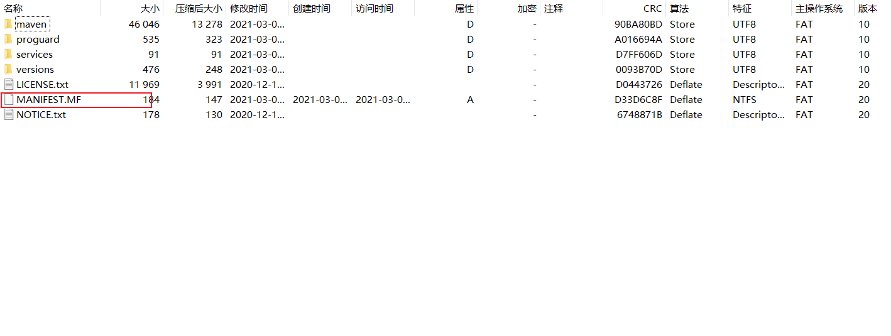

## 前言

​	搭建博客的时候，由于 GitHub 有时候会出现上不去的情况，就又搭建了一个码云平台的。但是这个码云就没有 GitHub 那么良心了，他的自动部署功能是要付费才可以的，不付费就得手动。当时我就想，我肯定要弄个自动部署的。

​	上学期在上课的时候，听到了老师提到 Selenium 这个工具，用来模拟人操作电脑的，我一听，妙啊，找个时间拿它来做个自动部署。

​	现在做完了，记录一下全过程吧。

<!-- more -->

## Selenium 简介

​	Selenium [1] 是一个用于Web应用程序测试的工具。Selenium测试直接运行在浏览器中，就像真正的用户在操作一样。

## 环境准备

（1）Java + Maven：虽然 Selenium 一般是和 python 一起搭配使用，但是我个人主要是使用 Java，还是偏向使用 Java。然后使用 Maven 导入 Selenium 依赖包，导入代码如下：

```xml
<dependencies>
    <dependency>
        <groupId>org.seleniumhq.selenium</groupId>
        <artifactId>selenium-java</artifactId>
        <version>3.141.59</version>
    </dependency>
</dependencies>
```

（2）浏览器驱动：Selenium 的使用需要对应浏览器驱动的支持，下面附上各浏览器驱动的下载地址，根据自身来下载，我自己是使用 Edge

- Firefox浏览器驱动：[geckodriver](https://github.com/mozilla/geckodriver/releases)
- Chrome浏览器驱动：[chromedriver](https://sites.google.com/a/chromium.org/chromedriver/home)[taobao备用地址](https://npm.taobao.org/mirrors/chromedriver)
- Edge浏览器驱动：[MicrosoftWebDriver](https://developer.microsoft.com/en-us/microsoft-edge/tools/webdriver/)
- Opera浏览器驱动：[operadriver](https://github.com/operasoftware/operachromiumdriver/releases)

## 编写代码

​	编写代码没什么好说的，根据情况来编写就好了，基本是模拟点击

```java
import org.openqa.selenium.Alert;
import org.openqa.selenium.By;
import org.openqa.selenium.WebDriver;
import org.openqa.selenium.WebElement;
import org.openqa.selenium.edge.EdgeDriver;
import org.openqa.selenium.interactions.Actions;

import java.util.List;
import java.util.Set;

public class AutoCommit {
    public static void main(String[] args) throws InterruptedException {
        // 设置驱动位置
        System.setProperty("webdriver.edge.driver", "D:/Other/Utils/Edgedriver/msedgedriver.exe");
        WebDriver driver = new EdgeDriver();
        driver.get("https://gitee.com/login");
        // 保证元素加载完毕
        Thread.sleep(3000);
        // 输入账号密码
        driver.findElement(By.cssSelector("input[class='login-password__account-input']")).sendKeys("用户名");
        driver.findElement(By.name("user[password]")).sendKeys("密码");
        // 点击登陆
        driver.findElement(By.cssSelector("input[class='ui fluid orange submit button large']")).click();
        // 等待加载
        Thread.sleep(3000);
        // 点击仓库按钮
        driver.findElement(By.cssSelector("div[class='content pb-1 pt-1']")).click();
        // 进入个人仓库
        driver.findElements(By.cssSelector("span[class='pro-name']")).get(1).click();
        // 等待加载
        Thread.sleep(3000);
        // 切换页面
        Set<String> windowHandles = driver.getWindowHandles();
        String newWindows = "";
        for(String data : windowHandles){
            if(!data.equals(driver.getWindowHandle())){
                newWindows = data;
                break;
            }
        }
        driver.switchTo().window(newWindows);
        // 停一下
        Thread.sleep(2000);
        // 进入服务
        driver.findElement(By.cssSelector("div[class='ui pointing top right dropdown git-project-service']")).click();
        // 进入Gitee Page,通过测试得知，Page的下标是18
        driver.findElements(By.cssSelector("a[class='item']")).get(18).click();
        // 点击更新
        driver.findElement(By.cssSelector("div[class='button orange redeploy-button ui update_deploy']")).click();
        // 点击 Alert 确定更新
        Alert alert = driver.switchTo().alert();
        alert.accept();
        // 等待更新, 20秒差不多是我更新一次的时间
        Thread.sleep(20000);
        // 关闭浏览器
        driver.quit();
    }
}
```

​	注意，代码中出现多次 `Thread.sleep()` 这个主要是用来等待浏览器加载页面的，根据个人情况调节

## 导出可执行 jar

​	编写完后，需要将 Maven 工程导成 jar 文件，这样可以放在 windows 计划任务中，每天自动更新。

​	先给项目创建一个 Artifact ，点击 File -> Project Structure


​	点击 Project Settings 下面的 Artifact


​	点击 + 号，添加一个 Artifact 


​	设置 Main Class，点击 OK 就设置完成了


​	然后点击 Build -> Build Artifact -> Build，就可以导出一个 jar ，导出的 Java 一般在工程项目的 out\artifacts 文件下


## 修改 jar 

​	直接导出的 jar 不能运行（可能是我这里面缺乏哪个步骤），如果运行会出现找不到主类的异常。需要使用解压打开 jar ，将 META-INF 下的MAINFEST.MF 文件添加一点东西，可以直接拉出来，修改完再放回去。




往文件中添加一行 `Main-Class: AutoCommit`，Main-Class 后面接要运行的类名


## 执行 jar

​	jar 直接双击就可以打开，但是一般我们不会这么做（为了全自动），使用 Bash 打开运行，代码为

```bash
# 切换路径
cd D:/Other/Utils
# 运行 jar
java -jar AutoCommit.jar
```

​	然后在之前自动更新博客的代码中加入这两行就可以了。

## 总结

​	流程看起来很简单，但是我还是遇到不少麻烦。

​	例如 Selenium 里面的 getElement 方法中 ByClassName 的 class 是不能带空格了，后面就换了一种定位方法。

​	不知道为什么我电脑里面的 javac 指令无法执行，虽然好像和这个没有关系，但是我还是弄了一会，主要是找问题比较麻烦，jdk 里面的 javac.exe 好像有问题，然后我就重新配置了一下 JDK。

​	以及上面的 jar 无法运行。

​	看起来简单，实际做起来，坑还是不少，继续加油吧少年。