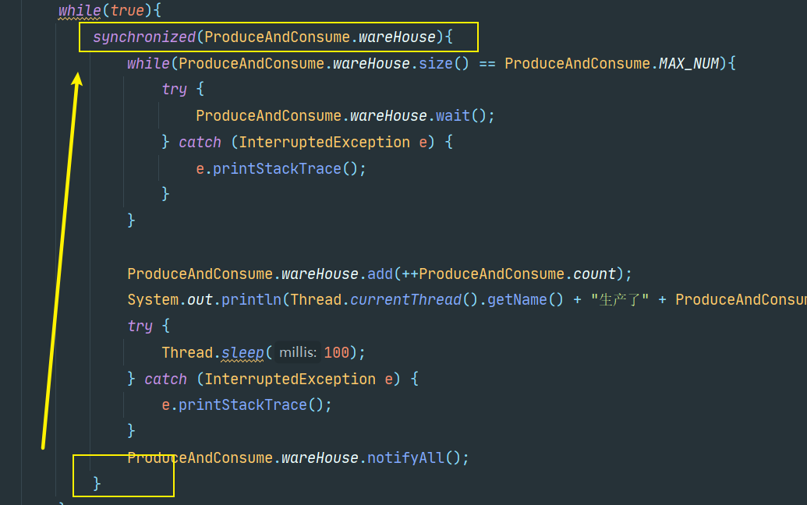

## 前言

​	最近在复习 Java，看到了多线程，就顺便来整理一下 Java 比较经典的生产者消费者。

<!-- more -->

## Synchronized

​	使用 Synchronized 来实现生产者消费者是比较基础的，具体代码如下

```java
import java.util.LinkedList;
import java.util.List;

public class ProduceAndConsume {
    // 最大生成数目
    static final int MAX_NUM = 1000;
    // 仓库
    static final List<Integer> wareHouse = new LinkedList<>();
    // 生成编号
    static int count = 0;

    public static void main(String[] args) {
        new Thread(new Produce(),"AAA").start();
        new Thread(new Consume(),"BBB").start();
        new Thread(new Produce(),"CCC").start();
        new Thread(new Consume(),"DDD").start();

    }
}

class Produce implements Runnable{
    @Override
    public void run() {
        while(true){
            // 每一次生产都停一下
            try {
                Thread.sleep(10);
            } catch (InterruptedException e) {
                e.printStackTrace();
            }
            synchronized(ProduceAndConsume.wareHouse){
                while(ProduceAndConsume.wareHouse.size() == ProduceAndConsume.MAX_NUM){
                    try {
                        ProduceAndConsume.wareHouse.wait();
                    } catch (InterruptedException e) {
                        e.printStackTrace();
                    }
                }

                ProduceAndConsume.wareHouse.add(++ProduceAndConsume.count);
                System.out.println(Thread.currentThread().getName() + "生产了" + ProduceAndConsume.count + "号商品");
                ProduceAndConsume.wareHouse.notifyAll();
            }
        }
    }
}

class Consume implements Runnable{
    @Override
    public void run() {
        while(true){
            // 每一次消费都停一下
            try {
                Thread.sleep(100);
            } catch (InterruptedException e) {
                e.printStackTrace();
            }
            synchronized(ProduceAndConsume.wareHouse){
                while(ProduceAndConsume.wareHouse.size() == 0){
                    try {
                        ProduceAndConsume.wareHouse.wait();
                    } catch (InterruptedException e) {
                        e.printStackTrace();
                    }
                }
                System.out.println(Thread.currentThread().getName() + "消费了" + ProduceAndConsume.wareHouse.remove(0));
                ProduceAndConsume.wareHouse.notifyAll();
            }
        }
    }
}
```

​	这是比较简单的实现（我这里由于文件名起的有点长，导致变量名很长），这里有一个需要注意的点，sleep 必须放在同步代码块外面。

​	如果你放在了里面，那你会 "惊讶" 的发现，会经常出现生成者生成满以后，消费者才会消费，然后消费者消费满以后，生成者才会生成继续生成。而正确的应该是，生产者生产，消费者消费，这是交叉进行的。

​	产生这个的理由找了我很久，后面找到一个我个人觉得比较可能的，涉及到了对象的锁池和等待池这个概念。

​	得不到锁的线程会被阻塞在锁池里面，而执行 wait 方法的线程，则是被存入等待池，当执行 notify 唤醒线程的时候，该线程会从等待池被移入锁池，然后再和锁池里面的其他线程或者活跃线程共同抢占锁。

​	我们发现，被 notify 唤醒的对象有一个从等待池移动到锁池的过程，这个过程肯定是需要执行时间的，而我们代码里面，当前线程 notify 后就又回去抢占资源了，由于这一过程十分迅速，所以一直会是当前进程获得锁（少数情况才是其他进程）



​	