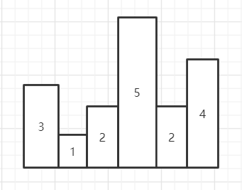

## 前言

​	存放一些杂七杂八的算法题

<!-- more -->

2021/3/22

​	现在不止是剑指 offer 的题了，会将某些我觉得有意思，又不太好丢到每日一题里面的题放这里

2021/4/17

​	名字也给我改了，以后统一放除每日一题以外的题目

## [剑指 Offer 03.数组中重复的数字](https://leetcode-cn.com/problems/shu-zu-zhong-zhong-fu-de-shu-zi-lcof/)

找出数组中重复的数字。


在一个长度为 n 的数组 nums 里的所有数字都在 0～n-1 的范围内。数组中某些数字是重复的，但不知道有几个数字重复了，也不知道每个数字重复了几次。请找出数组中任意一个重复的数字。

**示例 1：**

```
输入：
[2, 3, 1, 0, 2, 5, 3]
输出：2 或 3 
```

 

**限制：**

```
2 <= n <= 100000
```

### 思路

​	第一种解法，排序，然后判断前面是否出现相同的数据。

​	第二种解法，使用 Set ，由于 Set 的不允许存在重复的数据，如果尝试 add 一个重复的数据，那么会添加失败，并且返回一个 false

### 代码

​	第一种

```java
public int findRepeatNumber(int[] nums) {
        Arrays.sort(nums);
        for(int i = 1; i < nums.length; i++){
            if(nums[i] == nums[i-1]){
                return nums[i];
            }
        }

        return -1;
    }
```

​	第二种

```java
public int findRepeatNumber(int[] nums) {
    Set<Integer> data = new HashSet<>();
    for(int n : nums){
        if (!data.add(n)){
            return n;
        }
    }

    return -1;
}
```

## [剑指 Offer 04. 二维数组中的查找](https://leetcode-cn.com/problems/er-wei-shu-zu-zhong-de-cha-zhao-lcof/)

在一个 n * m 的二维数组中，每一行都按照从左到右递增的顺序排序，每一列都按照从上到下递增的顺序排序。请完成一个高效的函数，输入这样的一个二维数组和一个整数，判断数组中是否含有该整数。

**示例:**

现有矩阵 matrix 如下：

```
[
  [1,   4,  7, 11, 15],
  [2,   5,  8, 12, 19],
  [3,   6,  9, 16, 22],
  [10, 13, 14, 17, 24],
  [18, 21, 23, 26, 30]
]
```

给定 target = `5`，返回 `true`。

给定 target = `20`，返回 `false`。

 

**限制：**

```
0 <= n <= 1000
0 <= m <= 1000
```

### 思路

​	简单粗暴就直接搜！

​	另外一种做法就是，从左下角或者右上角开始搜。

​	以左下角为例，如果当前点的值比 target 大，则想上移动一行，如果小就想右移动一行，相等就返回。

### 代码

​	直接搜

```java
int[][] matrix;
public boolean findNumberIn2DArray(int[][] matrix, int target) {
    this.matrix = matrix;

    if(matrix.length == 0 || matrix[0].length == 0){
        return false;
    }

    int maxRow = findRow(target);
    for(int i = maxRow; i >= 0; i--){
        if(findCol(i,target)){
            return true;
        }
    }

    return false;
}

public int findRow(int target){
    for(int i = 0; i < matrix.length; i++){
        if(target < matrix[i][0]){
            return i - 1;
        }
    }

    return matrix.length-1;
}

public boolean findCol(int row, int target){
    for(int i = 0; i < matrix[row].length; i++){
        if(matrix[row][i] == target){
            return true;
        }

        if(target < matrix[row][i]){
            return false;
        }
    }

    return false;
}
```

​	有技巧的搜

```java
public static boolean findNumberIn2DArray(int[][] matrix, int target) {
    if(matrix.length == 0 || matrix[0].length == 0){
        return false;
    }
    int row = matrix.length;
    int col = matrix[0].length;
    int x = 0;
    int y = row-1;

    while(x < col && y >= 0){
        if(matrix[y][x] == target){
            return true;
        }else if(matrix[y][x] > target){
            y--;
        }else{
            x++;
        }
    }

    return false;
}
```

## [剑指 Offer 12. 矩阵中的路径](https://leetcode-cn.com/problems/ju-zhen-zhong-de-lu-jing-lcof/)

### 思路

​	常规深搜 + 回溯。

​	走过的路不能再走，所以使用一个 boolean 数组保存是否走过，接下来就没什么好说的了，只要懂深搜，这就是很常规的题。

​	有一个注意点，第一次进去的地方，也要加判断，一开始忘记加了，加错了。

### 代码

```java
import org.junit.Test;

public class JZOF12 {
    boolean flag = false;
    String word;
    char[][] board;
    boolean[][] used;
    int cLen;
    int rLen;
    int[][] direction = {{0,1},{1,0},{0,-1},{-1,0}};
    public boolean exist(char[][] board, String word) {
        if(word.length() == 0){
            return false;
        }
        this.word = word;
        this.board = board;
        rLen = board.length;
        cLen = board[0].length;
        used = new boolean[rLen][cLen];

        for(int i = 0; i < rLen && !flag; i++){
            for(int j = 0; j < cLen && !flag; j++){
                if(board[i][j] == word.charAt(0)){
                    // 记得标记已经走过
                    used[i][j] = true;
                    find(j,i,1);
                    used[i][j] = false;
                }
            }
        }

        return flag;
    }

    public void find(int col, int row,int count){
        if(count == word.length()){
            flag = true;
            return;
        }

        for(int i = 0; i < 4 && !flag; i++){
            int tempCol = col + direction[i][0];
            int tempRow = row + direction[i][1];

            if(tempCol >= 0 && tempRow >= 0 && tempCol < cLen && tempRow < rLen
                    && !used[tempRow][tempCol] && board[tempRow][tempCol] == word.charAt(count)){
                used[tempRow][tempCol] = true;
                find(tempCol,tempRow,count+1);
                used[tempRow][tempCol] = false;
            }
        }
    }
}

```

## [剑指 Offer 13. 机器人的运动范围](https://leetcode-cn.com/problems/ji-qi-ren-de-yun-dong-fan-wei-lcof/)

难度中等248收藏分享切换为英文接收动态反馈

地上有一个m行n列的方格，从坐标 `[0,0]` 到坐标 `[m-1,n-1]` 。一个机器人从坐标 `[0, 0] `的格子开始移动，它每次可以向左、右、上、下移动一格（不能移动到方格外），也不能进入行坐标和列坐标的数位之和大于k的格子。例如，当k为18时，机器人能够进入方格 [35, 37] ，因为3+5+3+7=18。但它不能进入方格 [35, 38]，因为3+5+3+8=19。请问该机器人能够到达多少个格子？

 

**示例 1：**

```
输入：m = 2, n = 3, k = 1
输出：3
```

**示例 2：**

```
输入：m = 3, n = 1, k = 0
输出：1
```

**提示：**

- `1 <= n,m <= 100`
- `0 <= k <= 20`

### 思路

解法一，递归。

​	当前状态只能从上一列或者上一行转化过来，因为不能斜着走，也不存在从下一行或者下一列转化，因为是从小到大 DP。

​	也就是说保存当前状态，然后查询是否前一个状态可以走，如果不可以，直接设置为 false，否则计算是否可以走。每一个可以走的位置，就计数。

​	但是递归有个问题就是，假如 m = 100, n = 100, k = 0，那么只能走原点，还是要全部遍历一遍，有点没有必要，可以通过加一个判断上一行和上一列同时走不了，那么后面就没必要走了，不过加这个判断，就每一个位置都得判断一次，也消耗时间。

解法二，深搜

​	从起点开始搜，判断四个方向是否可以走（两个方向也是可以的，写习惯四个方向了），经典判断，下一步是否越界，是否已经走过，是否可以走。然后搜就行了。

​	为什么不用广搜呢？因为我个人比较习惯用深搜，这道题也没有必须要用广搜，题解用了广搜，跑了一下，发现时间消耗比较多，可能是每一次队列保存一个坐标都要创建一个数组，消耗的时间比较多把。

### 代码

DP：

```java
class Solution {
    public int movingCount(int m, int n, int k) {
        // dp 计算
        boolean[][] dp = new boolean[m][n];
        // dp 起点
        dp[0][0] = true;
        // 记录可以走的位置个数
        int num = 1;
        // 先计算最左列和最下列能不能到达
        for(int i = 1; i < m; i++){
            dp[i][0] = dp[i-1][0] && arrival(i, 0, k);
            if(dp[i][0]){
                num++;
            }
        }
        for(int i = 1; i < n; i++){
            dp[0][i] = dp[0][i-1] && arrival(i, 0, k);
            if(dp[0][i]){
                num++;
            }
        }

        // 遍历，判断当前状态能否走到
        for(int i = 1; i < m; i++){
            for(int j = 1; j < n; j++){
                dp[i][j] =(dp[i-1][j] || dp[i][j-1]) && arrival(i,j,k);
                if(dp[i][j]){
                    num++;
                }
            }
        }

        return num;
    }

    public boolean arrival(int num1 ,int num2 , int power){
        int sum = 0;
        // 得到 num1 的各位数
        while(num1 != 0){
            sum += num1 % 10;
            num1 /= 10;
        }
        // 得到 num2 的各位数
        while(num2 != 0){
            sum += num2 % 10;
            num2 /= 10;
        }

        return power >= sum;
    }
}
```

深搜：

```java
class Solution {
    // 方向
    int[][] addre = new int[][]{{0,1},{1,0},{-1,0},{0,-1}};
    // (0,0) 点肯定可以到达，所以直接赋值1
    int ans = 1;
    // 判断是否走过
    boolean[][] used;
    int row;
    int col;
    public int movingCount(int m, int n, int k) {
        row = m;
        col = n;
        used = new boolean[m][n];
        // 起点已经走过
        used[0][0] = true;
        find(0,0,k);
        return ans;
    }

    public void find(int r,int c, int k){
        for(int i = 0; i < 4; i++){
            int tempRow = r + addre[i][0];
            int tempCol = c + addre[i][1];

            if(tempCol >= 0 && tempRow >= 0 && tempCol < col && tempRow < row && !used[tempRow][tempCol] && arrival(tempCol,tempRow,k)){
                ans++;
                used[tempRow][tempCol] = true;
                find(tempRow,tempCol,k);
            }
        }
    }

    public boolean arrival(int num1 ,int num2 , int power){
        int sum = 0;
        // 得到 num1 的各位数
        while(num1 != 0){
            sum += num1 % 10;
            num1 /= 10;
        }
        // 得到 num2 的各位数
        while(num2 != 0){
            sum += num2 % 10;
            num2 /= 10;
        }

        return power >= sum;
    }
}
```

## [剑指 Offer 14- I. 剪绳子](https://leetcode-cn.com/problems/jian-sheng-zi-lcof/)

难度中等192收藏分享切换为英文接收动态反馈

给你一根长度为 `n` 的绳子，请把绳子剪成整数长度的 `m` 段（m、n都是整数，n>1并且m>1），每段绳子的长度记为 `k[0],k[1]...k[m-1]` 。请问 `k[0]*k[1]*...*k[m-1]` 可能的最大乘积是多少？例如，当绳子的长度是8时，我们把它剪成长度分别为2、3、3的三段，此时得到的最大乘积是18。

**示例 1：**

```
输入: 2
输出: 1
解释: 2 = 1 + 1, 1 × 1 = 1
```

**示例 2:**

```
输入: 10
输出: 36
解释: 10 = 3 + 3 + 4, 3 × 3 × 4 = 36
```

**提示：**

- `2 <= n <= 58`

### 思路

​	使用 DP 求解，大于等于 4 的数，最后都会分解成 2 和 3 的乘积，那么从 3 开始递归上去，每一个数都看看是分解出 2 还是 3得到的值更高。

​	注意，最少剪一次，所以需要对 2 3 进行特判

### 代码

```java
public int cuttingRope(int n) {
    // 因为必须剪一刀，所以，处理2,3这两个特殊情况
    if(n < 4){
        return n-1;
    }

    // 设置初值
    int[] dp = new int[n+1];
    dp[0] = 1;
    dp[1] = 1;
    dp[2] = 2;
    for(int i = 3; i <= n; i++){
        dp[i] = Math.max(dp[i-2] * 2,dp[i-3] * 3);
    }

    return dp[n];
}
```

## [剑指 Offer 14- II. 剪绳子 II](https://leetcode-cn.com/problems/jian-sheng-zi-ii-lcof/)

难度中等83收藏分享切换为英文接收动态反馈

给你一根长度为 `n` 的绳子，请把绳子剪成整数长度的 `m` 段（m、n都是整数，n>1并且m>1），每段绳子的长度记为 `k[0],k[1]...k[m - 1]` 。请问 `k[0]*k[1]*...*k[m - 1]` 可能的最大乘积是多少？例如，当绳子的长度是8时，我们把它剪成长度分别为2、3、3的三段，此时得到的最大乘积是18。

答案需要取模 1e9+7（1000000007），如计算初始结果为：1000000008，请返回 1。

 

**示例 1：**

```
输入: 2
输出: 1
解释: 2 = 1 + 1, 1 × 1 = 1
```

**示例 2:**

```
输入: 10
输出: 36
解释: 10 = 3 + 3 + 4, 3 × 3 × 4 = 36
```

 

**提示：**

- `2 <= n <= 1000`

### 思路

​	这一题就不能用上一题的思路了，因为中间的值会出现取余后错误的情况。只能一次求完。

​	用贪心的思维，优先切出 3 来，切到不能再切（小于等于4）才用剩下的来乘目标，2,3,4都是不需要再切的值。其实上一题的 DP 也用到了这种贪心的思想。

​	有一个注意点，那就是保存的变量记得声明为 long，int * 2 或者 3 会溢出，导致数据错误。

### 代码

```java
public int cuttingRope(int n) {
    // 因为必须剪一刀，所以，处理2,3这两个特殊情况
    if(n < 4){
        return n-1;
    }
    // 4 也需要特殊处理
    long ans = 1;
    // 先把3全切了
    while(n > 4){
        ans = (ans * 3) % 1000000007;
        n -= 3;
    }

    return (int)(ans * n) % 1000000007;

}
```

## [剑指 Offer 15. 二进制中1的个数](https://leetcode-cn.com/problems/er-jin-zhi-zhong-1de-ge-shu-lcof/)

难度简单98收藏分享切换为英文接收动态反馈

请实现一个函数，输入一个整数（以二进制串形式），输出该数二进制表示中 1 的个数。例如，把 9 表示成二进制是 1001，有 2 位是 1。因此，如果输入 9，则该函数输出 2。

 

**示例 1：**

```
输入：00000000000000000000000000001011
输出：3
解释：输入的二进制串 00000000000000000000000000001011 中，共有三位为 '1'。
```

**示例 2：**

```
输入：00000000000000000000000010000000
输出：1
解释：输入的二进制串 00000000000000000000000010000000 中，共有一位为 '1'。
```

**示例 3：**

```
输入：11111111111111111111111111111101
输出：31
解释：输入的二进制串 11111111111111111111111111111101 中，共有 31 位为 '1'。
```

 

**提示：**

- 输入必须是长度为 `32` 的 **二进制串** 。

 

注意：本题与主站 191 题相同：https://leetcode-cn.com/problems/number-of-1-bits/

### 思路

​	使用位操作， n &= (n-1) 每一次会消去最后面的1，计算这个等式使用的次数即可判断出有多少个 1 。

​	当然，使用位操作也行，判断 n 的最后一位数，然后将 n 向右位移。

​	今天的每日一题就是这个，唉。

### 代码

```java
public int hammingWeight(int n) {
    int count = 0;
    while(n != 0){
        n &= (n-1);
        count++;
    }

    return count;
}
```

## [剑指 Offer 16. 数值的整数次方](https://leetcode-cn.com/problems/shu-zhi-de-zheng-shu-ci-fang-lcof/)

难度中等137收藏分享切换为英文接收动态反馈

实现 [pow(*x*, *n*)](https://www.cplusplus.com/reference/valarray/pow/) ，即计算 x 的 n 次幂函数（即，xn）。不得使用库函数，同时不需要考虑大数问题。

 

**示例 1：**

```
输入：x = 2.00000, n = 10
输出：1024.00000
```

**示例 2：**

```
输入：x = 2.10000, n = 3
输出：9.26100
```

**示例 3：**

```
输入：x = 2.00000, n = -2
输出：0.25000
解释：2-2 = 1/22 = 1/4 = 0.25
```

 

**提示：**

- `-100.0 < x < 100.0`
- `-231 <= n <= 231-1`
- `-104 <= xn <= 104`

### 思路

​	使用快速幂计算，假设 n 为 12，其对应的二进制为 1100 ，其中每个位置都有不同的权值，1(x ^ 8)1(x ^ 4)0(x ^ 2)0(x ^ 1)，对应了 12 个 x 的相乘。根据二进制的特点，你会发现，每个位置的权值都是上一个位置的两倍。

​	根据这个特点我们就可以写出快速幂了，不过这道题有点麻烦，因为 n 可以是负数，所以先保存符号，最后根据符号再来判断是不是要返回倒数。这道题我觉得最没必要的一个点就是，它测试数据里面有 INTEGER.MIN_NUM，这个值，我们知道，负数的最小值比正数的最大值要大（绝对值），所以，无法将最小值的符号提取出来，只能使用 long 来存储，觉得有点没必要。

### 代码

```java
public double myPow(double x, int n) {
    int flag = n > 0 ? 1 : -1;
    long num = (long)n * flag;
    double ans = 1;
    while(num != 0){
        if((num & 1) == 1){
            ans *= x;
        }
        x *= x;
        num >>= 1;
    }

    if(flag == 1){
        return ans;
    }else{
        return 1/ans;
    }
}
```

## 牛客 容器盛水

给定一个整形数组arr，已知其中所有的值都是非负的，将这个数组看作一个容器，请返回容器能装多少水。

示例1

输入

```
[3,1,2,5,2,4]
```

返回值

```
5
```

示例2

输入

```
[4,5,1,3,2]
```

返回值

```
2
```

说明

```
数组长度\leq 10^6数组长度≤106 
```

### 思路

​	一开始题都看不懂，后面懂了，就是每一个数就是一根柱子，在柱子之间可以倒水，例如[ 3, 1, 2, 5, 2, 4] 的图示如下：



​	你可以在 3 - 5 中间，也就是 1 2 的头上倒 3 格水，可以在 5 - 4，2的头上倒 2 格水。所以答案是 5 。

​	理解万题意以后，这道题就没什么难度了，使用双指针，从两端往中间遍历，

- 每一次选择两端中较低的一段（为了防止加水超过另外一段），然后往另一端遍历
- 如果遇到比他小的柱子，则计算差值加水
- 如果遇到大的，则跟新这一端，然后再重复这三个步骤，直到左右指针相等。

### 代码

```java
import java.util.*;


public class Solution {
    /**
     * max water
     * @param arr int整型一维数组 the array
     * @return long长整型
     */
    public long maxWater (int[] arr) {
        // write code here
        int left = 0;
        int right = arr.length-1;
        int minNum;
        long ans = 0;
        while(left != right){
            if(arr[left] > arr[right]){
                // 右边比较小，从右边开始遍历
                minNum = arr[right];
                right--;
                // 遍历所有比它小的
                while(left != right && arr[right] <= minNum){
                    ans += minNum - arr[right];
                    right--;
                }
            }else{
                minNum = arr[left];
                left++;
                while(left != right && arr[left] <= minNum){
                    ans += minNum - arr[left];
                    left++;
                }
            }
        }

        return ans;
    }
}
```


## [最长回文子串](https://leetcode-cn.com/problems/longest-palindromic-substring/)

难度中等3530收藏分享切换为英文接收动态反馈

给你一个字符串 `s`，找到 `s` 中最长的回文子串。

 

**示例 1：**

```
输入：s = "babad"
输出："bab"
解释："aba" 同样是符合题意的答案。
```

**示例 2：**

```
输入：s = "cbbd"
输出："bb"
```

**示例 3：**

```
输入：s = "a"
输出："a"
```

**示例 4：**

```
输入：s = "ac"
输出："a"
```

 

**提示：**

- `1 <= s.length <= 1000`
- `s` 仅由数字和英文字母（大写和/或小写）组成

### 思路

方法一：

​	dp 解法，`dp[i][j]`表示从 i 到 j 是否是回文串。我们枚举回文串的长度以及起始位置，如果出现 i 和 j 位置的字符相等，那么递推公式应该是 `dp[i][j] = dp[i-1][j-1]`，也就是从里面这个推出外面，由于我们是从前往后遍历，并且长度是递增的，那么在推到`dp[i][j]`的时候，`dp[i-1][j-1]`是已经推到过的。

​	注意，当长度等于2的时候，如果 i 和 j 的字符相等，那么`dp[i][j]`为真。而 i = j 的所有位置，也就是只有一个字符，也都为真。更具体的看代码

方法二：

​	中心扩散法，枚举每一个中心，然后从它往左右扩散，记录最长能扩散的长度即可。需要注意的是，这个中心有可能是一个字符，也有可能是两个字符中间的空隙，例如，abcba 的扩散中心就是 c ，而 acca 的扩散中心则是 c c 中间的空隙。这是可以统一处理的，就是脑子要转的过来。

### 代码

​	方法一：

```java
public String longestPalindrome(String s) {
    // 自身为空或者长度小于1
    if(s == null || s.length() < 2){
        return s;
    }

    int len = s.length();
    // dp数组
    boolean[][] dp = new boolean[len][len];
    // 记录最长的长度以及起始位置
    int maxLen = 1;
    int maxSt = 0;
    // 字符串航都为1的都是子串
    for(int i = 0; i < len; i++){
        dp[i][i] = true;
    }

    char[] data = s.toCharArray();
    // 枚举长度
    for(int i = 2; i <= len; i++){
        // 枚举起始位置
        for(int st = 0; st <= len - i; st++){
            // 结束位置
            int ed = st + i - 1;
            // 两端是否相等
            if(data[st] != data[ed]){
                dp[st][ed] = false;
            }else{
                if(i == 2){
                    dp[st][ed] = true;
                }else{
                    dp[st][ed] = dp[st+1][ed-1];
                }
            }

            // 和最大长度比较
            if(dp[st][ed] && i > maxLen){
                maxLen = i;
                maxSt = st;
            }
        }
    }
    return s.substring(maxSt,maxSt+maxLen);
}
```

​	方法二：

```java
class Solution {
    char[] data;
    int len;
    public String longestPalindrome(String s) {
        if(s == null || s.length() < 2){
            return s;
        }
        len = s.length();
        int st = 0;
        int ed = 0;
        data = s.toCharArray();
        for(int i = 0; i < len; i++){
            int temp1 = findMaxLen(i,i);
            int temp2 = findMaxLen(i,i+1);
            temp1 = Math.max(temp1,temp2);
            if(temp1 > ed - st){
                st = i - (temp1 - 1) / 2;
                ed = i + temp1 / 2;
            }
        }
        return s.substring(st, ed + 1);
    }

    public int findMaxLen(int left,int right){
        while(left >= 0 && right < len && data[left] == data[right]){
            left--;
            right++;
        }

        // 长度 = right - left + 1,由于上门的循环总会多走一步，所以需要-2,因此为 right - left - 1
        return right - left - 1;
    }
}
```

